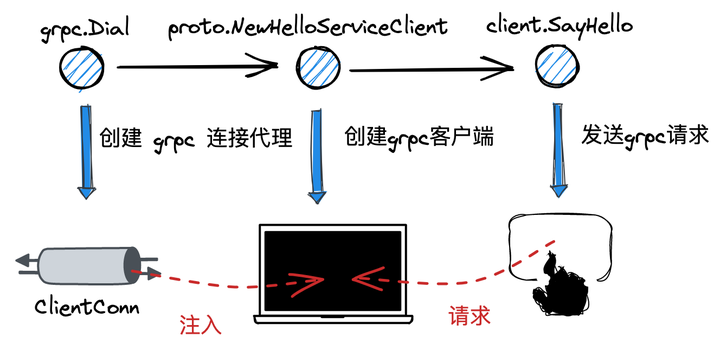

## 1 客户端代码示例

## 1.1 main 函数



首先给出 grpc-go 启动客户端的代码示例，核心内容分三块：

- 调用 grpc.Dial 方法，指定服务端 target，创建 grpc 连接代理对象 ClientConn
- 调用 proto.NewHelloServiceClient 方法，基于 pb 桩代码构造客户端实例
- 调用 client.SayHello 方法，真正发起 grpc 请求

```go
package main


import (
    "context"
    "fmt"


    "github.com/grpc_demo/proto"


    "google.golang.org/grpc"
    "google.golang.org/grpc/credentials/insecure"
)


func main() {
    conn, err := grpc.Dial("localhost:8093", grpc.WithTransportCredentials(insecure.NewCredentials()))
    // ...
    defer conn.Close()


    client := proto.NewHelloServiceClient(conn)


    resp, err := client.SayHello(context.Background(), &proto.HelloReq{
        Name: "xiaoxuxiansheng",
    })
    // ...


    fmt.Printf("resp: %+v", resp)
}
```

## 1.2 proto 文件

对应的 proto 文件定义：

```proto
syntax = "proto3"; // 固定语法前缀
option go_package = ".";  // 指定生成的Go代码在你项目中的导入路径
package pb; // 包名


// 定义服务
service HelloService {
    // SayHello 方法
    rpc SayHello (HelloReq) returns (HelloResp) {}
}


// 请求消息
message HelloReq {
    string name = 1;
}


// 响应消息
message HelloResp {
    string reply = 1;
}
```

## 2 核心数据结构


下面对 grpc-go 客户端涉及到的几个核心数据结构以及其间的关联做个介绍.

### 2.1 ClientConn

ClientConn 是广义上的 grpc 连接代理对象，和 grpc 客户端是一对一的关系，内部包含了一个连接池，根据配置可能同时管理多笔连接. 其中几个核心字段包括：

- target/parsedTarget：对服务端地址信息的封装
- balancerWrapper：负载均衡器. 初始化时会启动一个守护协程，动态地对 ClientConn 及 Subconn 的状态进行刷新
- blockingpicker：连接选择器. 在发送请求时，由其最终挑选出使用的 Subconn
- resolverWrapper：解析器. 负责根据不同的 schema，通过 target 解析出服务端的实际地址

```go
type ClientConn struct {
    // 连接上下文
    ctx    context.Context   
    // 上下文终止控制器
    cancel context.CancelFunc 


    // 连接的目标地址
    target          string               
    // 对连接目标地址的封装
    parsedTarget    resolver.Target    
    // ...
    // 连接配置项
    dopts           dialOptions          
    // 负载均衡器，底层基于 gracefulswitch.balancer
    balancerWrapper *ccBalancerWrapper  


    // 连接状态管理器
    csMgr              *connectivityStateManager
    // 连接选择器
    blockingpicker     *pickerWrapper

    // 调用前等待resolver成功解析
    firstResolveEvent *grpcsync.Event
    // 读写互斥锁
    mu              sync.RWMutex
    // 解析器
    resolverWrapper *ccResolverWrapper         
    // 连接池
    conns           map[*addrConn]struct{}     // Set to nil on close.
    // ...
}
```

### 2.2 ccBalancerWrapper

ccBalancerWrapper是在负载均衡器Balancer的基础上做的封装. 在ccBalancerWrapper被初始化时，会开启一个守护协程，通过监听 updateCh 中到达的事件，对 ClientConn 和 Subconn 的状态进行刷新.

```go
type ccBalancerWrapper struct {
    // 指向所属的 clientConn
    cc *ClientConn

    // 负载均衡器
    balancer        *gracefulswitch.Balancer
    curBalancerName string
    // ...
}
```

ccBalancerWrapper 的核心是一个负载均衡器 Balancer 接口,其中包含了几个核心方法:

- UpdateClientConnState：更新 ClientConn 的连接状态
- ResolverError：错误后处理
- UpdateSubConnState：更新子连接 Subconn 状态
- Close：关闭负载均衡器

```go
type Balancer interface {
    UpdateClientConnState(ClientConnState) error
    ResolverError(error)
    UpdateSubConnState(SubConn, SubConnState)
    Close()
}
```

在默认情况下，grpc客户端框架会为我们提供一个默认的负载均衡器 pickfirstBalancer：

```go
type pickfirstBalancer struct {
    state   connectivity.State
    cc      balancer.ClientConn
    subConn balancer.SubConn
}
```

与pickfirstBalancer具体的交互流程我们在第3章再作展开.

### 2.3 ccResolverWrapper

ccResolverWrapper的核心是内置的解析器 resolver.

```go
type ccResolverWrapper struct {
    // 指向所属的 clientConn
    cc         *ClientConn
    resolverMu sync.Mutex
    // 核心成员：内置的解析器
    resolver   resolver.Resolver
    // 当前解析状态
    curState resolver.State
    // ...
}
```

resolver.State.
```go
type State struct {
    // 最新解析地址的集合
    Addresses []Address
	// 最新服务配置的结果
    ServiceConfig *serviceconfig.ParseResult
    // 供负载均衡策略使用
    Attributes *attributes.Attributes
}
```

resolver通过Builder构造，对应的Buidler是一个interface,用户也可以提供自己的实现版本:

```go
type Builder interface {
    // 构造解析器 resolver
    Build(target Target, cc ClientConn, opts BuildOptions) (Resolver, error)
    // Scheme returns the scheme supported by this resolver.
    // Scheme is defined at https://github.com/grpc/grpc/blob/master/doc/naming.md.
    Scheme() string
}
```

resolver本身是一个接口，核心的方法是 ResolveNow：通过 target 解析出实际的客户端地址.

```go
type Resolver interface {
    // 解析 target
    // 可以为空
    ResolveNow(ResolveNowOptions)
    // 关闭 resolver
    Close()
}
```

grpc客户端为我们提供了一个默认的resolver：passthroughResolver：

```go
type passthroughResolver struct {
    target resolver.Target
    cc     resolver.ClientConn
}
```

passthroughResolver在解析 target 时的策略是直接透传不作处理. 具体交互流程见第3章.

### 2.4 ClientStream

在grpc客户端客户端发起请求时，会首先创建出一个 ClientStream，并依赖其核心方法 SendMsg 和 RecvMsg 进行请求的发送和响应的接受.

```go
type ClientStream interface {
    // 获取元数据
    Header() (metadata.MD, error)
	Trailer() metadata.MD
	// 关闭写入端的流
	CloseSend() error
    // 获取上下文
    Context() context.Context
    // 发送消息
    SendMsg(m interface{}) error
    // 接收消息
    RecvMsg(m interface{}) error
}
```

ClientStream是一个interface，其默认的实现是 clientStream：

```go
type clientStream struct {
    // ...
    cc       *ClientConn
    desc     *StreamDesc

    // 编码模块
    codec baseCodec
    // 压缩模块
    cp    Compressor
    comp  encoding.Compressor
    // ...
    // 上下文
    ctx context.Context 
    // 请求尝试
    attempt *csAttempt
    // ...
}
```

### 2.5 csAttempt

csAttemp 代表了一次 grpc 请求尝试，本身是具有生命周期的.

```go
type csAttempt struct {
    ctx        context.Context
    cs         *clientStream
    t          transport.ClientTransport
    s          *transport.Stream
    p          *parser
    pickResult balancer.PickResult

    // 解压模块
    dc        Decompressor
    decomp    encoding.Compressor
    decompSet bool

    // ...
}
```

## 3 grpc.Dial


### 3.1 grpc.Dial

```go
func Dial(target string, opts ...DialOption) (*ClientConn, error) {
    return DialContext(context.Background(), target, opts...)
}

func DialContext(ctx context.Context, target string, opts ...DialOption) (conn *ClientConn, err error) {
    cc := &ClientConn{
        target:            target,
        csMgr:             &connectivityStateManager{},
        conns:             make(map[*addrConn]struct{}),
        dopts:             defaultDialOptions(),
        blockingpicker:    newPickerWrapper(),
        czData:            new(channelzData),
        firstResolveEvent: grpcsync.NewEvent(),
    }
    // ...
    // Determine the resolver to use.
    resolverBuilder, err := cc.parseTargetAndFindResolver()
    // ...
    cc.balancerWrapper = newCCBalancerWrapper(cc, balancer.BuildOptions{
        DialCreds:        credsClone,
        CredsBundle:      cc.dopts.copts.CredsBundle,
        Dialer:           cc.dopts.copts.Dialer,
        Authority:        cc.authority,
        CustomUserAgent:  cc.dopts.copts.UserAgent,
        ChannelzParentID: cc.channelzID,
        Target:           cc.parsedTarget,
    })
    // ...
    rWrapper, err := newCCResolverWrapper(cc, resolverBuilder)
    // ...
    cc.mu.Lock()
    cc.resolverWrapper = rWrapper
    cc.mu.Unlock()
    // ...
    return cc, nil
}
```

在通过 DialContext 创建 grpc 连接代理 ClientConn 时，核心步骤包括：

- 创建 ClientConn 实例
- 调用 ClientConn.parseTargetAndFindResolver 方法，通过 target 中的 schema 获取到对应的解析器构造器 resolverBuilder
- 调用 newCCBalancerWrapper 方法构造出负载均衡器封装对象 ccBalancerWrapper，在内部会开启守护协程感知和处理 ClientConn 和 Subconn 状态变更的事件
- 调用 newCCResolverWrapper 方法，内部会调用 resolverBuilder 构造并启动 resolver 实例，同时会通过 ccBalancerWrapper 方法对 ClientConn 的状态进行更新

### 3.2 ClientConn.parseTargetAndFindResolver


  

```go
func (cc *ClientConn) parseTargetAndFindResolver() (resolver.Builder, error) {
    // ...
    var rb resolver.Builder
    parsedTarget, err := parseTarget(cc.target)
    
    rb = cc.getResolver(parsedTarget.URL.Scheme)
    if rb != nil {
        cc.parsedTarget = parsedTarget
        return rb, nil
    }
    // ...
}
```

ClientConn.parseTargetAndFindResolver 方法通过 target 中的 schema，会获取到对应的 resolverBuilder，后续用于构建出能解析出服务端地址的 resolver.

在 grpc-go 的 resolver 包下，会通过一个全局 map 实现 schema 到 resolverBuilder 的映射，同时会暴露出注册方法 Register，供用户自定义实现特定 schema 下的 resolverBuilder 和 resolver 并注入到 map 中.

```go
var (
    m = make(map[string]Builder)
    defaultScheme = "passthrough"
)


func Register(b Builder) {
    m[b.Scheme()] = b
}


func Get(scheme string) Builder {
    if b, ok := m[scheme]; ok {
        return b
    }
    return nil
}
```

grpc-go 中，默认的 resolverBuilder 和对应的 resolver 是 passthrough 类型，这类 resolver 的解析策略是对 target 直接透传，不作解析处理.

其中，passthroughBuilder.Build 方法中，会执行 passthroughResolver.start 方法一键启动解析器，这部分逻辑我们放到 3.4 小节中，在 passthroughBuilder.Build 方法真正被调用时再作展开.

```go
const scheme = "passthrough"

type passthroughBuilder struct{}

func (*passthroughBuilder) Build(target resolver.Target, cc resolver.ClientConn, opts resolver.BuildOptions) (resolver.Resolver, error) {
    // ...
    r := &passthroughResolver{
        target: target,
        cc:     cc,
    }
    r.start()
    return r, nil
}

type passthroughResolver struct {
    target resolver.Target
    cc     resolver.ClientConn
}

func (r *passthroughResolver) start() {
    r.cc.UpdateState(resolver.State{Addresses: []resolver.Address{{Addr: r.target.Endpoint()}}})
}

func (*passthroughResolver) ResolveNow(o resolver.ResolveNowOptions){}
```

### 3.3 newCCBalancerWrapper

```go
func newCCBalancerWrapper(cc *ClientConn, bopts balancer.BuildOptions) *ccBalancerWrapper {
    ctx, cancel := context.WithCancel(context.Background())
    ccb := &ccBalancerWrapper{
        cc:               cc,
        opts:             bopts,
        serializer:       grpcsync.NewCallbackSerializer(ctx),
        serializerCancel: cancel,
    }
    ccb.balancer = gracefulswitch.NewBalancer(ccb, bopts)
    return ccb
}```

```go
func NewCallbackSerializer(ctx context.Context) *CallbackSerializer {
    t := &CallbackSerializer{
        Done:      make(chan struct{}),
        callbacks: buffer.NewUnbounded(),
    }
    go t.run(ctx)
    return t
}
```

```go
func (t *CallbackSerializer) run(ctx context.Context) {
    var backlog []func(context.Context)
    defer close(t.Done)
    for ctx.Err() == nil {
        select {
        case <-ctx.Done():
            // Do nothing here. Next iteration of the for loop will not happen,
            // since ctx.Err() would be non-nil.
        case callback, ok := <-t.callbacks.Get():
            if !ok {
                return
            }
            t.callbacks.Load()
            callback.(func(ctx context.Context))(ctx)
        }
    }
    // Fetch pending callbacks if any, and execute them before returning from
    // this method and closing t.Done.
    t.closedMu.Lock()
    t.closed = true
    backlog = t.fetchPendingCallbacks()
    t.callbacks.Close()
    t.closedMu.Unlock()
    for _, b := range backlog {
        b(ctx)
    }
}
```

newCCBalancerWrapper 方法构造了 ccBalancer 实例。
在 newCCBalancerWrapper 方法中，还调用了 gracefulswitch.NewBalancer 构造了内置负载均衡器的外壳，但真正的负载均衡器 Balancer 此时还未注入，注入实际会在 3.4 小节，resovler 启动的链路当中。在 newCCBalancerWrapper 方法中，调用了 NewCallbackSerializer，并启动额外的协程用于异步处理函数。

### 3.4 newCCResolverWrapper


```go
func newCCResolverWrapper(cc *ClientConn, rb resolver.Builder) (*ccResolverWrapper, error) {
    ctx, cancel := context.WithCancel(context.Background())
    ccr := &ccResolverWrapper{
        cc:                  cc,
        channelzID:          opts.channelzID,
        ignoreServiceConfig: opts.bOpts.DisableServiceConfig,
        opts:                opts,
        serializer:          grpcsync.NewCallbackSerializer(ctx),
        serializerCancel:    cancel,
    }

    r, err := opts.builder.Build(opts.target, ccr, opts.bOpts)
    if err != nil {
        cancel()
        return nil, err
    }

    // Any error reported by the resolver at build time that leads to a
    // re-resolution request from the balancer is dropped by grpc until we
    // return from this function. So, we don't have to handle pending resolveNow
    // requests here.
    ccr.mu.Lock()
    ccr.resolver = r
    ccr.mu.Unlock()

    return ccr, nil
}
```

newCCResolverWrapper 方法构造了 ccResolverWrapper 实例，但真正的核心逻辑是根据传入的 resolverBuilder 构造器出对应的 resolver 然后注入到 ccResolverWrapper 当中.

grpc-go 客户端默认的 resovlerBuilder 和 resolver 是 passthrough 类型，下面我们再一次展开

passthroughBuilder.Build 方法来看：

```go
func (*passthroughBuilder) Build(target resolver.Target, cc resolver.ClientConn, opts resolver.BuildOptions) (resolver.Resolver, error) {
    // ...
    r := &passthroughResolver{
        target: target,
        cc:     cc,
    }
    r.start()
    return r, nil
}
```

在方法中，构造了一个 passthroughResolver 实例，并在返回前调用了 passthroughResolver.start 方法启动了解析器.

```go
func (r *passthroughResolver) start() {
    r.cc.UpdateState(resolver.State{Addresses: []resolver.Address{{Addr: r.target.Endpoint()}}})
}
```


此处直接透传了用户传入的服务端地址 target.Endpoint，经历了 ccResolverWrapper.UpdateState -> ClientConn.updateResolverState 的调用链路，然后分别通过 ccBalancerWrapper.switchTo 和 ccBalancerWrapper.updateClientConnState 方法，通过 serializer 向 ccBalancerWrapper 传递了设定 balancer 和更新 ClientConn 的匿名函数，并异步处理。

```go
func (ccr *ccResolverWrapper) UpdateState(s resolver.State) error {
    errCh := make(chan error, 1)
    ok := ccr.serializer.Schedule(func(context.Context) {
        ccr.addChannelzTraceEvent(s)
        ccr.curState = s
        if err := ccr.cc.updateResolverState(ccr.curState, nil); err == balancer.ErrBadResolverState {
            errCh <- balancer.ErrBadResolverState
            return
        }
        errCh <- nil
    })
    if !ok {
        // The only time when Schedule() fail to add the callback to the
        // serializer is when the serializer is closed, and this happens only
        // when the resolver wrapper is closed.
        return nil
    }
    return <-errCh
}

func (cc *ClientConn) updateResolverState(s resolver.State, err error) error {
	defer cc.firstResolveEvent.Fire()
    // ...
    cc.maybeApplyDefaultServiceConfig(s.Addresses)
    // ...    
    uccsErr := bw.updateClientConnState(&balancer.ClientConnState{ResolverState: s, BalancerConfig: balCfg})
    // ...
}
```

#### **3.4.1 ccBalancerWrapper.switchTo**

```go
func (cc *ClientConn) maybeApplyDefaultServiceConfig(addrs []resolver.Address) {
    // ...
    cc.applyServiceConfigAndBalancer(emptyServiceConfig, &defaultConfigSelector{emptyServiceConfig}, addrs)
}
const PickFirstBalancerName = "pick_first"


func (cc *ClientConn) applyServiceConfigAndBalancer(sc *ServiceConfig, configSelector iresolver.ConfigSelector, addrs []resolver.Address) {
    // 倘若未通过 config 设定，则默认的 balancer 是 pickFirst
    newBalancerName = PickFirstBalancerName
    // ...
    cc.balancerWrapper.switchTo(newBalancerName)
}
func (ccb *ccBalancerWrapper) switchTo(name string) {
    ccb.mu.Lock()
    ccb.serializer.Schedule(func(_ context.Context) {
        // TODO: Other languages use case-sensitive balancer registries. We should
        // switch as well. See: https://github.com/grpc/grpc-go/issues/5288.
        if strings.EqualFold(ccb.curBalancerName, name) {
            return
        }
        ccb.buildLoadBalancingPolicy(name) // 创建load balancer
    })
    ccb.mu.Unlock()
}
```


接下来在 buildLoadBalancingPolicy 函数中，会根据 name 找到注册的 load balancer. 并调用底层的 gracefulswitch.Balancer 的 SwitchTo 切换 LB。

```go
func (ccb *ccBalancerWrapper) buildLoadBalancingPolicy(name string) {
    builder := balancer.Get(name)
    if builder == nil {
        channelz.Warningf(logger, ccb.cc.channelzID, "Channel switches to new LB policy %q, since the specified LB policy %q was not registered", PickFirstBalancerName, name)
        builder = newPickfirstBuilder()
    } else {
        channelz.Infof(logger, ccb.cc.channelzID, "Channel switches to new LB policy %q", name)
    }
    if err := ccb.balancer.SwitchTo(builder); err != nil {
        channelz.Errorf(logger, ccb.cc.channelzID, "Channel failed to build new LB policy %q: %v", name, err)
        return
    }
    ccb.curBalancerName = builder.Name()
}
```

在 ccBalancerWrapper.switchTo 方法中，由于传入的 name 为 pick_first，因此会构造出对应的 pickerFirst balancer 并注入到 ccBalancerWrapper 中.

```go
func (gsb *Balancer) SwitchTo(builder balancer.Builder) error {
    // ...
    bw := &balancerWrapper{
        gsb: gsb,
        lastState: balancer.State{
            ConnectivityState: connectivity.Connecting,
            Picker:            base.NewErrPicker(balancer.ErrNoSubConnAvailable),
        },
        subconns: make(map[balancer.SubConn]bool),
    }
    // ...
    if gsb.balancerCurrent == nil {
        gsb.balancerCurrent = bw
    } else {
        gsb.balancerPending = bw
    }
    // ...
    newBalancer := builder.Build(bw, gsb.bOpts)
    // ...
    // ...
    bw.Balancer = newBalancer
    return nil
}
```

其中 pickerFirst balancer 定义如下：

```go
const PickFirstBalancerName = "pick_first"

type pickfirstBuilder struct{}

func (*pickfirstBuilder) Build(cc balancer.ClientConn, opt balancer.BuildOptions) balancer.Balancer {
    return &pickfirstBalancer{cc: cc}
}

func (*pickfirstBuilder) Name() string {
    return PickFirstBalancerName
}

type pickfirstBalancer struct {
    state   connectivity.State
    cc      balancer.ClientConn
    subConn balancer.SubConn
}
```

#### **3.4.2 ccBalancerWrapper.updateClientConnState**


重新回到 ClientConn.updateResolverState 方法中，在处理完 ccBalancerWrapper.switchTo 分支完成负载均衡器 Balancer 的创建和设置后，会调用ccBalancerWrapper.updateClientConnState 方法对 ClientConn 的状态进行更新.

```go
func (ccb *ccBalancerWrapper) updateClientConnState(ccs *balancer.ClientConnState) error {
	ccb.mu.Lock()
    errCh := make(chan error, 1)
    // Here and everywhere else where Schedule() is called, it is done with the
    // lock held. But the lock guards only the scheduling part. The actual
    // callback is called asynchronously without the lock being held.
    ok := ccb.serializer.Schedule(func(_ context.Context) {
        // If the addresses specified in the update contain addresses of type
        // "grpclb" and the selected LB policy is not "grpclb", these addresses
        // will be filtered out and ccs will be modified with the updated
        // address list.
        if ccb.curBalancerName != grpclbName {
            var addrs []resolver.Address
            for _, addr := range ccs.ResolverState.Addresses {
                if addr.Type == resolver.GRPCLB {
                    continue
                }
                addrs = append(addrs, addr)
            }
            ccs.ResolverState.Addresses = addrs
        }
        errCh <- ccb.balancer.UpdateClientConnState(*ccs)
    })

    if !ok {
        // If we are unable to schedule a function with the serializer, it
        // indicates that it has been closed. A serializer is only closed when
        // the wrapper is closed or is in idle.
        ccb.mu.Unlock()
        return fmt.Errorf("grpc: cannot send state update to a closed or idle balancer")
    }
    ccb.mu.Unlock()
    // ...
}
```

ccBalancerWrapper 的守护协程接收到 Schedule 消息后，会调用传入的函数 对 ClientConn 的状态进行更新.

```go
func (gsb *Balancer) UpdateClientConnState(state balancer.ClientConnState) error {
    // ...
    return balToUpdate.UpdateClientConnState(state)
}
```

此处会一路走到负载均衡器 Balancer 的 UpdateClientConnState 方法中. 对应的 Balancer 为 pickFirst 类型，我们展开对应的方法源码：

```go
func (b *pickfirstBalancer) UpdateClientConnState(state balancer.ClientConnState) error {
    // ...
    subConn, err := b.cc.NewSubConn(state.ResolverState.Addresses, balancer.NewSubConnOptions{})
    // ...
    b.subConn = subConn
    b.state = connectivity.Idle
    b.cc.UpdateState(balancer.State{
        ConnectivityState: connectivity.Connecting,
        Picker:            &picker{err: balancer.ErrNoSubConnAvailable},
    })
    b.subConn.Connect()
    return nil
}
```

pickfirstBalancer.UpdateClientConnState 方法的核心步骤包括：

- 调用 ccBalancerWrapper.NewSubConn 方法创建了子连接 subconn
- 调用了 ccBalancerWrapper.UpdateState 方法，
- 调用了 subconn.Connect 方法，建立子连接

**（1）ccBalancerWrapper.NewSubConn**

```go
func (ccb *ccBalancerWrapper) NewSubConn(addrs []resolver.Address, opts balancer.NewSubConnOptions) (balancer.SubConn, error) {
    // ...
    ac, err := ccb.cc.newAddrConn(addrs, opts)
    // ...
    acbw := &acBalancerWrapper{ac: ac, producers: make(map[balancer.ProducerBuilder]*refCountedProducer)}
    acbw.ac.mu.Lock()
    ac.acbw = acbw
    acbw.ac.mu.Unlock()
    return acbw, nil
}
```

在 ccBalancerWrapper.NewSubConn 方法中，基于 target 的 address 构造了连接 addrConn，并将其封装到 balancer.SubConn 具体实现类 acBalancerWrapper 中进行返回.

```go
type acBalancerWrapper struct {
    mu        sync.Mutex
    ac        *addrConn
    // ...
}
type addrConn struct {
    ctx    context.Context
    cancel context.CancelFunc

    cc     *ClientConn
    dopts  dialOptions
    acbw   balancer.SubConn
    // ...
    transport transport.ClientTransport // The current transport.

    mu      sync.Mutex
    curAddr resolver.Address  
    addrs   []resolver.Address 
    state connectivity.State
    // ...
}

func (cc *ClientConn) newAddrConn(addrs []resolver.Address, opts balancer.NewSubConnOptions) (*addrConn, error) {
    ac := &addrConn{
        state:        connectivity.Idle,
        cc:           cc,
        addrs:        addrs,
        scopts:       opts,
        dopts:        cc.dopts,
        czData:       new(channelzData),
        resetBackoff: make(chan struct{}),
    }
    // ...
    cc.conns[ac] = struct{}{}
    return ac, nil
}
```

在构造 addrConn 实例的过程中会将其添加到 ClientConn 的连接池集合 ClientConn.conns 当中.

**（2）ccBalancerWrapper.UpdateState**

在 ccBalancerWrapper.UpdateState 方法中，会对连接选择器 picker 进行设定，然后调用 connectivityStateManager.updateState 方法将连接状态设定为 connecting 连接中.

```go
func (ccb *ccBalancerWrapper) UpdateState(s balancer.State) {
    // ...
    ccb.cc.blockingpicker.updatePicker(s.Picker)
    ccb.cc.csMgr.updateState(s.ConnectivityState)
}

func (pw *pickerWrapper) updatePicker(p balancer.Picker) {
    pw.mu.Lock()
    if pw.done || pw.idle {
        pw.mu.Unlock()
        return
    }
    pw.picker = p
    // pw.blockingCh should never be nil.
    close(pw.blockingCh)
    pw.blockingCh = make(chan struct{})
    pw.mu.Unlock()
}
```

此处设定的连接选择器 picker 的类型默认为 pickFirst picker. 其中内置了唯一一个 pickResult，在 pick 时会固定返回这个结果.

```go
type picker struct {
    result balancer.PickResult
    err    error
}

func (p *picker) Pick(balancer.PickInfo) (balancer.PickResult, error) {
    return p.result, p.err
}
```

**（3）pickfirstBalancer.UpdateClientConnState**


最后，pickfirstBalancer.UpdateClientConnState 方法还会调用 acBalancerWrapper.Connect 方法启动子连接. 其中会异步调用 addrConn.connect 方法

```go
func (acbw *acBalancerWrapper) Connect() {
    go acbw.ac.connect()
}
func (ac *addrConn) connect() error {
    ac.mu.Lock()
    // ...
    ac.resetTransport()
    return nil
}
```

后续 addrConn.resetTransport 方法中，经由 addrConn.tryAllAddrs -> addrConn.createTransport -> addrConn.startHealthCheck -> ClientConn.handleSubConnStateChange -> ccBalancerWrapper.updateSubConnState 的方法链路，将子连接 subconn 状态更新为 ready 添加到 picker 的 pickerResult 当中.

```go
func (ac *addrConn) resetTransport() {
    // ...
    addrs := ac.addrs
    // ...
    if err := ac.tryAllAddrs(addrs, connectDeadline); err != nil {
        //  ...
        ac.updateConnectivityState(connectivity.TransientFailure, err)
    }
    // ...
}
func (ac *addrConn) tryAllAddrs(addrs []resolver.Address, connectDeadline time.Time) error {
    var firstConnErr error
    for _, addr := range addrs {
        // ...
        err := ac.createTransport(addr, copts, connectDeadline)
        if err == nil {
            return nil
        }
        // ...
    }
    // ...
}

func (ac *addrConn) createTransport(addr resolver.Address, copts transport.ConnectOptions, connectDeadline time.Time) error {
    addr.ServerName = ac.cc.getServerName(addr)
    hctx, hcancel := context.WithCancel(ac.ctx)
    // ...


    newTr, err := transport.NewClientTransport(connectCtx, ac.cc.ctx, addr, copts, onClose)
    // ...
    if hctx.Err() != nil {
        // onClose was already called for this connection, but the connection
        // was successfully established first.  Consider it a success and set
        // the new state to Idle.
        ac.updateConnectivityState(connectivity.Idle, nil)
        return nil
    }
    ac.curAddr = addr
    ac.transport = newTr
    ac.startHealthCheck(hctx) 
    return nil
}

func (ac *addrConn) startHealthCheck(ctx context.Context) {
    var healthcheckManagingState bool
    defer func() {
        if !healthcheckManagingState {
            ac.updateConnectivityState(connectivity.Ready, nil)
        }
    }()
    // ...
    healthCheckFunc := ac.cc.dopts.healthCheckFunc
    if healthCheckFunc == nil {
        // ...
        return
    }
    // ...
}
func (ac *addrConn) updateConnectivityState(s connectivity.State, lastErr error) {
    // ...
    ac.state = s
    // ...
    ac.cc.handleSubConnStateChange(ac.acbw, s, lastErr)
}
func (cc *ClientConn) handleSubConnStateChange(sc balancer.SubConn, s connectivity.State, err error) {
    cc.balancerWrapper.updateSubConnState(sc, s, err)
}
func (ccb *ccBalancerWrapper) updateSubConnState(sc balancer.SubConn, s connectivity.State, err error) {
    ccb.mu.Lock()
    ccb.serializer.Schedule(func(_ context.Context) {
        ccb.balancer.UpdateSubConnState(sc, balancer.SubConnState{ConnectivityState: s, ConnectionError: err})
    })
    ccb.mu.Unlock()
}
```

ccBalancerWrapper 的守护协程中，会调用ccb.balancer.UpdateSubConnState，完成对 pickfirstPicker 中 pickerResult 的更新.

```go
func (ccb *ccBalancerWrapper) handleSubConnStateChange(update *scStateUpdate) {
    ccb.balancer.UpdateSubConnState(update.sc, balancer.SubConnState{ConnectivityState: update.state, ConnectionError: update.err})
}

func (gsb *Balancer) UpdateSubConnState(sc balancer.SubConn, state balancer.SubConnState) {
    // ...
    balToUpdate.UpdateSubConnState(sc, state)
}

func (b *pickfirstBalancer) UpdateSubConnState(subConn balancer.SubConn, state balancer.SubConnState) {
    // ...
    switch state.ConnectivityState {
    case connectivity.Ready:
        b.cc.UpdateState(balancer.State{
            ConnectivityState: state.ConnectivityState,
            Picker:            &picker{result: balancer.PickResult{SubConn: subConn}},
        })
    case connectivity.Connecting:
        b.cc.UpdateState(balancer.State{
            ConnectivityState: state.ConnectivityState,
            Picker:            &picker{err: balancer.ErrNoSubConnAvailable},
        })
    // ...
    }
}
func (ccb *ccBalancerWrapper) UpdateState(s balancer.State) {
    // ...
    ccb.cc.blockingpicker.updatePicker(s.Picker)
    ccb.cc.csMgr.updateState(s.ConnectivityState)
}
```

到这里为止，通过 grpc.Dial 方法构造 ClientConn 对象，为客户端请求进行前置准备的主线链路就已经梳理完毕.

## 4 grpc.Invoke


### 4.1 ClientConn.Invoke

在grpc-go客户端通过pb桩代码发起请求时，内部会调用 ClientConn.Invoke 方法，核心步骤分为三部分：

- 调用 newClientStream 方法构造一个 clientStream 用于与服务端的通信交互
- 调用 clientStream.SendMsg 方法发送请求
- 调用 clientStream.RecvMsg 方法接收响应

```go
func (c *helloServiceClient) SayHello(ctx context.Context, in *HelloReq, opts ...grpc.CallOption) (*HelloResp, error) {
    out := new(HelloResp)
    err := c.cc.Invoke(ctx, "/pb.HelloService/SayHello", in, out, opts...)
    // ...
    return out, nil
}
func (cc *ClientConn) Invoke(ctx context.Context, method string, args, reply interface{}, opts ...CallOption) error {
    // ...
    return invoke(ctx, method, args, reply, cc, opts...)
}
func invoke(ctx context.Context, method string, req, reply interface{}, cc *ClientConn, opts ...CallOption) error {
    cs, err := newClientStream(ctx, unaryStreamDesc, cc, method, opts...)
    // ...
    if err := cs.SendMsg(req); err != nil {
        return err
    }
    return cs.RecvMsg(reply)
}
```

### 4.2 newClientStream

#### 4.2.1 newClientStreamWithParams

```go
func newClientStream(ctx context.Context, desc *StreamDesc, cc *ClientConn, method string, opts ...CallOption) (_ ClientStream, err error) {
    // ...
    var newStream = func(ctx context.Context, done func()) (iresolver.ClientStream, error) {
        return newClientStreamWithParams(ctx, desc, cc, method, mc, onCommit, done, opts...)
    }
    // ...
    return newStream(ctx, func() {})
}
func newClientStreamWithParams(ctx context.Context, desc *StreamDesc, cc *ClientConn, method string, mc serviceconfig.MethodConfig, onCommit, doneFunc func(), opts ...CallOption) (_ iresolver.ClientStream, err error) {
    // ...
    // 初始化压缩模块
    var cp Compressor
    // ...
    
    cs := &clientStream{
        callHdr:      callHdr,
        ctx:          ctx,
        methodConfig: &mc,
        opts:         opts,
        callInfo:     c,
        cc:           cc,
        desc:         desc,
        codec:        c.codec,
        cp:           cp,
        comp:         comp,
        cancel:       cancel,
        firstAttempt: true,
        onCommit:     onCommit,
    }
      
    // ...
    // 获取 csAttempt 的闭包函数
    op := func(a *csAttempt) error {
        if err := a.getTransport(); err != nil {
            return err
        }
        if err := a.newStream(); err != nil {
            return err
        }
        // ...
        cs.attempt = a
        return nil
    }
    if err := cs.withRetry(op, func() { cs.bufferForRetryLocked(0, op) }); err != nil {
        return nil, err
    }


    // ...
    return cs, nil
}
```

#### 4.2.2 clientStream.withRetry

在 clientStream.withRetry 方法中，会针对 op 方法进行重试，直到处理成功或者返回的错误类型为 io.EOF.

```go
func (cs *clientStream) withRetry(op func(a *csAttempt) error, onSuccess func()) error {
    // ...
    for {
        // ...
        err := op(a)
        // ...
        if err == io.EOF {
            <-a.s.Done()
        }
        // 处理完成
        if err == nil || (err == io.EOF && a.s.Status().Code() == codes.OK) {
            onSuccess()
            cs.mu.Unlock()
            return err
        }
        // ...
    }
}
```

#### 4.2.3 csAttempt.getTransport


在 csAttempt.getTransport 方法链路中，最终会通过 pickFirstPicker.pick 方法获取到对应的 pickResult，拿到用于请求的的子连接 subconn.

此处呼应了本文 3.4.2 小节第（3）部分，在构建 resolver 过程中，就提前准备并添加到 pickFirstPicker 中的 pickResult.

在获取到子连接 subconn 后，会调用其中的 addrConn.getReadyTranport 获取到通信器 transport. 这部分在后续单开的通信篇再作展开.

```go
func (a *csAttempt) getTransport() error {
    cs := a.cs


    var err error
    a.t, a.pickResult, err = cs.cc.getTransport(a.ctx, cs.callInfo.failFast, cs.callHdr.Method)
    // ...
    return nil
}
func (cc *ClientConn) getTransport(ctx context.Context, failfast bool, method string) (transport.ClientTransport, balancer.PickResult, error) {
    return cc.blockingpicker.pick(ctx, failfast, balancer.PickInfo{
        Ctx:            ctx,
        FullMethodName: method,
    })
}
func (pw *pickerWrapper) pick(ctx context.Context, failfast bool, info balancer.PickInfo) (transport.ClientTransport, balancer.PickResult, error) {
    for {
        // ...
        ch = pw.blockingCh
        p := pw.picker
        pw.mu.Unlock()


        pickResult, err := p.Pick(info)
        // ...


        acw, ok := pickResult.SubConn.(*acBalancerWrapper)
        // ...
        if t := acw.getAddrConn().getReadyTransport(); t != nil {
            // ...
            return t, pickResult, nil
        }
        // ...
        
    }
}
func (p *picker) Pick(balancer.PickInfo) (balancer.PickResult, error) {
    return p.result, p.err
}
```

#### 4.2.4 csAttempt.newStream

在 csAttempt.newStream 方法中，会通过 ClientTransport.NewStream 方法创建一个 rpc stream 用于后续的请求通信. 这部分放在后续单开的通信篇中再作展开.

```go
func (a *csAttempt) newStream() error {
    cs := a.cs
    // ...
    // 构造一个 grpc stream
    s, err := a.t.NewStream(a.ctx, cs.callHdr)
    // ...
    a.s = s
    a.p = &parser{r: s}
    return nil
}
```

### 4.3 clientStream.SendMsg

发送请求是基于 clientStream.SendMsg -> csAttempt.ClientTransport.sendMsg 来执行的，有关通信模块的细节，我们后续单开一个通信篇再作展开.

```go
func (cs *clientStream) SendMsg(m interface{}) (err error) {
    // ...
    // 消息前处理，包括编码、压缩等细节
    hdr, payload, data, err := prepareMsg(m, cs.codec, cs.cp, cs.comp)
    // ...
    // 通过 csAttempt 发送请求
    op := func(a *csAttempt) error {
        return a.sendMsg(m, hdr, payload, data)
    }
    err = cs.withRetry(op, func() { cs.bufferForRetryLocked(len(hdr)+len(payload), op) })
    // ...
    return err
}
func (a *csAttempt) sendMsg(m interface{}, hdr, payld, data []byte) error {
    cs := a.cs
    // ...
    if err := a.t.Write(a.s, hdr, payld, &transport.Options{Last: !cs.desc.ClientStreams}); err != nil {
        // ...
    }
    // ...
    return nil
}
```

### 4.4 clientStream.RecvMsg

grpc-go客户端接收来自服务端的响应参数时，基于 clientStream.RecvMsg -> csAttempt.recvMsg -> recv 的方法链路完成，recv 方法内部会先通过 recvAndDecompress 方法接收响应并进行解压，然后调用 baseCodec.Unmarshal 方法，遵循特定的协议对响应进行反序列化.

这部分通信和编码相关的细节，我们后续单开通信篇章再作展开.

```go
func (cs *clientStream) RecvMsg(m interface{}) error {
    // 通过 csAttempt 接收响应
    err := cs.withRetry(func(a *csAttempt) error {
        return a.recvMsg(m, recvInfo)
    }, cs.commitAttemptLocked)
    // ...
    return err
}

func (a *csAttempt) recvMsg(m interface{}, payInfo *payloadInfo) (err error) {
    cs := a.cs
    // ...
    err = recv(a.p, cs.codec, a.s, a.dc, m, *cs.callInfo.maxReceiveMessageSize, payInfo, a.decomp)
    // ...
}

func recv(p *parser, c baseCodec, s *transport.Stream, dc Decompressor, m interface{}, maxReceiveMessageSize int, payInfo *payloadInfo, compressor encoding.Compressor) error {
    d, err := recvAndDecompress(p, s, dc, maxReceiveMessageSize, payInfo, compressor)
    // ...
    if err := c.Unmarshal(d, m); err != nil {
        return status.Errorf(codes.Internal, "grpc: failed to unmarshal the received message: %v", err)
    }
    // ...
}
```