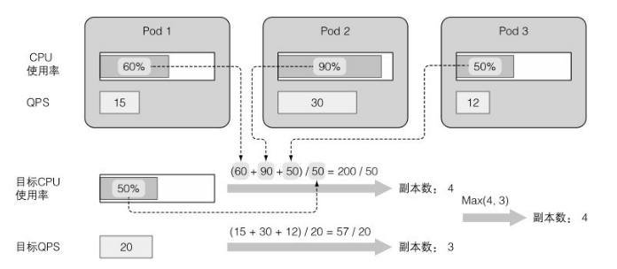

# 第 15 章 自动横向伸缩 pod 与集群节点

## 1.pod 的横向自动伸缩

横向 pod 自动伸缩是指由控制器管理的 pod 副本数量的自动伸缩。它 由 Horizontal 控 制 器 执 行 ， 通过创建⼀个 HorizontalpodAutoscaler（HPA）资源来启用和配置 Horizontal 控制器。 该控制器周期性检查 pod 度量，计算满⾜ HPA 资源所配置的⽬标数值所需的副本数量，进而调整⽬标资源（如 Deployment、ReplicaSet、 ReplicationController、StatefulSet 等）的 replicas 字段。

### 了解自动伸缩过程

自动伸缩的过程可以分为三个步骤：

1. 获取被伸缩资源对象所管理的所有 pod 度量。
2. 计算使度量数值到达（或接近）所指定⽬标数值所需的 pod 数量。
3. 更新被伸缩资源的 replicas 字段。

#### 获取 pod 度量

Autoscaler 本⾝并不负责采集 pod 度量数据，pod 与节点度量数据是由运行在每个节点的 kubelet 之上，名为 cAdvisor 的 agent 采集的。



> 期望副本数 = ceil[当前副本数 * (当前指标 / 期望指标)]

### 基于 CPU 使用率进行自动伸缩

就 Autoscaler 而⾔，只有 pod 的保证 CPU 用量（CPU 请求）才与确认
pod 的 CPU 使用有关。Autoscaler 对⽐ pod 的实际 CPU 使用与它的请求， 这意味着你需要给被伸缩的 pod 设置 CPU 请求，不管是直接设置还是通 过 LimitRange 对象间接设置，这样 Autoscaler 才能确定 CPU 使用率。

#### 基于 CPU 使用率创建 HPA

你需要确保 Deployment 所创建的所有 pod 都指定了 CPU 资源请求，这样 才有可能实现自动伸缩

```yaml
apiVersion: apps/v1
kind: Deployment
metadata:
  name: kubia
spec:
  selector:
    matchLabels:
      app: kubia
  replicas: 3
  template:
    metadata:
      name: kubia
      labels:
        app: kubia
    spec:
      containers:
        - image: luksa/kubia:v1
          name: nodejs
          resources:
            requests:
              cpu: 100m
```

使用 kubectl autoscale 为 depolyment 创建 HorizontalpodAutoscaler （HPA）对象。

```bash
$ kubectl autoscale deployment kubia --cpu-percent=30 --min=1 --max=5
horizontalpodautoscaler.autoscaling/kubia autoscaled
```
