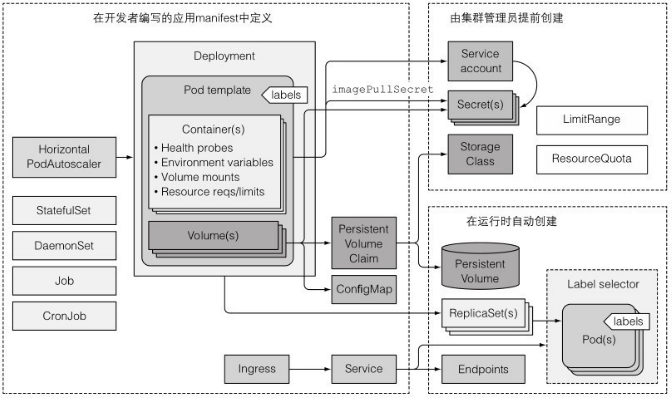
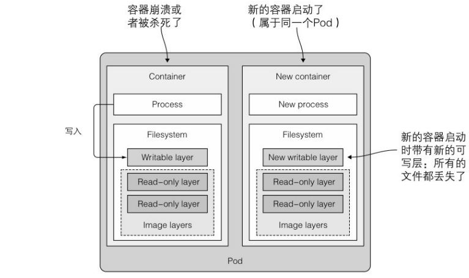
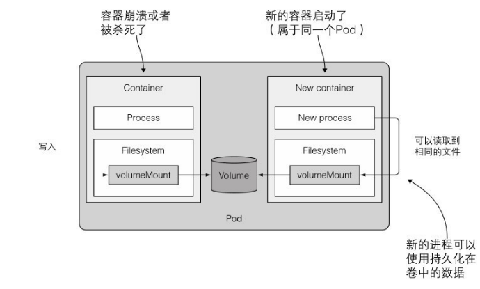
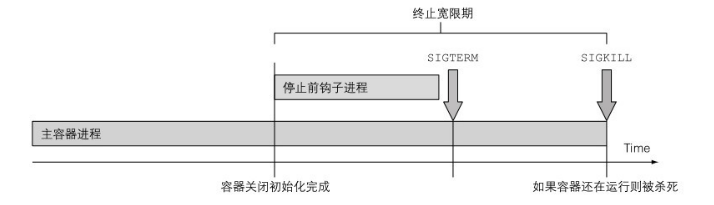
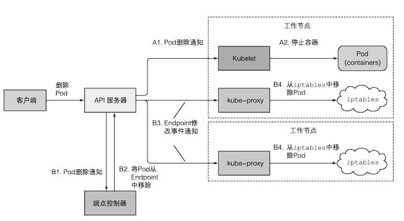
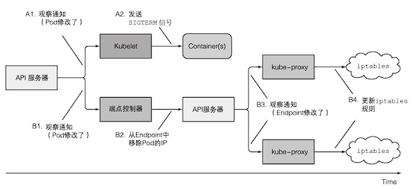
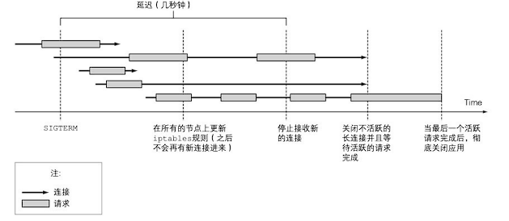

# 开发应用的最佳实践

## 1.集中⼀切资源

⼀个实际应用程序的各个组成部分:



## 2.了解 pod 的生命周期

### 应用必须预料到会被杀死或者重新调度

#### 预料到本地 IP 和主机名会发生变化

当⼀个 pod 被杀死并且在其他地方运行之后（技术上来讲是⼀个新的 pod 替换了旧的 pod，旧 pod 没有被迁移），它不仅拥有了⼀个新的 IP 地址还有了⼀个新的名称和主机名。⼤部分⽆状态的应用都可以处理这种场景不会有不利的影响，但是有状态服务通常不能。我们已经了解到有状态应用可以通过⼀个 StatefulSet 来运行，StatefulSet 会保证在将应用调度到新的节点并启动之后，可以看到和之前⼀样的主机 和持久化状态。当然 pod 的 IP 还是会发生变化，应用必须能够应对这种变化。因此应用开发者在⼀个集群应用中不应该依赖成员的 IP 地址来构建彼此的关系，另外如果使用主机名来构建关系，必须使用 StatefulSet。

#### 预料到写入磁盘的数据会消失

在应用往磁盘写入数据的情况下， 当应用在新的 pod 中启动后这些数据可能会丢失，除⾮你将持久化的存储挂载到应用的数据写入路径。在 pod 被重新调度的时候，数据丢失是一定的，但是即使在没有调度的情况下，写入磁盘的文件仍然会丢失。甚至是在单个 pod 的生命周期过程中，pod 中的应用写入磁盘的文件也会丢失。
单个容器可能因为各种原因被重启，例如进程崩溃了，例如存活探针返回失败了，或者是因为节点内存逐步耗尽，进程 被 OOMKiller 杀死了。当上述情况发生的时候，pod 还是⼀样，但是容器却是全新的了。Kubelet 不会⼀个容器运行多次，而是会重新创建⼀个容器。



#### 使用存储卷来跨容器持久化数据

需要至少使用⼀个 pod 级别的卷。因为卷的存在和销毁与 pod 生命周期是⼀致的，所以新的容器将可以重用之前容器写到卷上的数据。



### 重新调度死亡的或者部分死亡的 pod

如果⼀个 pod 的容器⼀直处于崩溃状态，Kubelet 将会⼀直不停地重启它们。每次重启的时间间隔将会以指数级增加，直到达到 5 分钟。在这个 5 分钟的时间间隔中，pod 基本上是死亡了，因为它们的容器进程没有运行。

### 以固定顺序启动 pod

#### 了解 pod 是如何启动的

当你使用 Kubernetes 来运行多个 pod 的应用的时候，Kubernetes 没有内置的方法来先运行某些 pod 然后等这些 pod 运行成功后再运行其他 pod。当然你也可以先发布第⼀个应用的配置，然后等待 pod 启动完毕 再发布第⼆个应用的配置。但是你的整个系统通常都是定义在⼀个单独的 YAML 或者 JSON 文件中，这些文件包含了多个 pod、服务或者其他对象的定义。 Kubernetes API 服务器确实是按 YAML/JSON 文件中定义的对象的顺序来进行处理的，但是仅仅意味着它们在被写入到 etcd 的时候是有顺序的。⽆法确保 pod 会按照那个顺序启动。 但是你可以阻止⼀个主容器的启动，直到它的预置条件被满⾜。这个是通过在 pod 中包含⼀个叫作 init 的容器来实现的。

#### init 容器介绍

它们可以用来初始化 pod，这通常意味着向容器的存储卷中写入数据，然后将这个存储卷挂载到主容器中。
⼀个 pod 可以拥有任意数量的 init 容器。init 容器是顺序执行的，并且仅当最后⼀个 init 容器执行完毕才会去启动主容器。

#### 将 init 容器加入 pod

```yaml
apiVersion: v1
kind: Pod
metadata:
  name: fortune-client
spec:
  initContainers:
    - name: init
      image: busybox
      command:
        - sh
        - -c
        - 'while true; do echo "Waiting for fortune service to come up..."; wget http://fortune -q -T 1 -O /dev/null >/dev/null 2>/dev/null && break; sleep 1; done; echo "Service is up! Starting main container."'
  containers:
    - image: busybox
      name: main
      command:
        - sh
        - -c
        - 'echo "Main container started. Reading fortune very 10 seconds."; while true; do echo "-------------"; wget -q -O - http://fortune; sleep 10; done'
```

部署这个 pod 的时候，只有 pod 的 init 容器会启动起来。

```bash
$ kubectl get po fortune-client
NAME             READY   STATUS     RESTARTS   AGE
fortune-client   0/1     Init:0/1   0          33s
```

查看 init 容器的日志

```bash
$ kubectl logs fortune-client -c init
Waiting for fortune service to come up...
```

当运行 kubectl logs 命令的时候，需要通过选项-c 来指定 init 容器的名称。

#### 处理 pod 内部依赖的最佳实践

但是更佳的情况是构建⼀个不需要它所依赖的服务都准备好后才能启动的应用。毕竟，这些服务在后⾯也有可能下线，但是这个时候应用已经在运行中了。
应用需要自身能够应对它所依赖的服务没有准备好的情况。另外不要忘了 Readiness 探针。需要这样做的原因不仅是这个就绪探针收到的信号会阻止应用成为⼀个服务端点，而且 Deployment 控制器在滚动升级的时候会使用应用的就绪探针，因此可以避免错误版本的出现。

### 增加生命周期钩子

除 init 外还有两种类型的生命周期钩子：

> 启动后（Post-start）钩子
> 停止前（Pre-stop）钩子

这些生命周期的钩子是基于每个容器来指定的，和 init 容器不同的是，init 容器是应用到整个 pod。
生命周期钩子与存活探针和就绪探针相似的是它们都可以：

> 在容器内部执行⼀个命令
> 向⼀个 URL 发送 HTTP GET 请求

#### 使用启动后容器生命周期钩子

启动后钩子是在容器的主进程启动之后立即执行的。
这个钩子和主进程是并行执行的。钩子的名称或许有误导性，因为它并不是等到主进程完全启动后（如果这个进程有⼀个初始化的过 程，Kubelet 显然不会等待这个过程完成，因为它并不知道什么时候会 完成）执行的。
在钩子执行完毕之前，容器会⼀直停留在 Waiting 状态，其原因是 ContainerCreating。因此，pod 的状态会是 Pending 而不是 Running。如果钩子运行失败或者返回了⾮零的状态码，主容器会被杀死。

```yaml
apiVersion: v1
kind: Pod
metadata:
  name: pod-with-poststart-hook
spec:
  containers:
    - image: luksa/kubia
      name: kubia
      lifecycle:
        postStart:
          exec:
            command:
              - sh
              - -c
              - "echo 'hook will fail with exit code 15'; sleep 5 ; exit 15"
```

遗憾的是，如果钩子程序启动的进程将日志输出到标准输出终端，你将⽆法在任何地方看到它们。这样就会导致调试生命周期钩子程序⾮常痛苦。果钩子程序失败了，你仅仅会在 pod 的事件中看到⼀ 个 FailedPostStartHook 的告警信息（可以通过命令 kubectl describe pod 来 查看）。

pod 的事件显式了基于命令的钩子程序的退出码

```bash
$ kubectl get po pod-with-poststart-hook
Warning  FailedPostStartHook  1s    kubelet            Exec lifecycle hook ([sh -c echo 'hook will fail with exit code 15'; sleep 5 ; exit 15]) for Container "kubia" in Pod "pod-with-poststart-hook_default(4aed9e24-be35-4ec5-b22a-6b4c195facfe)" failed - error: command 'sh -c echo 'hook will fail with exit code 15'; sleep 5 ; exit 15' exited with 15: , message: "hook will fail with exit code 15\n"
Normal   Killing              1s    kubelet            FailedPostStartHook
```

#### 使用停止前容器生命周期钩子

停止前钩子是在容器被终止之前立即执行的。当⼀个容器需要终止运行的时候，Kubelet 在配置了停止前钩子的时候就会执行这个停止 前钩子，并且仅在执行完钩子程序后才会向容器进程发送 SIGTERM 信 号（如果这个进程没有优雅地终止运行，则会被杀死）。 停止前钩子在容器收到 SIGTERM 信号后没有优雅地关闭的时候，可以利用它来触发容器以优雅的方式关闭。这些钩子也可以在容器终 止之前执行任意的操作，并且并不需要在应用内部实现这些操作（当你在运行⼀个第三方应用，并且在⽆法访问应用或者修改应用源码的 情况下很有用）。

```yaml
apiVersion: v1
kind: Pod
metadata:
  name: pod-with-prestop-hook
spec:
  containers:
    - image: luksa/kubia
      name: kubia
      ports:
        - containerPort: 8080
          protocol: TCP
      lifecycle:
        preStop:
          httpGet:
            port: 8080
            path: shutdown
```

确保请求不会发送到 localhost，因为 localhost 表⽰节点，而不是 pod。
和启动后钩子不同的是，⽆论钩子执行是否成功容器都会被终止。如果停止前钩子执行失败了，你会在 pod 的事件中看到⼀个 FailedPreStopHook 的告警。

#### 在应用没有收到 SIGTERM 信号时使用停止前钩子

应用没有接收到信号的原因 并不是 Kubernetes 没有发送信号，而是因为在容器内部信号没有被传递给应用的进程。如果容器镜像配置是通过执行⼀个 shell 进程，然 后在 shell 进程内部执行应用进程，那么这个信号就被这个 shell 进程吞没了，这样就不会传递给子进程。
在这种情况下，合理的做法是让 shell 进程传递这个信号给应用进程，而不是添加⼀个停止前钩子来发送信号给应用进程。可以通过在 作为主进程执行的 shell 进程内处理信号并把它传递给应用进程的方式 来实现。或者如果你⽆法配置容器镜像执行 shell 进程，而是通过直接 运行应用的⼆进制文件，可以通过在 Dockerfile 中使用 ENTRYPOINT 或 者 CMD 的 exec 方式来实现，即 ENTRYPOINT[ʺ/mybinaryʺ] 而不是 ENTRYPOINT /mybinary。
在通过第⼀种方式运行⼆进制文件 mybinary 的容器中，这个进程就是容器的主进程，而在第⼆种方式中，是先运行⼀个 shell 作为主进 程，然后 mybinary 进程作为 shell 进程的子进程运行。

#### 了解生命周期钩子是针对容器而不是 pod

### 了解 pod 的关闭

让我们从头开始，pod 的关闭是通过 API 服务器删除 pod 的对象来触发的。当接收到 HTTP DELETE 请求后，API 服务器还没有删除 pod 对 象，而是给 pod 设置⼀个 deletionTimestamp 值。拥有 deletionTimestamp 的 pod 就开始停止了。
当 Kubelet 意识到需要终止 pod 的时候，它开始终止 pod 中的每个容器。Kubelet 会给每个容器⼀定的时间来优雅地停止。这个时间叫作终 止宽限期（Termination Grace Period），每个 pod 可以单独配置。在终止 进程开始之后，计时器就开始计时，接着按照顺序执行以下事件：

1. 执行停止前钩子（如果配置了的话），然后等待它执行完毕
2. 向容器的主进程发送 SIGTERM 信号
3. 等待容器优雅地关闭或者等待终止宽限期超时
4. 如果容器主进程没有优雅地关闭，使用 SIGKILL 信号强制终止进程



#### 指定终止宽限期

终止宽限期可以通过 pod spec 中的 spec.terminationGracePeriodPeriods 字段来设置。默认情况下，值为 30，表⽰容器在被强制终止之 前会有 30 秒的时间来自行优雅地终止。
在删除 pod 的时候，pod spec 中指定的终止宽限时间也可以通过如 下方式来覆盖：

```bash
kubectl delete po mypod --grace-period=5
```

当 pod 所有的容器都停止后，Kubelet 会通知 API 服务器，然后 pod 资源最终都会被删除。可以强制 API 服务器立即删除 pod 资源，而不用等待确认。可以通过设置宽限时间为 0，然后增加⼀个--force 选项来实现：

```bash
kubectl delete po mypod --grace-period=0 --force
```

只有在确认 pod 不会再运行，或者⽆法和集群中的其他成员通信（可以通过托管 pod 的节点网络连接失败并且⽆法重连来确认）的情况下再强制删除有状态的 pod。

#### 在应用中合理地处理容器关闭操作

应用应该通过启动关闭流程来响应 SIGTERM 信号，并且在流程结束后终止运行。
在这个关闭的过程中，这个 pod 需要将它的数据迁移到其他存活的 pod 上⾯以确保数据不会丢失。那么 这个 pod 是否应该在接收到终止信号的时候就开始迁移数据（⽆论是通 过 SIGTERM 信号还是停止前钩子）？
完全不是！这种做法是不推荐的，理由至少有两点： ⼀个容器终止运行并不⼀定代表整个 pod 被终止了。 你⽆法保证这个关闭流程能够在进程被杀死之前执行完毕。 第⼆种场景不仅会在应用在超过终止宽限期还没有优雅地关闭时
发生，还会在容器关闭过程中运行 pod 的节点出现故障时发生。即使这 个时候节点又重启了，Kubelet 不会重启容器的关闭流程（甚至都不会 再启动这个容器了）。这样就⽆法保证 pod 可以完成它整个关闭的流 程。

#### 将重要的关闭流程替换为专注于关闭流程的 pod

⼀个解决方案是让应用（在接收到终止信号的时候）创建⼀个新的 Job 资源，这个 Job 资源会运行⼀个新的 pod，这个 pod 唯⼀的⼯作就是把被删除的 pod 的数据迁移到仍然存活的 pod。但是如果你注意到的话，你就会了解你⽆法保证应用每次都能够成功创建这个 Job 对象。万⼀当应用要去创建 Job 的时候节点出现故障呢？ 这个问题的合理的解决方案是用⼀个专门的持续运行中的 pod 来持续检查是否存在孤立的数据。当这个 pod 发现孤立的数据的时候，它就可以把它们迁移到仍存活的 pod。当然不⼀定是⼀个持续运行的 pod， 也可以使用 CronJob 资源来周期性地运行这个 pod。

## 3. 确保所有的客户端请求都得到了妥善处理

### 在 pod 启动时避免客户端连接断开

需要做的是当且仅当应用准备好处理进来的请求的时候，才去让就绪探针返回成功。好的实践第⼀步是添加⼀个指向应用根 URL 的 HTTP GET 请求的就绪探针。

### 在 pod 关闭时避免客户端连接断开

#### 了解 pod 删除时发生的⼀连串事件



当 API 服务器接收到删除 pod 的请求之后，它⾸先修改了 etcd 中的状态并且把删除事件通知给观察者。其中的两个观察者就是 Kubelet 和端点控制器（Endpoint Controller）。



简要概括⼀下，妥善关闭⼀个应用包括如下步骤：

1. 等待几秒钟，然后停止接收新的连接。
2. 关闭所有没有请求过来的长连接。
3. 等待所有的请求都完成。
4. 然后完全关闭应用。



## 4.让应用在 Kubernetes 中方便运行和管理

### 构建可管理的容器镜像

当你把应用打包进镜像的时候，可以包括应用的⼆进制文件和它的依赖库，或者可以将⼀个完整的操作系统和应用打包在⼀起。
部署新的 pod 或者扩展它们会很快。这个要求镜像⾜够⼩而且不包容任何⽆用的东西。

### 合理地给镜像打标签，正确地使用 ImagePullPolicy

必须使用能够指明具体版本的标签而不是 latest。记住如果使用的是可更改的标签（总是向相同的标签推送更改），那么你需要在 podspec 中将 imagePullPolicy 设置为 Always。

### 使用多维度而不是单维度的标签

别忘了给所有的资源都打上标签，而不仅仅是 pod。确保给每个资源添加了多个标签，这样就可以通过不同的维度来选择它们了。
标签可以包含如下的内容

> 资源所属的应用（或者微服务）的名称
> 应用层级（前端、后端，等等）
> 运行环境（开发、测试、预发布、⽣产，等等）
> 版本号
> 发布类型（稳定版、⾦丝雀、蓝绿开发中的绿⾊或者蓝⾊，等
> 等）
> 租户（如果你在每个租户中运行不同的 pod 而不是使用命名空间）
> 分⽚（带分⽚的系统）

标签管理可以让你以组而不是隔离的方式来管理资源，从而很容易了解资源的归属。

### 通过注解描述每个资源

可以使用注解来给资源添加额外的信息。资源至少应该包括⼀个描述资源的注解和⼀个描述资源负责⼈的注解。
在微服务框架中，pod 应该包含⼀个注解来描述该 pod 依赖的其他服务的名称。这样就很容易展现 pod 之间的依赖关系了。其他的注解可以包括构建和版本信息，以及其他⼯具或者图形界⾯会使用到的元信息（图标名称等）。

### 给进程终止提供更多的信息

为了让诊断过程更容易，可以使用 Kubernetes 的另⼀个特性，这个特性可以在 pod 状态中很容易地显⽰出容器终止的原因。可以让容器中的进程向容器的文件系统中指定文件写入⼀个终止消息。这个文件的内容会在容器终止后被 Kubelet 读取，然后显⽰在 kubectl describe pod 中。操作⼈员⽆须去查看容器的日志就可以很快地看到应用为什么终止了。这个进程需要写入终止消息的文件默认路径是 /dev/termination/log ，当然这个路径也可以在 pod spec 中容器定义的部分设置 terminationMessagePath 字段来自定义。

可以通过运行⼀个容器会⽴即死亡的 pod 来实际看⼀下这个过程:

```yaml
apiVersion: v1
kind: Pod
metadata:
  name: pod-with-termination-message
spec:
  containers:
    - image: busybox
      name: main
      command:
        - sh
        - -c
        - 'echo "I''ve had enough" > /var/termination-reason ; exit 1'
      terminationMessagePath: /var/termination-reason
```

当运行这个 pod 的时候 ，你会很快看到 pod 的状态变 成 CrashLoopBackOff。这个时候如果你使用 kubectl describe，你会看到容器为什么死亡了，而不需要去深入到它的日志中。

```bash
$ kubectl describe po pod-with-termination-message
...
 Last State:  Terminated
      Reason:    Error
      Message:   I've had enough

      Exit Code:    1
      Started:      Thu, 24 Nov 2022 13:17:51 +0800
      Finished:     Thu, 24 Nov 2022 13:17:51 +0800
    Ready:          False
    Restart Count:  1
...
```
