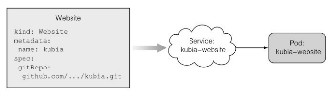
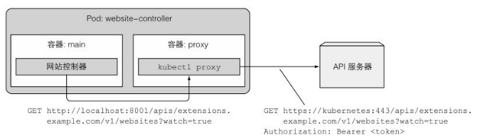
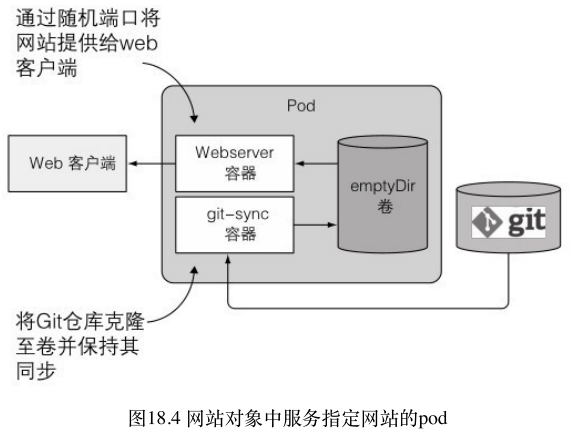
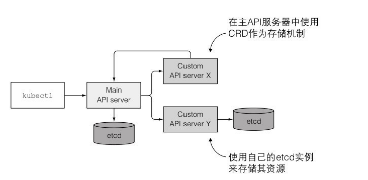

# 第 18 章 Kubernetes 应用扩展

## 1.定义自定义 API 对象

我们能使用自定义控件观察⾼阶对象，并在这些⾼阶对象的基础上创建 底层对象。例如，你想在 Kubernetes 集群中运行⼀个 messaging 代理，只 需要创建⼀个队列资源实例，而自定义队列控件将自动完成所需的 Secret、Deployment 和 Service。

### CustomResourceDefinitions 介绍

开发者只需向 Kubernetes API 服务器提交 CRD 对象，即可定义新的资源类型。CRD 与所有 Kubernetes 核心资源都有⼀个关联控制器。

#### CRD 范例介绍

如果你想让自⼰的 Kubernetes 集群用户不必处理 pod、服务以及其他 Kubernetes 资源，甚⾄只需要确认网站域名以及网站中的⽂件 （HTML、CSS、PNG，等等）就能以最简单的⽅式运行静态网站。这时候，你需要⼀个 Git 存储库当作这些⽂件的来源。当用户创建网站资 源实例时，你希望 Kubernetes 创建⼀个新的 web 服务器 pod。并通过服务将它公开。



```yaml
kind: Website
metadata:
  name: kubia
spec:
  gitRepo: https://github.com/luksa/kubia-website-example.git
```

#### 创建⼀个 CRD 对象

可以用 CRD 中指定的 names.kind 属性，即 kind: Website。extensions.example.com 的部分是资源的 API 组。

```yaml
apiVersion: apiextensions.k8s.io/v1
kind: CustomResourceDefinition
metadata:
  name: websites.extensions.example.com
spec:
  # 可以是 Namespaced 或 Cluster
  scope: Namespaced
  group: extensions.example.com
  versions:
    - name: v1
      # 每个版本都可以通过 served 标志来独立启用或禁止
      served: true
      # 其中一个且只有一个版本必需被标记为存储版本
      storage: true
      schema:
        openAPIV3Schema:
          type: object
          properties:
            spec:
              type: object
              properties:
                image:
                  type: string
                replicas:
                  type: integer
                gitRepo:
                  type: string
  names:
    # 名称的复数形式，用于 URL：/apis/<组>/<版本>/<名称的复数形式>
    plural: websites
    # 名称的单数形式，作为命令行使用时和显示时的别名
    singular: website
    # kind 通常是单数形式的驼峰命名（CamelCased）形式。你的资源清单会使用这一形式。
    kind: Website
    # shortNames 允许你在命令行使用较短的字符串来匹配资源
    shortNames:
      - ws
```

```bash
$ kubectl create -f website-crd.yaml
customresourcedefinition.apiextensions.k8s.io/websites.extensions.example.com created
```

#### 创建自定义资源实例

```yaml
apiVersion: extensions.example.com/v1
kind: Website
metadata:
  name: kubia
spec:
  gitRepo: https://github.com/luksa/kubia-website-example.git
```

```bash
$ kubectl create -f kubia-website.yaml
website.extensions.example.com/kubia created
```

#### 检索自定义资源实例

```bash
$ kubectl get websites
NAME    AGE
kubia   2m1s
```

与现有的 Kubernetes 资源⼀样，可以创建并列出自定义资源实例。也可以使用 kubectl describe 来查看自定义对象的详细信息，或者使用 kubectl get 检索整个 YAML 列表。

```bash
kubectl get website kubia -o yaml
```

```yaml
apiVersion: extensions.example.com/v1
kind: Website
metadata:
  creationTimestamp: "2022-11-27T06:32:39Z"
  generation: 1
  name: kubia
  namespace: default
  resourceVersion: "685304"
  uid: 4112e7d7-7ee0-49ee-9735-0dc7444e4482
spec:
  gitRepo: https://github.com/luksa/kubia-website-example.git
```

#### 删除自定义资源实例

```bash
$ kubectl delete website kubia
website.extensions.example.com "kubia" deleted
```

### 使用自定义控制器自动定制资源

为了让你的网站对象运行⼀个通过服务暴露的 web 服务器 pod，你就需要构建和部署⼀个网站控制器。它能查看 API 服务器创建网站对象的过程，然后为每⼀个对象创建服务和 Web 服务器 pod。


#### 了解网站控制器的功能

启动后，控制器⽴即开始通过以下 URL 请求查看网站对象：

> <http://localhost:8001/apis/extensions.example.com/v1/websites?watch=true>

通过识别主机名和端口，我们看到控制器不直接连接到 API 服务 器，而是连接到 kubectl proxy 进程。该进程在同⼀个 pod 中的 sidecar 容器中运行，并充当 API 服务器的 ambassador（见第 8 章）。代理将请求转发 给 API 服务器，并同时处理 TLS 加密和认证。


每次创建新的网站对象时，API 服务器都会发送 ADDED 监听事件。当控制器收到这样的事件时，就会在该监听事件所包含的网站对 象中提取网站名称和 Git 存储库的 URL，然后将它们的 JSON 清单发布到 API 服务器，来创建 Deployment 和 Service 对象。
当网站资源实例被删除时，API 服务器还会发送 DELETED 监听事 件。在收到事件后，控制器就会删除之前创建的 Deployment 资源和 Service 资源。与此同时，控制器也会关闭并删除为该网站提供服务的 web 服务器。


#### 将控制器作为 pod 运行

### 自定义 API 服务器

```yaml
apiVersion: apps/v1
kind: Deployment
metadata:
  name: website-controller
spec:
  selector:
    matchLabels:
      app: website-controller
  replicas: 1
  template:
    metadata:
      name: website-controller
      labels:
        app: website-controller
    spec:
      serviceAccountName: website-controller
      containers:
        - name: main
          image: luksa/website-controller
        - name: proxy
          image: luksa/kubectl-proxy:1.6.2
```


