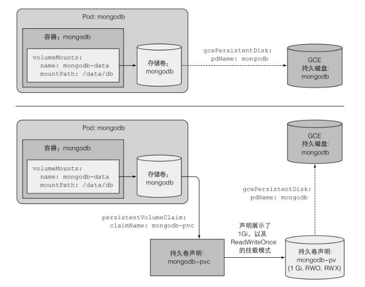

# 第六章 卷：将磁盘挂载到容器

## 1.卷介绍

- 问题：Pod 中每个容器的文件系统来自镜像，相互独立。
- 解决：使用存储卷，让容器访问外部磁盘空间、容器间共享存储。

卷是 Pod 生命周期的一部分，不是 k8s 资源对象。Pod 启动时创建，删除时销毁（文件可选保留）。用于 Pod 中挂载到多个容器进行文件共享。

卷类型：

- emptyDir：存放临时数据的临时空目录。
- hostPath：将 k8s worker 节点的系统文件挂载到 Pod 中，常用于单节点集群的持久化存储。
- persistentVolumeClaim：PVC 持久卷声明，用于预配置 PV

## 2.emptyDir 卷

1 个 Pod 中 2 个容器使用同一个 emptyDir 卷 html，来共享文件夹，随 Pod 删除而清除，属于非持久化存储。

```yaml
apiVersion: v1
kind: Pod
metadata:
  name: fortune
spec:
  containers:
    - image: luksa/fortune
      name: html-generator
      volumeMounts:
        - name: html
          mountPath: /var/htdocs
    - image: nginx:alpine
      name: web-server
      volumeMounts:
        - name: html
          mountPath: /usr/share/nginx/html
          readOnly: true
      ports:
        - containerPort: 80
          protocol: TCP
  volumes:
    - name: html
      emptyDir: {}
```

emptyDir 卷跟随 Pod 被 k8s 自动分配在宿主机指定目录：`/var/lib/kubelet/pods/PODUID/volumes/kubernetes.io~empty-dir/VOLUMENAME`

如上的 html 卷位置在 minikube 节点：

```shell
$ sudo ls -l /var/lib/kubelet/pods/144c55eb-edf5-4b44-a2f6-a0d9cfe04f7c/volumes/kubernetes.io~empty-dir/html
total 4
-rw-r--r-- 1 root root 80 Apr 26 05:01 index.html
```

## 3.hostPath 卷

hostPath 卷的数据不跟随 Pod 生命周期，下一个调度至此节点的 Pod 能继续使用前一个 Pod 留下的数据，pod 和节点是强耦合的，只适合单节点部署。
可以选择性地为 hostPath 卷指定 type。支持的 type 值如下：

| 取值              | 行为                                                                                                             |
| ----------------- | ---------------------------------------------------------------------------------------------------------------- |
| DirectoryOrCreate | 如果在给定路径上什么都不存在，那么将根据需要创建空目录，权限设置为 0755，具有与 kubelet 相同的组和属主信息。     |
| Directory         | 在给定路径上必须存在的目录。                                                                                     |
| FileOrCreate      | 如果在给定路径上什么都不存在，那么将在那里根据需要创建空文件，权限设置为 0644，具有与 kubelet 相同的组和所有权。 |
| File              | 在给定路径上必须存在的文件。                                                                                     |
| Socket            | 在给定路径上必须存在的 UNIX 套接字。                                                                             |
| CharDevice        | 在给定路径上必须存在的字符设备。                                                                                 |
| BlockDevice       | 在给定路径上必须存在的块设备。                                                                                   |

```yaml
apiVersion: v1
kind: Pod
metadata:
  name: test-pd
spec:
  containers:
    - image: registry.k8s.io/test-webserver
      name: test-container
      volumeMounts:
        - mountPath: /test-pd
          name: test-volume
  volumes:
    - name: test-volume
      hostPath:
        # 宿主上目录位置
        path: /data
        # 此字段为可选
        type: Directory
```

## 5.持久化卷 PV、持久化卷声明 PVC

PV 与 PVC 用于解耦 Pod 与底层存储。PV、PVC 与底层存储关系：



流程：

- 管理员向集群加入节点时准备 NFS 等存储资源（TODO ）
- 管理员创建指定大小和访问模式的 PV
- 用户创建需要大小的 PVC
- K8S 寻找符合 PVC 的 PV 并绑定
- 用户在 Pod 中通过卷引用 PVC，从而使用存储 PV 资源

Admin 通过网络存储创建 PV:

```yaml
apiVersion: v1
kind: PersistentVolume # 创建持久卷
metadata:
  name: mongodb-pv
spec:
  capacity:
    storage: 1Gi # 告诉 k8s 容量大小和多个客户端挂载时的访问模式
  accessModes:
    - ReadWriteOnce
    - ReadOnlyMany
  persistentVolumeReclaimPolicy: Retain # Cycle / Delete 标识 PV 删除后数据的处理方式
  hostPath: # 持久卷绑定到本地的 hostPath
    path: /tmp/mongodb
```

User 通过创建 PVC 来找到大小、容量均匹配的 PV 并绑定：

```yaml
apiVersion: v1
kind: PersistentVolumeClaim
metadata:
  name: mongodb-pvc # pvc 名称将在 pod 中引用
spec:
  resources:
    requests:
      storage: 1Gi
  accessModes:
    - ReadWriteOnce
  storageClassName: "" # 手动绑定 PVC 到已存在的 PV，否则有值就是等待绑定到匹配的新 PV
```

User 创建 Pod 使用 PVC：

```yaml
kind: Pod
metadata:
  name: mongodb
spec:
  containers:
    - image: mongo
      name: mongodb
      volumeMounts:
        - name: mongodb-data
          mountPath: /tmp/data
      ports:
        - containerPort: 27017
          protocol: TCP
  volumes:
    - name: mongodb-data
      persistentVolumeClaim: # pod 中通过 claimName 指定要引用的 PVC 名称
        claimName: mongodb-pvc
```

PV 设置卷的四种种访问模式：

- RWO：ReadWriteOnly：仅允许单个节点挂载读写
- ROX：ReadOnlyMany ：允许多个节点挂载只读
- RWX：ReadWriteMany：允许多个节点挂载读写
- RWOP：ReadWriteOncePod 卷可以被单个 Pod 以读写方式挂载。 如果你想确保整个集群中只有一个 Pod 可以读取或写入该 PVC， 请使用 ReadWriteOncePod 访问模式。这只支持 CSI 卷以及需要 Kubernetes 1.22 以上版本。
  注：PV 是集群级别的存储资源，PVC 和 Pod 是命名空间范围的。所以，在 A 命名空间的 PVC 和在 B 命名空间的 PVC 都有可能绑到同一个 PV 上。

## 6.动态 PV：存储类 StorageClass

场景：进一步解耦 Pod 与 PVC，使 Pod 不依赖 PVC 名称，而且跨集群移植只需保证 SC 一致即可，不用管 PVC 和 PV。同时还能给不同 PV 进行归档如按硬盘属性进行分类。

```yaml
apiVersion: storage.k8s.io/v1
kind: StorageClass
metadata:
  name: fast
provisioner: k8s.io/minikube-hostpath # 指定 SC 收到创建 PVC 请求时应调用哪个组件进行处理并返回 PV
parameters:
  type: pd-ssd
```

总流程：可创建 StorageClass 存储类资源，用于分类 PV，在 PVC 中绑定到符合条件的 PV 上。


