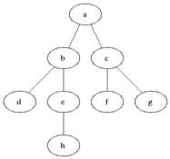
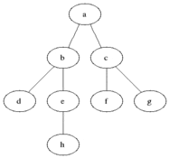

BFS (广度优先搜索) 是一种在树或图数据结构中搜索满足给定条件的节点的算法，其基本思想是从起始节点 (通常是根节点) 出发，探索当前深度的所有节点，然后再移动到下一个深度级别的节点，搜索过程中，需要额外的内存（通常是队列）来存储已经遍历到但尚未继续搜索的子节点，队列长度就是未搜索子节点的个数，直到搜索完所有节点或者找到满足条件的节点 (或路径)，算法结束。

> DFS: 不撞南墙不回头
> 
> BFS: 步步为营

### 算法基本步骤

1. 初始化队列
2. 将起始节点 (通常是根节点) 加入到队列中
3. 循环遍历队列 (队列不为空的前提下)，执行下列操作:
	1. 从队列中取出第一个节点
	2. 对该节点进行逻辑处理 (例如标记已访问、计算数据、更新当前层级等)
	3. 将该节点相邻的所有 (或者未访问) 节点全部加入到队列中
4. 重复第 3 步，直到队列为空或者所有节点均被访问

### 执行过程示例

下面是一个典型的图 (同时也是一棵树) 数据结构:



对该图执行 BFS 算法时，具体的执行过程中，每个节点被访问的顺序如图所示:




# [994. 腐烂的橘子 中等](https://leetcode.cn/problems/rotting-oranges/description/)

在给定的 `m x n` 网格 `grid` 中，每个单元格可以有以下三个值之一：

- 值 `0` 代表空单元格；
- 值 `1` 代表新鲜橘子；
- 值 `2` 代表腐烂的橘子。

每分钟，腐烂的橘子 **周围 4 个方向上相邻** 的新鲜橘子都会腐烂。

返回 _直到单元格中没有新鲜橘子为止所必须经过的最小分钟数。如果不可能，返回 `-1` _ 。

> **输入**：grid = [[2,1,1],[1,1,0],[0,1,1]]
> **输出**：4

## 思路


## 代码实现

```go
func orangesRotting(grid [][]int) int {
    // 定义方向数组，用于表示四个方向
    dirs := [][]int{{0, 1}, {0, -1}, {1, 0}, {-1, 0}}

    // 统计新鲜橘子的数量
    freshCount := 0
    for i := 0; i < len(grid); i++ {
        for j := 0; j < len(grid[i]); j++ {
            if grid[i][j] == 1 {
                freshCount++
            }
        }
    }

    // 如果没有新鲜橘子，则返回 0
    if freshCount == 0 {
        return 0
    }

    // 定义一个队列，用于存储腐烂的橘子的位置
    queue := make([][]int, 0)

    // 将所有腐烂的橘子的位置加入队列
    for i := 0; i < len(grid); i++ {
        for j := 0; j < len(grid[i]); j++ {
            if grid[i][j] == 2 {
                queue = append(queue, []int{i, j})
            }
        }
    }

    // 定义一个变量，用于记录经过的分钟数
    minutes := 0

    // 开始 BFS 遍历
    for len(queue) > 0 {
        size := len(queue)
        for i := 0; i < size; i++ {
            // 取出队首的腐烂的橘子
            cur := queue[0]
            queue = queue[1:]

            // 遍历四个方向
            for _, dir := range dirs {
                x := cur[0] + dir[0]
                y := cur[1] + dir[1]

                // 判断是否越界或者不是新鲜的橘子
                if x < 0 || x >= len(grid) || y < 0 || y >= len(grid[0]) || grid[x][y] != 1 {
                    continue
                }

                // 将新鲜的橘子变为腐烂
                grid[x][y] = 2

                // 将新鲜的橘子的位置加入队列
                queue = append(queue, []int{x, y})

                // 新鲜橘子的数量减一
                freshCount--
            }
        }

        // 经过的分钟数加一
        minutes++
    }

    // 如果还有新鲜橘子，则返回 -1
    if freshCount > 0 {
        return -1
    }

    // 返回经过的分钟数减一
    return minutes - 1
}
```

```rust
fn oranges_rotting(grid: Vec<Vec<i32>>) -> i32 {
    let dirs = vec![(0, 1), (0, -1), (1, 0), (-1, 0)];
    
    let mut grid = grid;
    let mut fresh_count = 0;
    let mut queue = VecDeque::new();

    for i in 0..grid.len() {
        for j in 0..grid[i].len() {
            if grid[i][j] == 1 {
                fresh_count += 1;
            } else if grid[i][j] == 2 {
                queue.push_back((i, j));
            }
        }
    }

    if fresh_count == 0 {
        return 0;
    }

    let mut minutes = 0;

    while !queue.is_empty() {
        let size = queue.len();
        for _ in 0..size {
            let (cur_x, cur_y) = queue.pop_front().unwrap();

            for dir in &dirs {
                let x = cur_x as isize + dir.0;
                let y = cur_y as isize + dir.1;

                // 判断是否越界或者不是新鲜的橘子
                if x < 0 || x >= grid.len() as isize || y < 0 || y >= grid[0].len() as isize {
                    continue;
                }

                let x = x as usize;
                let y = y as usize;

                if grid[x][y] != 1 {
                    continue;
                }

                grid[x][y] = 2;
                queue.push_back((x, y));
                fresh_count -= 1;
            }
        }
        minutes += 1;
    }
    if fresh_count > 0 {
        return -1;
    }
    minutes
}
```

# [934. 最短的桥 中等](https://leetcode.cn/problems/shortest-bridge/description/)

给你一个大小为 `n x n` 的二元矩阵 `grid` ，其中 `1` 表示陆地，`0` 表示水域。

**岛** 是由四面相连的 `1` 形成的一个最大组，即不会与非组内的任何其他 `1` 相连。`grid` 中 **恰好存在两座岛** 。

你可以将任意数量的 `0` 变为 `1` ，以使两座岛连接起来，变成 **一座岛** 。

返回必须翻转的 `0` 的最小数目。

> **输入：** grid = [[0,1,0],[0,0,0],[0,0,1]]
> **输出：** 2
## 思路

- **标记第一座岛屿**：
    - 使用双重循环遍历整个网格，找到第一个值为 `1` 的陆地。
    - 将该陆地标记为 `-1` 表示已访问，并将其加入 BFS 的初始队列 `q` 中。
    - 使用 BFS 遍历所有与该陆地相连的陆地，将它们全部标记为 `-1` 并加入队列 `q`。
- **BFS 寻找最短桥**：
    - 初始化步数 `step` 为 0。
    - 在队列 `q` 不为空的情况下，不断从队列中取出元素：
        - 对当前位置的四个方向进行探索。
        - 如果遇到值为 `1` 的陆地，说明找到了第二座岛屿，返回当前步数 `step`。
        - 如果遇到值为 `0` 的水域，将其标记为 `-1` 表示已访问，并加入队列 `q` 中。
        - 每层 BFS 结束后，步数 `step` 自增，表示当前层的搜索完毕，继续下一层的搜索。

## 代码实现

```go
func shortestBridge(grid [][]int) int {
	type pair struct{ x, y int }
	dirs := []pair{{-1, 0}, {1, 0}, {0, -1}, {0, 1}}
	n := len(grid)
	q := []pair{}
	island := []pair{}

	// 找到第一座岛屿并标记
	found := false
	for i := 0; i < n && !found; i++ {
		for j := 0; j < n && !found; j++ {
			if grid[i][j] == 1 {
				grid[i][j] = -1
				q = append(q, pair{i, j})
				found = true

				// BFS 标记第一座岛屿
				for len(q) > 0 {
					p := q[0]
					q = q[1:]
					island = append(island, p)
					for _, d := range dirs {
						x, y := p.x+d.x, p.y+d.y
						if 0 <= x && x < n && 0 <= y && y < n && grid[x][y] == 1 {
							grid[x][y] = -1
							q = append(q, pair{x, y})
						}
					}
				}
			}
		}
	}

	// BFS 找到最短桥
	step := 0
	for len(island) > 0 {
		size := len(island)
		for i := 0; i < size; i++ {
			p := island[0]
			island = island[1:]
			for _, d := range dirs {
				x, y := p.x+d.x, p.y+d.y
				if 0 <= x && x < n && 0 <= y && y < n {
					if grid[x][y] == 1 {
						return step
					}
					if grid[x][y] == 0 {
						grid[x][y] = -1
						island = append(island, pair{x, y})
					}
				}
			}
		}
		step++
	}

	return -1
}
```

# [463. 岛屿的周长 简单](https://leetcode.cn/problems/island-perimeter/description/)

给定一个 `row x col` 的二维网格地图 `grid` ，其中：`grid[i][j] = 1` 表示陆地， `grid[i][j] = 0` 表示水域。

网格中的格子 **水平和垂直** 方向相连（对角线方向不相连）。整个网格被水完全包围，但其中恰好有一个岛屿（或者说，一个或多个表示陆地的格子相连组成的岛屿）。

岛屿中没有“湖”（“湖” 指水域在岛屿内部且不和岛屿周围的水相连）。格子是边长为 1 的正方形。网格为长方形，且宽度和高度均不超过 100 。计算这个岛屿的周长。


> **输入：** grid = [[0,1,0,0],[1,1,1,0],[0,1,0,0],[1,1,0,0]]
> **输出：** 16
> **解释：** 它的周长是上面图片中的 16 个黄色的边

## 思路

判断四周边界的情况依次加一即可。

## 代码实现

```go
func islandPerimeter(grid [][]int) int {
	var dir [][]int = [][]int{{1, 0}, {-1, 0}, {0, 1}, {0, -1}}
	m, n := len(grid), len(grid[0])
	perimeter := 0
	for i := 0; i < m; i++ {
		for j := 0; j < n; j++ {
			if grid[i][j] == 0 {
				continue
			}
			for k := 0; k < 4; k++ {
				x, y := i+dir[k][0], j+dir[k][1]
				if x < 0 || x >= m || y < 0 || y >= n || grid[x][y] == 0 {
					perimeter++
				}
			}
		}
	}
	return perimeter
}
```

```rust
impl Solution {
    pub fn island_perimeter(grid: Vec<Vec<i32>>) -> i32 {
        let mut ans = 0;
        for i in 0..grid.len() {
            for j in 0..grid[0].len() {
                if grid[i][j] == 0 {
                    continue;
                }
                for (x, y) in [(i + 1, j), (i - 1, j), (i, j + 1), (i, j - 1)] {
                    ans += if x < grid.len() && y < grid[0].len() && grid[x][y] == 1 {
                        0
                    } else {
                        1
                    };
                }
            }
        }
        ans
    }
}
```

# [127. 单词接龙 困难](https://leetcode.cn/problems/word-ladder/description/)

字典 `wordList` 中从单词 `beginWord` 到 `endWord` 的 **转换序列** 是一个按下述规格形成的序列 `beginWord -> s1 -> s2 -> ... -> sk`：

- 每一对相邻的单词只差一个字母。
-  对于 `1 <= i <= k` 时，每个 `si` 都在 `wordList` 中。注意， `beginWord` 不需要在 `wordList` 中。
- `sk == endWord`

给你两个单词 `beginWord` 和 `endWord` 和一个字典 `wordList` ，返回 _从 `beginWord` 到 `endWord` 的 **最短转换序列** 中的 **单词数目**_ 。如果不存在这样的转换序列，返回 `0` 。

> **输入：** beginWord = "hit", endWord = "cog", wordList = ["hot","dot","dog","lot","log","cog"]
> **输出：** 5
> **解释：** 一个最短转换序列是 "hit" -> "hot" -> "dot" -> "dog" -> "cog", 返回它的长度 5。

## 思路

从 `beginWord` 出发，枚举所有替换一个字符的方案，如果方案存在于 `wordList` 中，则加入队列中，这样队列中就存在所有替换次数为 1 的单词。然后从队列中取出元素，继续这个过程，直到遇到 `endWord` 或者队列为空为止。

## 代码实现

```go
func ladderLength(beginWord string, endWord string, wordList []string) int {
	wordMap := make(map[string]struct{})
	for _, word := range wordList {
		wordMap[word] = struct{}{}
	}

	if _, ok := wordMap[endWord]; !ok {
		return 0
	}

	delete(wordMap, beginWord)
	ans := 1
	queue := []string{beginWord}

	for len(queue) > 0 {
		size := len(queue)
		for s := 0; s < size; s++ {
			word := queue[0]
			queue = queue[1:]

			for i := 0; i < len(word); i++ {
				for j := 'a'; j <= 'z'; j++ {
					newWord := word[:i] + string(j) + word[i+1:]
					if _, ok := wordMap[newWord]; ok {
						if newWord == endWord {
							return ans + 1
						}
						queue = append(queue, newWord)
						delete(wordMap, newWord)
					}
				}
			}
		}

		ans++
	}

	return 0
}
```

### 双向BFS

```go
func ladderLength(beginWord string, endWord string, wordList []string) int {
	// 将 wordList 转换为 set，以便于快速判断某个单词是否在列表中
	wordSet := make(map[string]bool)
	for _, word := range wordList {
		wordSet[word] = true
	}

	if !wordSet[endWord] {
		// endWord 不在列表中，无法转换到 endWord
		return 0
	}

	// 两端的 BFS 队列和访问记录
	beginQueue := []string{beginWord}
	endQueue := []string{endWord}
	beginVisited := make(map[string]bool)
	endVisited := make(map[string]bool)
	beginVisited[beginWord] = true
	endVisited[endWord] = true

	// 双向广度优先搜索
	level := 1
	for len(beginQueue) > 0 && len(endQueue) > 0 {
		// 选择节点数较少的一侧进行扩展
		if len(beginQueue) > len(endQueue) {
			beginQueue, endQueue = endQueue, beginQueue
			beginVisited, endVisited = endVisited, beginVisited
		}

		size := len(beginQueue)
		for i := 0; i < size; i++ {
			word := beginQueue[0]
			beginQueue = beginQueue[1:]

			for j := 0; j < len(word); j++ {
				for ch := 'a'; ch <= 'z'; ch++ {
					newWord := word[:j] + string(ch) + word[j+1:]
					if wordSet[newWord] {
						if endVisited[newWord] {
							// 找到了最短转换序列
							return level + 1
						}

						if !beginVisited[newWord] {
							// 将未访问过的单词加入队列，并标记为已访问
							beginQueue = append(beginQueue, newWord)
							beginVisited[newWord] = true
						}
					}
				}
			}
		}
		level++
	}

	// 无法转换到 endWord
	return 0
}
```

# [126. 单词接龙 II 困难](https://leetcode.cn/problems/word-ladder-ii/)

按字典 `wordList` 完成从单词 `beginWord` 到单词 `endWord` 转化，一个表示此过程的 **转换序列** 是形式上像 `beginWord -> s1 -> s2 -> ... -> sk` 这样的单词序列，并满足：

- 每对相邻的单词之间仅有单个字母不同。
- 转换过程中的每个单词 `si`（`1 <= i <= k`）必须是字典 `wordList` 中的单词。注意，`beginWord` 不必是字典 `wordList` 中的单词。
- `sk == endWord`

给你两个单词 `beginWord` 和 `endWord` ，以及一个字典 `wordList` 。请你找出并返回所有从 `beginWord` 到 `endWord` 的 **最短转换序列** ，如果不存在这样的转换序列，返回一个空列表。每个序列都应该以单词列表 `[beginWord, s1, s2, ..., sk]` 的形式返回。


> **输入：** beginWord = "hit", endWord = "cog", wordList = ["hot","dot","dog","lot","log","cog"]
> **输出：** [["hit","hot","dot","dog","cog"],["hit","hot","lot","log","cog"]]
> **解释：** 存在 2 种最短的转换序列：
> "hit" -> "hot" -> "dot" -> "dog" -> "cog"
> "hit" -> "hot" -> "lot" -> "log" -> "cog"

## 思路

- **初始化：**
    - 创建 `wordMap` 存储 `wordList` 中的所有单词，并检查 `endWord` 是否存在于 `wordMap` 中。如果不存在，返回空列表。
- **广度优先搜索：**
    - 使用队列 `queue` 从 `beginWord` 开始进行 BFS。
    - 遍历当前层的所有节点，生成所有可能的相邻单词。
    - 如果相邻单词在 `wordMap` 中且未被访问，加入队列并记录其前驱节点。
    - 使用 `found` 标志记录是否找到 `endWord`。
- **回溯找到所有最短路径：**
    - 从 `endWord` 开始，利用前驱节点记录进行 DFS 回溯，找到所有从 `beginWord` 到 `endWord` 的路径，并存储在 `res` 中。 从 `endWord` 开始回溯，只需要找到所有前驱节点，并沿着这些节点回溯即可。而从 `beginWord` 开始，需要维护大量的路径信息，容易导致重复计算和较高的空间复杂度。

## 代码实现

```go
func findLadders(beginWord string, endWord string, wordList []string) [][]string {
	wordSet := make(map[string]bool)
	for _, word := range wordList {
		wordSet[word] = true
	}
	wordSet[beginWord] = true

	if !wordSet[endWord] {
		return [][]string{}
	}

	levelMap := make(map[string]int)
	wordMap := make(map[string][]string)
	visited := make(map[string]bool)
	queue := []string{beginWord}
	visited[beginWord] = true
	level := 0
	levelMap[beginWord] = 0
	finished := false

	for len(queue) > 0 {
		levelSize := len(queue)
		level++
		for i := 0; i < levelSize; i++ {
			word := queue[0]
			queue = queue[1:]

			for j := 0; j < len(word); j++ {
				for c := 'a'; c <= 'z'; c++ {
					if c == rune(word[j]) {
						continue
					}
					newWordBytes := []byte(word)
					newWordBytes[j] = byte(c)
					newWord := string(newWordBytes)

					if !wordSet[newWord] {
						continue
					}
					wordMap[newWord] = append(wordMap[newWord], word)

					if visited[newWord] {
						continue
					}
					if newWord == endWord {
						finished = true
					}

					levelMap[newWord] = level
					queue = append(queue, newWord)
					visited[newWord] = true
				}
			}
		}
	}

	if !finished {
		return [][]string{}
	}

	var res [][]string

	var dfs func(path []string, word string)
	dfs = func(path []string, word string) {
		if word == beginWord {
			res = append(res, append([]string{beginWord}, path...))
			return
		}
		path = append([]string{word}, path...)
		if parents, ok := wordMap[word]; ok {
			for _, parent := range parents {
				if levelMap[parent]+1 == levelMap[word] {
					dfs(path, parent)
				}
			}
		}
		path = path[1:]
	}

	dfs([]string{}, endWord)

	return res
}

```

# [433. 最小基因变化 中等](https://leetcode.cn/problems/minimum-genetic-mutation/)

基因序列可以表示为一条由 8 个字符组成的字符串，其中每个字符都是 `'A'`、`'C'`、`'G'` 和 `'T'` 之一。

假设我们需要调查从基因序列 `start` 变为 `end` 所发生的基因变化。一次基因变化就意味着这个基因序列中的一个字符发生了变化。

- 例如，`"AACCGGTT" --> "AACCGGTA"` 就是一次基因变化。

另有一个基因库 `bank` 记录了所有有效的基因变化，只有基因库中的基因才是有效的基因序列。（变化后的基因必须位于基因库 `bank` 中）

给你两个基因序列 `start` 和 `end` ，以及一个基因库 `bank` ，请你找出并返回能够使 `start` 变化为 `end` 所需的最少变化次数。如果无法完成此基因变化，返回 `-1` 。

注意：起始基因序列 `start` 默认是有效的，但是它并不一定会出现在基因库中。

> 示例 1：
> **输入：** start = "AACCGGTT", end = "AACCGGTA", bank = ["AACCGGTA"]
> **输出：** 1

> 示例 2：
> **输入:** start = "AACCGGTT", end = "AAACGGTA", bank = ["AACCGGTA","AACCGCTA","AAACGGTA"]
> **输出:** 2


## 思路

- 排除边界条件：start 或 end 空或 bank 为空或 end 不在 bank 中。
- bfs 的初始化工作：初始化步长，初始化 queue，将 start 入队列，用 visit 来标记已经访问过的点。
- 进行 bfs：先将步长+1，然后确定每次 bfs 的长度 size，寻找目标基因，然后入队出队等操作

由于单向 `bfs` 类似金字塔，越到底层，塔基越大（而众多塔基中只有一点 end 满足条件），而且其回溯路径也少。所以我们采用双向 bfs，即既从 begin->end 遍历，又从 end->begin 遍历，当然每次我们都选用较短队列进行遍历，这样可减少用时。

## 代码实现

```go
func minMutation(start, end string, bank []string) int {
	m := make(map[string]struct{})
	for _, v := range bank {
		m[v] = struct{}{}
	}

	if _, ok := m[end]; !ok {
		return -1
	}
	startQueue := []string{start}
	endQueue := []string{end}
	startVisited := map[string]struct{}{start: struct{}{}}
	endVisited := map[string]struct{}{end: struct{}{}}
	ans := 1

	for len(startQueue) > 0 && len(endQueue) > 0 {
		if len(startQueue) > len(endQueue) {
			startQueue, endQueue = endQueue, startQueue
			startVisited, endVisited = endVisited, startVisited
		}

		length := len(startQueue)

		for i := 0; i < length; i++ {
			cur := startQueue[0]
			startQueue = startQueue[1:]
			for j := 0; j < len(cur); j++ {
				for _, v := range "ACGT" {
					if v == rune(cur[j]) {
						continue
					}

					next := cur[:j] + string(v) + cur[j+1:]
					if _, ok := m[next]; !ok {
						continue
					}

					if _, ok := endVisited[next]; ok {
						return ans
					}

					if _, ok := startVisited[next]; ok {
						continue
					}

					startQueue = append(startQueue, next)
					startVisited[next] = struct{}{}
				}
			}
			ans++
		}
	}
	return -1
}
```

# [1091. 二进制矩阵中的最短路径 中等](https://leetcode.cn/problems/shortest-path-in-binary-matrix/)

给你一个 `n x n` 的二进制矩阵 `grid` 中，返回矩阵中最短 **畅通路径** 的长度。如果不存在这样的路径，返回 `-1` 。

二进制矩阵中的 畅通路径 是一条从 **左上角** 单元格（即，`(0, 0)`）到 右下角 单元格（即，`(n - 1, n - 1)`）的路径，该路径同时满足下述要求：

- 路径途经的所有单元格的值都是 `0` 。
- 路径中所有相邻的单元格应当在 **8 个方向之一** 上连通（即，相邻两单元之间彼此不同且共享一条边或者一个角）。

**畅通路径的长度** 是该路径途经的单元格总数。


> **输入：** grid = [[0,1],[1,0]]
> **输出：** 2

## 思路

利用 BFS 从左上角逐步扩展到右下角，便可以很容易求解。注意每轮扩展需要考虑 8 个方向。

## 代码实现

```go
func shortestPathBinaryMatrix(grid [][]int) int {
	var (
		dirs = [][]int{{-1, -1}, {-1, 0}, {-1, 1}, {0, 1},
			{0, -1}, {1, -1}, {1, 0}, {1, 1}}
		queue   = [][]int{{0, 0}}
		ans     = 1
		m, n    = len(grid), len(grid[0])
		visited = make([][]bool, m)
	)
	for i := range visited {
		visited[i] = make([]bool, n)
	}

	if grid[0][0] == 1 || grid[m-1][n-1] == 1 {
		return -1
	}

	visited[0][0] = true

	for len(queue) != 0 {
		size := len(queue)
		for i := 0; i < size; i++ {
			x, y := queue[0][0], queue[0][1]
			queue = queue[1:]
			if x == m-1 && y == n-1 {
				return ans + 1
			}
			for _, dir := range dirs {
				dx, dy := x+dir[0], y+dir[1]
				if dx < 0 || dx >= m || dy < 0 || dy >= n || visited[dx][dy] || grid[dx][dy] == 1 {
					continue
				}

				queue = append(queue, []int{dx, dy})
				visited[dx][dy] = true
			}
		}
		ans++
	}

	return -1
}
```

# [752. 打开转盘锁 中等](https://leetcode.cn/problems/open-the-lock/description/)

你有一个带有四个圆形拨轮的转盘锁。每个拨轮都有10个数字： `'0', '1', '2', '3', '4', '5', '6', '7', '8', '9'` 。每个拨轮可以自由旋转：例如把 `'9'` 变为 `'0'`，`'0'` 变为 `'9'` 。每次旋转都只能旋转一个拨轮的一位数字。

锁的初始数字为 `'0000'` ，一个代表四个拨轮的数字的字符串。

列表 `deadends` 包含了一组死亡数字，一旦拨轮的数字和列表里的任何一个元素相同，这个锁将会被永久锁定，无法再被旋转。

字符串 `target` 代表可以解锁的数字，你需要给出解锁需要的最小旋转次数，如果无论如何不能解锁，返回 `-1` 。

> **输入：** deadends = ["0201","0101","0102","1212","2002"], target = "0202"
> **输出：** 6
> **解释：**
> 可能的移动序列为 "0000" -> "1000" -> "1100" -> "1200" -> "1201" -> "1202" -> "0202"。
> 注意 "0000" -> "0001" -> "0002" -> "0102" -> "0202" 这样的序列是不能解锁的，
> 因为当拨动到 "0102" 时这个锁就会被锁定。

## 思路

- "0000" 经过一次旋转，可变成的字符串是 0000 的邻接节点
- 维护一个队列，逐个考察这一层的所有 “节点”，安排它们的邻接点入列
- 1100 - 1000 - 1100 这样变回来，徒增转换的次数，违背求最小的要求
- 所以要跳过访问过的节点，同时也要跳过“死亡点”
- 一层一层地遍历节点，当访问到目标节点时，返回当前所在的层次，即为最小旋转次数。

## 代码实现

```go
func openLock(deadends []string, target string) int {
	deadendMap := make(map[string]struct{})
	for _, deadend := range deadends {
		deadendMap[deadend] = struct{}{}
	}

	queue := []string{"0000"}
	step := 0
	visited := make(map[string]struct{})

	for len(queue) > 0 {
		for i := len(queue); i > 0; i-- {
			cur := queue[0]
			queue = queue[1:]
			if cur == target {
				return step
			}
			if _, ok := deadendMap[cur]; ok {
				continue
			}
			if _, ok := visited[cur]; ok {
				continue
			}
			visited[cur] = struct{}{}

			for j := 0; j < len(cur); j++ {
				num := int(cur[j] - '0')
				up := (num + 1) % 10
				down := (num + 9) % 10
				queue = append(queue, cur[:j]+strconv.Itoa(up)+cur[j+1:])
				queue = append(queue, cur[:j]+strconv.Itoa(down)+cur[j+1:])
			}
		}
		step++
	}

	return -1
}
```

### 双向BFS

```go
func openLock(deadends []string, target string) int {
    deadendMap := make(map[string]struct{})
    for _, deadend := range deadends {
        deadendMap[deadend] = struct{}{}
    }

    if _, found := deadendMap["0000"]; found {
        return -1
    }
    if target == "0000" {
        return 0
    }

    startQueue := []string{"0000"}
    endQueue := []string{target}
    startVisited := map[string]struct{}{"0000": {}}
    endVisited := map[string]struct{}{target: {}}
    step := 1

    for len(startQueue) > 0 && len(endQueue) > 0 {
        if len(startQueue) > len(endQueue) {
            startQueue, endQueue = endQueue, startQueue
            startVisited, endVisited = endVisited, startVisited
        }

        length := len(startQueue)

        for i := 0; i < length; i++ {
            cur := startQueue[0]
            startQueue = startQueue[1:]
            for j := 0; j < len(cur); j++ {
                num := int(cur[j] - '0')
                for _, d := range []int{1, -1} {
                    next := cur[:j] + strconv.Itoa((num+d+10)%10) + cur[j+1:]

                    if _, found := deadendMap[next]; found {
                        continue
                    }

                    if _, found := endVisited[next]; found {
                        return step
                    }

                    if _, found := startVisited[next]; found {
                        continue
                    }

                    startQueue = append(startQueue, next)
                    startVisited[next] = struct{}{}
                }
            }
        }
        step++
    }

    return -1
}
```


# [1162. 地图分析 中等](https://leetcode.cn/problems/as-far-from-land-as-possible/description/)

你现在手里有一份大小为 `n x n` 的 网格 `grid`，上面的每个 单元格 都用 `0` 和 `1` 标记好了。其中 `0` 代表海洋，`1` 代表陆地。

请你找出一个海洋单元格，这个海洋单元格到离它最近的陆地单元格的距离是最大的，并返回该距离。如果网格上只有陆地或者海洋，请返回 `-1`。

我们这里说的距离是「曼哈顿距离」（ Manhattan Distance）：`(x0, y0)` 和 `(x1, y1)` 这两个单元格之间的距离是 `|x0 - x1| + |y0 - y1|` 。

**示例 1：**

****

> **输入：** grid = [[1,0,1],[0,0,0],[1,0,1]]
> **输出：** 2
> **解释：** 
> 海洋单元格 (1, 1) 和所有陆地单元格之间的距离都达到最大，最大距离为 2。

## 思路

我们可以将「源点/起点」和「汇点/终点」进行反转：从每个「陆地」区域出发，多个「陆地」区域每次同时向往扩散一圈，每个「海洋」区域被首次覆盖时所对应的圈数，就是「海洋」区域距离最近的「陆地」区域的距离。

我们可以想象存在一个「虚拟源点」，其与所有「真实源点」（陆地）存在等权的边，那么任意「海洋」区域与「最近的陆地」区域的最短路等价于与「虚拟源点」的最短路。
实现上，我们并不需要真的将这个虚拟源点建立出来，只需要将所有的「真实源点」进行入队即可。

这个过程相当于从队列中弹出「虚拟源点」，并把它所能到点（真实源点）进行入队，然后再进行常规的 BFS 即可。

## 代码实现

```go
func maxDistance(grid [][]int) int {
    m, n := len(grid), len(grid[0])
    queue := [][]int{}
    visited := make([][]bool, m)
    
    for i := 0; i < m; i++ {
        visited[i] = make([]bool, n)
        for j := 0; j < n; j++ {
            if grid[i][j] == 1 {
                queue = append(queue, []int{i, j})
                visited[i][j] = true
            }
        }
    }

    if len(queue) == 0 || len(queue) == m*n {
        return -1
    }

    dirs := [][]int{{1, 0}, {-1, 0}, {0, 1}, {0, -1}}
    level := -1

    for len(queue) > 0 {
        level++
        size := len(queue)
        for i := 0; i < size; i++ {
            x, y := queue[0][0], queue[0][1]
            queue = queue[1:]
            for _, dir := range dirs {
                nx, ny := x+dir[0], y+dir[1]
                if nx >= 0 && nx < m && ny >= 0 && ny < n && !visited[nx][ny] {
                    visited[nx][ny] = true
                    queue = append(queue, []int{nx, ny})
                }
            }
        }
    }

    return level
}
```

# [773. 滑动谜题 困难](https://leetcode.cn/problems/sliding-puzzle/description/)

在一个 `2 x 3` 的板上（`board`）有 5 块砖瓦，用数字 `1~5` 来表示, 以及一块空缺用 `0` 来表示。一次 **移动** 定义为选择 `0` 与一个相邻的数字（上下左右）进行交换.

最终当板 `board` 的结果是 `[[1,2,3],[4,5,0]]` 谜板被解开。

给出一个谜板的初始状态 `board` ，返回最少可以通过多少次移动解开谜板，如果不能解开谜板，则返回 `-1` 。


> **输入：** board = [[1,2,3],[4,0,5]]
> **输出：**1
> **解释：**交换 0 和 5 ，1 步完成

## 思路


## 代码实现

```go
func slidingPuzzle(board [][]int) int {
    neighbors := [][]int{{1, 3}, {0, 2, 4}, {1, 5}, {0, 4}, {1, 3, 5}, {2, 4}}
    
    startByte := []byte{}
    for _, v := range board {
        for _, vv := range v {
            startByte = append(startByte, byte(vv+'0'))
        }
    }
    start := string(startByte)
    end := "123450"
    if start == end {
        return 0
    }
    
    getNeighbors := func(status string) (ret []string) {
        s := []byte(status)
        x := strings.Index(status, "0")
        for _, y := range neighbors[x] {
            s[x], s[y] = s[y], s[x]
            ret = append(ret, string(s))
            s[x], s[y] = s[y], s[x]
        }
        return
    }
    
    startVisited := map[string]struct{}{start: {}}
    endVisited := map[string]struct{}{end: {}}
    startQueue := []string{start}
    endQueue := []string{end}
    ans := 0
    
    for len(startQueue) > 0 && len(endQueue) > 0 {
        if len(startQueue) > len(endQueue) {
            startQueue, endQueue = endQueue, startQueue
            startVisited, endVisited = endVisited, startVisited
        }
        
        length := len(startQueue)
        for i := 0; i < length; i++ {
            cur := startQueue[0]
            startQueue = startQueue[1:]
            if _, found := endVisited[cur]; found {
                return ans
            }
            for _, neighbor := range getNeighbors(cur) {
                if _, found := startVisited[neighbor]; found {
                    continue
                }
                startVisited[neighbor] = struct{}{}
                startQueue = append(startQueue, neighbor)
            }
        }
        ans++
    }
    
    return -1
}
```

# [815. 公交路线 困难](https://leetcode.cn/problems/bus-routes/description/)

给你一个数组 `routes` ，表示一系列公交线路，其中每个 `routes[i]` 表示一条公交线路，第 `i` 辆公交车将会在上面循环行驶。

- 例如，路线 `routes[0] = [1, 5, 7]` 表示第 `0` 辆公交车会一直按序列 `1 -> 5 -> 7 -> 1 -> 5 -> 7 -> 1 -> ...` 这样的车站路线行驶。

现在从 `source` 车站出发（初始时不在公交车上），要前往 `target` 车站。 期间仅可乘坐公交车。

求出 **最少乘坐的公交车数量** 。如果不可能到达终点车站，返回 `-1` 。

> **输入：** routes = [[1,2,7],[3,6,7]], source = 1, target = 6
> **输出：** 2
> **解释：** 最优策略是先乘坐第一辆公交车到达车站 7 , 然后换乘第二辆公交车到车站 6 。

## 思路

把公交车站看作图的各个节点，在到达某个车站时，可以考虑经过这个车站的所有线路，并乘坐所有的线路（即加入队列）。
如果之前乘坐过某条线路，那么有两种可能：
- 这条线路还在被遍历
- 这条线路已经走过了，但是并没有送达目的地
显然，这两种情况都是可以被剪枝掉的，因此可以维护一个 visited 数组用来记录。如果所有的线路都已经遍历完成，却仍没有到终点，这说明无法到达终点，返回-1 即可。

为了记录每个车站都有哪些线路经过，可以另外维护一个哈希表来记录。

## 代码实现

```go
func numBusesToDestination(routes [][]int, source int, target int) int {
	if source == target {
		return 0
	}

	stations := map[int][]int{}
	for i, route := range routes {
		for _, station := range route {
			stations[station] = append(stations[station], i)
		}
	}

	visited := make([]bool, len(routes))
	q := []int{source}
	ans := 0
	for len(q) != 0 {
		length := len(q)
		for i := 0; i < length; i++ {
			cur := q[0]
			q = q[1:]
			if cur == target {
				return ans
			}
			for _, route := range stations[cur] {
				if visited[route] {
					continue
				}
				visited[route] = true
				for _, station := range routes[route] {
					q = append(q, station)
				}
			}
		}
		ans++
	}

	return -1
}
```

### 双向BFS

```go
func numBusesToDestination(routes [][]int, source int, target int) int {
	if source == target {
		return 0
	}

	stations := map[int][]int{}
	for i, route := range routes {
		for _, station := range route {
			stations[station] = append(stations[station], i)
		}
	}

	startQueue := []int{source}
	endQueue := []int{target}
	startVisited := map[int]bool{}
	startVisited[source] = true
	endVisited := map[int]bool{}
	endVisited[target] = true
	visitedRoutes := make([]bool, len(routes))
	ans := 0

	for len(startQueue) != 0 && len(endQueue) != 0 {
		if len(startQueue) > len(endQueue) {
			startQueue, endQueue = endQueue, startQueue
			startVisited, endVisited = endVisited, startVisited
		}
		length := len(startQueue)
		for i := 0; i < length; i++ {
			cur := startQueue[0]
			startQueue = startQueue[1:]
			if endVisited[cur] {
				return ans
			}
			for _, route := range stations[cur] {
				if visitedRoutes[route] {
					continue
				}
				visitedRoutes[route] = true
				for _, station := range routes[route] {
					if startVisited[station] {
						continue
					}
					startVisited[station] = true
					startQueue = append(startQueue, station)
				}
			}
		}
		ans++
	}

	return -1
}
```