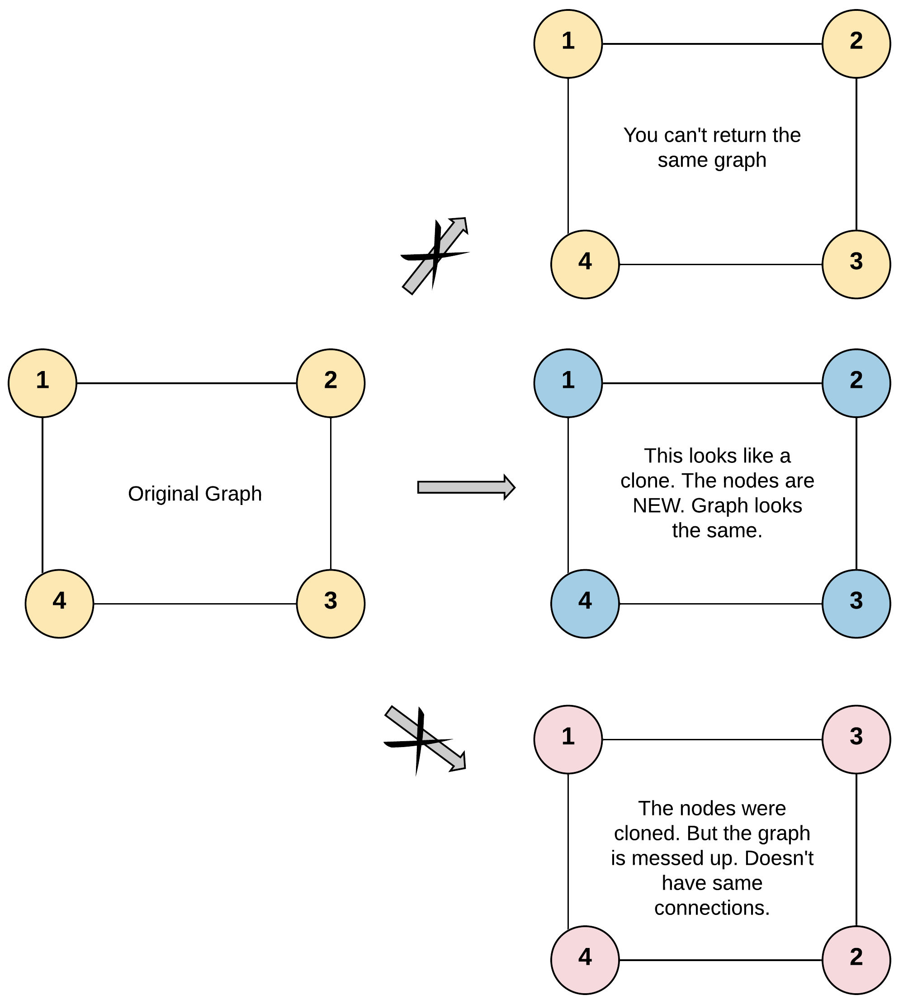

DFS (深度优先搜索) 是一种用于遍历树或图数据结构的算法，其基本思想是从起始节点 (通常是根节点) 出发，沿着路径尽可能进行深度搜索，直到到达最深的节点，然后再回溯到之前的节点继续 (递归) 深度搜索其他路径，直到搜索完所有可能的路径，算法结束。
# 算法基本步骤

1. 从起始节点 (根节点) 开始遍历，将其标记为已访问
    
2. 单次遍历过程中，对于 “当前节点”，依次访问其所有相邻节点
    
3. 对于每个相邻节点，如果未被访问过，递归调用 DFS
    
4. 当所有相邻节点都被访问过或当前节点没有相邻节点时，回溯到上一级节点，继续搜索其他路径
# [200. 岛屿数量](https://leetcode.cn/problems/number-of-islands/description/)

给你一个由 `'1'`（陆地）和 `'0'`（水）组成的的二维网格，请你计算网格中岛屿的数量。

岛屿总是被水包围，并且每座岛屿只能由水平方向和/或竖直方向上相邻的陆地连接形成。

此外，你可以假设该网格的四条边均被水包围。

> **输入**：grid = [
>   ["1","1","1","1","0"],
>   ["1","1","0","1","0"],
>   ["1","1","0","0","0"],
>   ["0","0","0","0","0"]
> ]
> **输出**：1

解题思路：

1. 递归结束条件: 当前坐标超出边界 (二维数组索引越界)，或者当前节点不是 '1' (陆地)
2. 确定 DFS 起始节点: 参数使用二维数组表示图的邻接表，那么就从数组第一个元素开始 `grid [0][0]`
3. 确定单次访问节点: 当前节点 上下左右 4 个方向所有为 '1' (陆地) 的节点 (这样就可以连成一片，形成一个小岛)，然后递归，单个节点访问之后，将值标记为 '0', 避免重复访问
4. 状态变量如何更新: 以当前节点开始，完成一轮 DFS 过程，岛屿数量 + 1

```go
func numIslands(grid [][]byte) int {
	var (
		dx             = []int{0, 1, -1, 0}
		dy             = []int{1, 0, 0, -1}
		rowLen, colLen = len(grid), len(grid[0])
		dfs            func(int, int)
		ans            int
	)
	
	dfs = func(row, col int) {
		var x, y int
		grid[row][col] = '0'
		for i := 0; i < 4; i++ {
			x, y = row+dx[i], col+dy[i]
			if x >= 0 && x < rowLen && y >= 0 && y < colLen && grid[x][y] == '1' {
				dfs(x, y)
			}
		}
	}
	
	for i := range grid {
		for j := range grid[i] {
			if grid[i][j] == '1' {
				dfs(i, j)
				ans++
			}
		}
	}
	return ans
}
```

# [130. 被围绕的区域](https://leetcode.cn/problems/surrounded-regions/description/)

给你一个 `m x n` 的矩阵 `board` ，由若干字符 `'X'` 和 `'O'` 组成，**捕获** 所有 **被围绕的区域**：

- **连接：**一个单元格与水平或垂直方向上相邻的单元格连接。
- **区域：连接所有** `'0'` 的单元格来形成一个区域。
- **围绕：**如果您可以用 `'X'` 单元格 **连接这个区域**，并且区域中没有任何单元格位于 `board` 边缘，则该区域被 `'X'` 单元格围绕。

> **输入：** board = [["X","X","X","X"],["X","O","O","X"],["X","X","O","X"],["X","O","X","X"]]
> **输出：** [["X","X","X","X"],["X","X","X","X"],["X","X","X","X"],["X","O","X","X"]]
> **解释：**
> 
> 在上图中，底部的区域没有被捕获，因为它在 board 的边缘并且不能被围绕。

解题思路：

注意到题目解释中提到：任何边界上的 O 都不会被填充为 X。我们可以想到，所有的不被包围的 O 都直接或间接与边界上的 O 相连。我们可以利用这个性质判断 O 是否在边界上，具体地说：

1. 对于每一个边界上的 O，我们以它为起点，标记所有与它直接或间接相连的字母 O。
2. 最后我们遍历这个矩阵，对于每一个字母：
    - 如果该字母被标记过，则该字母为没有被字母 X 包围的字母 O，我们将其还原为字母 O。
    - 如果该字母没有被标记过，则该字母为被字母 X 包围的字母 O，我们将其修改为字母 X。

```go
var dx []int = []int{0, -1, 1, 0}
var dy []int = []int{1, 0, 0, -1}

func solve(board [][]byte) {
	for i := range board {
		for j := range board[i] {
			if i == 0 || i == len(board)-1 || j == 0 || j == len(board[i])-1 {
				if board[i][j] == 'O' {
					dfs(i, j, board)
				}
			}
		}
	}

	for i := range board {
		for j := range board[i] {
			if board[i][j] == '*' {
				board[i][j] = 'O'
			} else if board[i][j] == 'O' {
				board[i][j] = 'X'
			}
		}
	}
}

func dfs(row, col int, board [][]byte) {
	if board[row][col] == 'O' {
		board[row][col] = '*'
		var x, y int
		for i := 0; i < 4; i++ {
			x, y = row+dx[i], col+dy[i]
			if x >= 0 && x < len(board) && y >= 0 && y < len(board[0]) && board[x][y] != 'X' {
				dfs(x, y, board)
			}
		}
	}
}
```

# [133. 克隆图](https://leetcode.cn/problems/clone-graph/description/)

给你无向 连通 图中一个节点的引用，请你返回该图的 深拷贝（克隆）。

图中的每个节点都包含它的值 val（int） 和其邻居的列表（list[Node]）。

```
class Node {
    public int val;
    public List<Node> neighbors;
}
```

**测试用例格式：**

简单起见，每个节点的值都和它的索引相同。例如，第一个节点值为 1（`val = 1`），第二个节点值为 2（`val = 2`），以此类推。该图在测试用例中使用邻接列表表示。

**邻接列表** 是用于表示有限图的无序列表的集合。每个列表都描述了图中节点的邻居集。

给定节点将始终是图中的第一个节点（值为 1）。你必须将 **给定节点的拷贝** 作为对克隆图的引用返回。


> **输入**：adjList = [[2,4],[1,3],[2,4],[1,3]]
> **输出**：[[2,4],[1,3],[2,4],[1,3]]
> **解释**：
> 图中有 4 个节点。
> 节点 1 的值是 1，它有两个邻居：节点 2 和 4 。
> 节点 2 的值是 2，它有两个邻居：节点 1 和 3 。
> 节点 3 的值是 3，它有两个邻居：节点 2 和 4 。
> 节点 4 的值是 4，它有两个邻居：节点 1 和 3 。

解题思路：

1. 递归结束条件: 当前节点为 nil, 或者当前节点已经被克隆，直接返回已经克隆的新节点
2. 确定 DFS 起始节点: 题目给出的参数节点
3. 确定单次访问节点: 当前节点的所有邻居节点
4. 使用一个 Hash 存储源和克隆的新节点之间的关系，访问当前源节点时，将克隆后的新节点和源节点完成映射

```go
func cloneGraph(node *Node) *Node {
	if node == nil {
		return nil
	}
	
	var (
		dfs     func(*Node) *Node
		visited = map[*Node]*Node{}
	)
	
	dfs = func(node *Node) *Node {
		if node == nil {
			return nil
		}
		if n, ok := visited[node]; ok {
			return n
		}
		n := &Node{Val: node.Val}
		visited[node] = n
		for _, v := range node.Neighbors {
			n.Neighbors = append(n.Neighbors, dfs(v))
		}
		return n
	}

	return dfs(node)
}
```