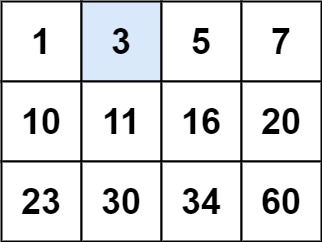

# [35. 搜索插入位置](https://leetcode.cn/problems/search-insert-position/description/)

给定一个排序数组和一个目标值，在数组中找到目标值，并返回其索引。如果目标值不存在于数组中，返回它将会被按顺序插入的位置。

请必须使用时间复杂度为 `O(log n)` 的算法。

示例 1:

> **输入**: nums = [1,3,5,6], target = 5
> **输出**: 2

示例 2:

> **输入**: nums = [1,3,5,6], target = 2
> **输出**: 1

解题思路：

利用二分法在 `O(log⁡n)` 的时间内找到是否存在目标值。如果没有找到目标值，直接将左边界返回。根据if的判断条件，`left` 左边的值一直保持小于 `target`，`high` 右边的值一直保持大于等于 `target`，而且 `left` 最终一定等于 `high` +1，这么一来，循环结束后，在 `left` 和 `high` 之间画一条竖线，恰好可以把数组分为两部分：`left` 左边的部分和 `high` 右边的部分，而且 `left` 左边的部分全部小于 `target`，并以 `high` 结尾；`high` 右边的部分全部大于等于 `target`，并以 `left` 为首。所以最终答案一定在 `left` 的位置。

```go
func searchInsert(nums []int, target int) int {
	low, high := 0, len(nums)-1

	for low <= high {
		mid := low + (high-low)>>1
		if nums[mid] == target {
			// 找到目标值后直接返回索引
			return mid
		} else if nums[mid] >= target {
			// target 在数组的左半部分
			high = mid - 1
		} else {
			// target 在数组的右半部分
			low = mid + 1
		}
	}

	return low
}
```

# [74. 搜索二维矩阵](https://leetcode.cn/problems/search-a-2d-matrix/description/)

给你一个满足下述两条属性的 `m x n` 整数矩阵：

每行中的整数从左到右按非严格递增顺序排列。
每行的第一个整数大于前一行的最后一个整数。
给你一个整数 `target` ，如果 `target` 在矩阵中，返回 `true` ；否则，返回 `false` 。



> **输入**：matrix = [[1,3,5,7],[10,11,16,20],[23,30,34,60]], target = 3
> **输出**：true

解题思路：

虽然题目中给的参数数据结构是矩阵，其实也就是二维数组，并且该二维数组是逐行逐列递增的，**将其扁平化之后就是一个有序的一维数组**，然后就可以套用二分查找算法来解题了。二分查找过程中，需要将一维数组索引转化为对应矩阵（二维数组）的坐标。

```go
func searchMatrix(matrix [][]int, target int) bool {
	rows := len(matrix)
	// 边界处理
	if rows == 0 {
		return false
	}

	cols := len(matrix[0])
	// 一维数组的长度等于矩阵的行数量 * 列数量 - 1
	// 因为数组下标从 0 开始
	low, hi := 0, rows*cols-1

	for low <= hi {
		mid := low + (hi-low)>>1
		// 将索引转换为具体的矩阵坐标
		val := matrix[mid/cols][mid%cols]

		if val == target {
			return true
		} else if val < target {
			low = mid + 1
		} else {
			hi = mid - 1
		}
	}

	return false
}
```

# [162. 寻找峰值](https://leetcode.cn/problems/find-peak-element/description/)

峰值元素是指其值严格大于左右相邻值的元素。

给你一个整数数组 `nums`，找到峰值元素并返回其索引。数组可能包含多个峰值，在这种情况下，返回 **任何一个峰值** 所在位置即可。

你可以假设 `nums[-1] = nums[n] = -∞` 。

你必须实现时间复杂度为 `O(log n)` 的算法来解决此问题。

> **输入：** nums = `[1,2,3,1]`
> **输出：** 2
> **解释：** 3 是峰值元素，你的函数应该返回其索引 2。

解题思路：

我们可以 **在二分查找算法的基础上略微修改**：每个二分查找过程中不再是查找具体的 `target`, 而是直接使用当前的 “中间元素” 为基准进行对比:

- 如果当前 “中间元素” 大于紧跟其后的元素，**说明当前元素后面的元素不是峰值元素**，此时可能存在两种情况: 1. 当前元素是一个峰值元素 2. 当前元素的左侧存在峰值元素 3. 无论两种情况中的哪一种，直接将指向右侧边界的 `high` 指针指向当前元素索引
- 如果当前 “中间元素” 小于等于紧跟其后的元素，**说明当前元素后面存在峰值元素**, 直接将指向左侧边界的 `low` 指针指向当前元素索引 + 1

```go
func findPeakElement(nums []int) int {
	low, high := 0, len(nums)-1
	for low < high {
		mid := low + (high-low)>>1
		// 如果 mid 较大，则左侧存在峰值，high = m，如果 mid + 1 较大，则右侧存在峰值，low = mid + 1
		if nums[mid] > nums[mid+1] {
			high = mid
		} else {
			low = mid + 1
		}
	}
	return low
}
```

# [33. 搜索旋转排序数组](https://leetcode.cn/problems/search-in-rotated-sorted-array/description/)

整数数组 `nums` 按升序排列，数组中的值 **互不相同** 。

在传递给函数之前，`nums` 在预先未知的某个下标 `k`（`0 <= k < nums.length`）上进行了 **旋转**，使数组变为 `[nums[k], nums[k+1], ..., nums[n-1], nums[0], nums[1], ..., nums[k-1]]`（下标 **从 0 开始** 计数）。例如， `[0,1,2,4,5,6,7]` 在下标 `3` 处经旋转后可能变为 `[4,5,6,7,0,1,2]` 。

给你 **旋转后** 的数组 `nums` 和一个整数 `target` ，如果 `nums` 中存在这个目标值 `target` ，则返回它的下标，否则返回 `-1` 。

你必须设计一个时间复杂度为 `O(log n)` 的算法解决此问题。

> **输入**：nums = [4,5,6,7,0,1,2], target = 0
> **输出**：4

解题思路：

由于数组在某个点被旋转，可以将其视为两个有序子数组的结合。需要判断当前搜索区间的哪一部分是有序的，以便确定目标值可能存在的范围。

- **左半部分有序**：
    - 如果 `nums[low] <= nums[mid]`，则左半部分 `[low, mid]` 是有序的。
    - 判断 `target` 是否在左半部分（即 `nums[low] <= target < nums[mid]`）。如果是，更新右边界 `high = mid - 1`，继续搜索左半部分。否则，更新左边界 `low = mid + 1`，搜索右半部分。
- **右半部分有序**：
    - 如果 `nums[low] > nums[mid]`，则右半部分 `[mid, high]` 是有序的。
    - 判断 `target` 是否在右半部分（即 `nums[mid] < target <= nums[right]`）。如果是，更新左边界 `low = mid + 1`，继续搜索右半部分。否则，更新右边界 `high = mid - 1`，搜索左半部分。

```go
func search(nums []int, target int) int {
    low, high := 0, len(nums)-1

    for low <= high {
        mid := low + (high-low)>>1

        if nums[mid] == target {
            return mid
        }

        // Check if the left half is sorted
        if nums[low] <= nums[mid] {
            if nums[low] <= target && target < nums[mid] {
                high = mid - 1
            } else {
                low = mid + 1
            }
        } else {
            // The right half must be sorted
            if nums[mid] < target && target <= nums[high] {
                low = mid + 1
            } else {
                high = mid - 1
            }
        }
    }

    return -1
}
```

# [81. 搜索旋转排序数组 II](https://leetcode.cn/problems/search-in-rotated-sorted-array-ii/description/)

已知存在一个按非降序排列的整数数组 `nums` ，数组中的值不必互不相同。

在传递给函数之前，`nums` 在预先未知的某个下标 `k`（`0 <= k < nums.length`）上进行了 **旋转** ，使数组变为 `[nums[k], nums[k+1], ..., nums[n-1], nums[0], nums[1], ..., nums[k-1]]`（下标 **从 0 开始** 计数）。例如， `[0,1,2,4,4,4,5,6,6,7]` 在下标 `5` 处经旋转后可能变为 `[4,5,6,6,7,0,1,2,4,4]` 。

给你 **旋转后** 的数组 `nums` 和一个整数 `target` ，请你编写一个函数来判断给定的目标值是否存在于数组中。如果 `nums` 中存在这个目标值 `target` ，则返回 `true` ，否则返回 `false` 。

> **输入**：nums = [2,5,6,0,0,1,2], target = 0
> **输出**：true

解题思路：

类似 33 题，对于数组中有重复元素的情况，二分查找时可能会有 a[l]=a[mid]=a[r]，此时无法判断区间 [l,mid] 和区间 [mid+1,r] 哪个是有序的。
对于这种情况，我们只能将当前二分区间的左边界加一，右边界减一，然后在新区间上继续二分查找。

```go
func search(nums []int, target int) bool {
    if nums == nil || len(nums) == 0 {
        return false
    }

    start, end := 0, len(nums) - 1

    for start <= end {
        mid := start + (end - start) / 2
        if nums[mid] == target {
            return true
        }
        
        // 处理重复元素
        if nums[start] == nums[mid] {
            start++
            continue
        }

        // 前半部分有序
        if nums[start] < nums[mid] {
            if nums[start] <= target && target < nums[mid] {
                end = mid - 1
            } else {
                start = mid + 1
            }
        } else {
            // 后半部分有序
            if nums[mid] < target && target <= nums[end] {
                start = mid + 1
            } else {
                end = mid - 1
            }
        }
    }

    return false
}
```

# [153. 寻找旋转排序数组中的最小值](https://leetcode.cn/problems/find-minimum-in-rotated-sorted-array/description/)

已知一个长度为 `n` 的数组，预先按照升序排列，经由 `1` 到 `n` 次 **旋转** 后，得到输入数组。例如，原数组 `nums = [0,1,2,4,5,6,7]` 在变化后可能得到：

- 若旋转 `4` 次，则可以得到 `[4,5,6,7,0,1,2]`
- 若旋转 `7` 次，则可以得到 `[0,1,2,4,5,6,7]`

注意，数组 `[a[0], a[1], a[2], ..., a[n-1]]` **旋转一次** 的结果为数组 `[a[n-1], a[0], a[1], a[2], ..., a[n-2]]` 。

给你一个元素值 **互不相同** 的数组 `nums` ，它原来是一个升序排列的数组，并按上述情形进行了多次旋转。请你找出并返回数组中的 **最小元素** 。

你必须设计一个时间复杂度为 `O(log n)` 的算法解决此问题。

> **输入**：nums = [3,4,5,1,2]
> **输出**：1
> **解释**：原数组为 [1,2,3,4,5] ，旋转 3 次得到输入数组。

解题思路：

由于数组是由一个升序数组经过多次旋转得到的，因此数组被分成了两部分，每部分都是升序的。最小元素正好位于这两个部分的交界处。我们可以利用二分查找的方法来解决这个问题：

1. **初始化边界**：设定 `low` 为数组的起始位置 `0`，`high` 为数组的末尾位置 `len(nums) - 1`。
2. **迭代搜索**：
    - 计算 `mid` 位置。
    - **右半部分有序**：如果 `nums[mid] > nums[high]`，说明最小元素在右半部分。因为中间元素大于右边界元素，表示右半部分是旋转过的，所以更新 `low = mid + 1`。
    - **左半部分有序或最小元素是 mid**：如果 `nums[mid] <= nums[high]`，说明最小值在 `mid` 的左边或就是 `mid`，因为 `mid` 元素不大于 `high` 元素，所以在这一范围内是未旋转的或包含最小值。
    - **更新搜索区间**：不断缩小搜索区间 `low` 和 `high`，直到 `low` 等于 `high`。
3. **终止条件**：当 `low` 和 `high` 收敛到同一个位置时，找到最小元素，即 `nums[low]` 或 `nums[high]`。

```go
func findMin(nums []int) int {
    low, high := 0, len(nums) - 1
    for low < high {
        mid := low + (high-low)>>1
        if nums[mid] < nums[high] {
            high = mid
        } else {
            low = mid + 1
        }
    }
    return nums[low]
}
```

# [154. 寻找旋转排序数组中的最小值 II](https://leetcode.cn/problems/find-minimum-in-rotated-sorted-array-ii/description/)

已知一个长度为 `n` 的数组，预先按照升序排列，经由 `1` 到 `n` 次 **旋转** 后，得到输入数组。例如，原数组 `nums = [0,1,4,4,5,6,7]` 在变化后可能得到：

- 若旋转 `4` 次，则可以得到 `[4,5,6,7,0,1,4]`
- 若旋转 `7` 次，则可以得到 `[0,1,4,4,5,6,7]`

注意，数组 `[a[0], a[1], a[2], ..., a[n-1]]` **旋转一次** 的结果为数组 `[a[n-1], a[0], a[1], a[2], ..., a[n-2]]` 。

给你一个可能存在 **重复** 元素值的数组 `nums` ，它原来是一个升序排列的数组，并按上述情形进行了多次旋转。请你找出并返回数组中的 **最小元素** 。

> **输入**：nums = [2,2,2,0,1]
> **输出**：0

解题思路：

与 [153. 寻找旋转排序数组中的最小值](https://leetcode.cn/problems/find-minimum-in-rotated-sorted-array/description/)非常类似, 唯一的不同就是有重复元素
主体思路仍是二分法:
nums 总是可分为: nums 1 与 nums 2 两个子数组, 并且两个数组都是递增的, 且 nums 1[i]>=nums 2[j]
 `mid` 的索引取地板除, 最终要根据 nums[mid]与 nums[right]进行范围缩小
最终要找的是 nums 2 的起始索引对应的值
1. nums[mid]>nums[right], 如[5,6,7,8,4], 那么 nums 2 起点必定严格位于 mid (不含) 右边, left=mid+1
2. nums[mid]<nums[right], 如[5,1,2,3,4], 那么 nums 2 起点必定位于 mid (含) 左边, right=mid
3. nums[mid] == nums[right], 如[5,1,2,2,2], 那么 right--继续进入下一轮循环
    3.1 这个操作不会越界:right>left>=0
    3.2 这个操作会一直尝试收缩右边界间接缩小 mid 直至[mid, right]跳出相等范围序列
    而被收缩的原本的 nums[right]必定不是唯一的最小值, 换句话说有效范围依然合法
    反证: nums[right]是唯一最小值, left<right && mid<right (地板除)
        因此不可能出现 nums[mid] == nums[right]与题设矛盾
    有以下几种情况:[3,4,2,2,2,2];[3,2,2,2,2,2];[2,2,2,2,2,2]
    都可以正确求出最小值索引
最后 left == right 直接返回 nums[left]即可

```go
func findMin(nums []int) int {
	low, high := 0, len(nums)-1
	var mid int
	for low <= high {
		mid = low + (high-low)/2
		if nums[mid] > nums[high] {
			low = mid + 1
		} else if nums[mid] < nums[high] {
			high = mid
		} else {
			high--
		}
	}
	return nums[low]
}
```