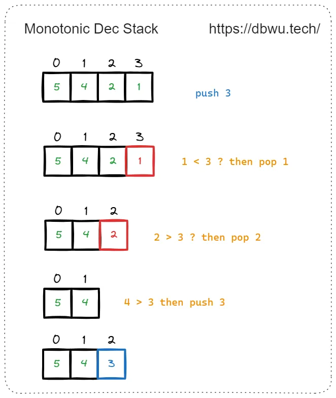

单调栈（Monotonic Stack）是一种特殊的栈 (Stack) 结构，其元素满足特定的单调性条件，主要应用于 **区间元素大小和顺序相关问题**。

单调栈主要分为两种类型:

1. **递增单调栈**: 栈内元素从栈底到栈顶依次递增 (例如 1, 2, 3 ...)，当新元素入栈时，如果比栈顶元素大，直接入栈，否则循环弹出栈顶元素，直到满足单调递增的条件 (也即是找到比新元素小的栈顶元素，或者栈内元素为空)，循环停止，然后将新元素入栈


2. **递减单调栈**: 栈内元素从栈底到栈顶依次递减 (例如 3, 2, 1 ...)，当新元素入栈时，如果比栈顶元素小，直接入栈，否则循环弹出栈顶元素，直到满足单调递减的条件 (也即是找到比新元素大的栈顶元素，或者栈内元素为空)，循环停止，然后将新元素入栈



# [1475. 商品折扣后的最终价格](https://leetcode.cn/problems/final-prices-with-a-special-discount-in-a-shop/description/)

给你一个数组 `prices` ，其中 `prices[i]` 是商店里第 `i` 件商品的价格。

商店里正在进行促销活动，如果你要买第 `i` 件商品，那么你可以得到与 `prices[j]` 相等的折扣，其中 `j` 是满足 `j > i` 且 `prices[j] <= prices[i]` 的 **最小下标** ，如果没有满足条件的 `j` ，你将没有任何折扣。

请你返回一个数组，数组中第 `i` 个元素是折扣后你购买商品 `i` 最终需要支付的价格。

> **输入**：prices = [8,4,6,2,3]
> **输出**：[4,2,4,2,3]
> **解释**：
> 商品 0 的价格为 price[0]=8 ，你将得到 prices[1]=4 的折扣，所以最终价格为 8 - 4 = 4 。
> 商品 1 的价格为 price[1]=4 ，你将得到 prices[3]=2 的折扣，所以最终价格为 4 - 2 = 2 。
> 商品 2 的价格为 price[2]=6 ，你将得到 prices[3]=2 的折扣，所以最终价格为 6 - 2 = 4 。
> 商品 3 和 4 都没有折扣。

解题思路：

我们可以使用单调栈来高效地解决这个问题。通过单调栈，可以在一次遍历中找到每个元素右边第一个更小的值，从而计算每个商品在促销活动中的最终价格。具体思路如下：

1. **初始化**：
    - 创建一个空的单调栈 `stack`，用于存储价格的下标。
2. **正序遍历数组**：
    - 从左到右遍历数组 `prices`。
    - 对于每个商品价格 `prices[i]`：
        - 当栈不为空且栈顶元素对应的价格大于等于当前价格 `prices[i]` 时：
            - 将栈顶元素的下标出栈。
            - 计算该下标对应商品的折扣后的价格，并更新结果数组 `res`。
        - 将当前商品价格的下标 `i` 入栈。
3. **处理未处理的元素**：
    - 遍历完成后，栈中可能还有未处理的元素。这些元素没有找到满足条件的折扣，因此价格保持不变，已经在初始化时处理过。

```go
func finalPrices(prices []int) []int {
	stack := make([]int, 0)
	res := make([]int, len(prices))

	for i, price := range prices {
		res[i] = price
		for len(stack) != 0 && price <= prices[stack[len(stack)-1]] {
			top := stack[len(stack)-1]
			res[top] = prices[top] - price
			stack = stack[:len(stack)-1]
		}
		stack = append(stack, i)
	}

	return res
}
```
