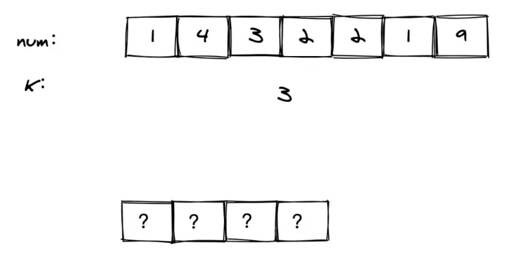
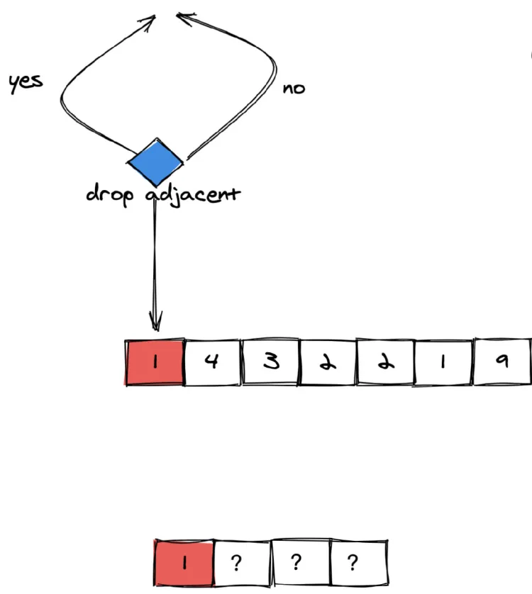
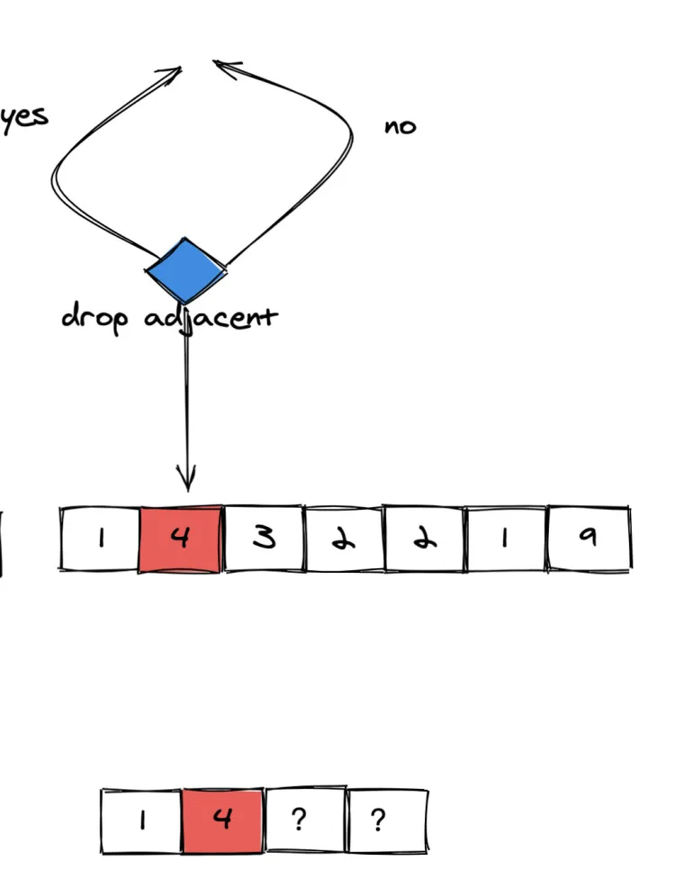
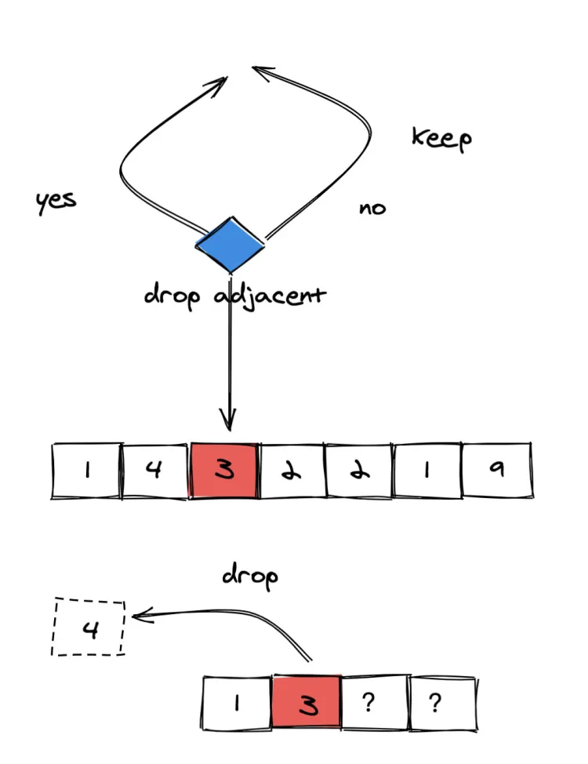
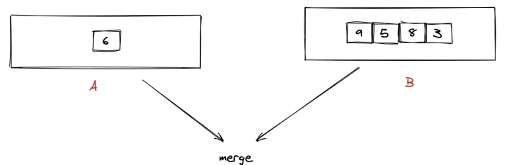
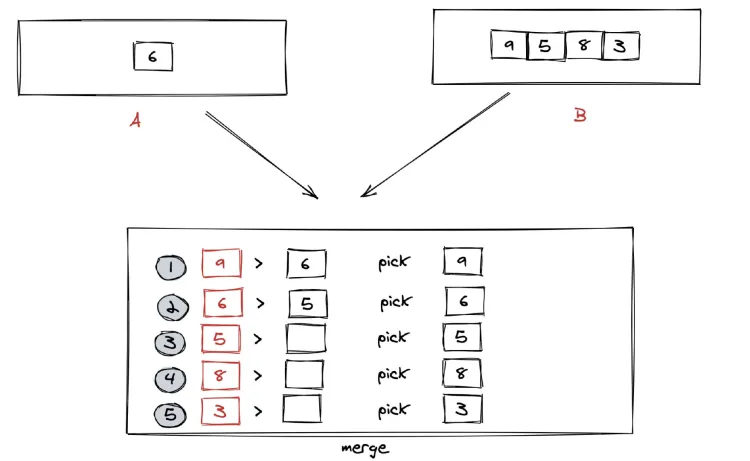

单调栈（Monotonic Stack）是一种特殊的栈 (Stack) 结构，其元素满足特定的单调性条件，主要应用于 **区间元素大小和顺序相关问题**。

单调栈主要分为两种类型:

1. **递增单调栈**: 栈内元素从栈底到栈顶依次递增 (例如 1, 2, 3 ...)，当新元素入栈时，如果比栈顶元素大，直接入栈，否则循环弹出栈顶元素，直到满足单调递增的条件 (也即是找到比新元素小的栈顶元素，或者栈内元素为空)，循环停止，然后将新元素入栈


2. **递减单调栈**: 栈内元素从栈底到栈顶依次递减 (例如 3, 2, 1 ...)，当新元素入栈时，如果比栈顶元素小，直接入栈，否则循环弹出栈顶元素，直到满足单调递减的条件 (也即是找到比新元素大的栈顶元素，或者栈内元素为空)，循环停止，然后将新元素入栈


# [1475. 商品折扣后的最终价格](https://leetcode.cn/problems/final-prices-with-a-special-discount-in-a-shop/description/)

给你一个数组 `prices` ，其中 `prices[i]` 是商店里第 `i` 件商品的价格。

商店里正在进行促销活动，如果你要买第 `i` 件商品，那么你可以得到与 `prices[j]` 相等的折扣，其中 `j` 是满足 `j > i` 且 `prices[j] <= prices[i]` 的 **最小下标** ，如果没有满足条件的 `j` ，你将没有任何折扣。

请你返回一个数组，数组中第 `i` 个元素是折扣后你购买商品 `i` 最终需要支付的价格。

> **输入**：prices = [8,4,6,2,3]
> **输出**：[4,2,4,2,3]
> **解释**：
> 商品 0 的价格为 price[0]=8 ，你将得到 prices[1]=4 的折扣，所以最终价格为 8 - 4 = 4 。
> 商品 1 的价格为 price[1]=4 ，你将得到 prices[3]=2 的折扣，所以最终价格为 4 - 2 = 2 。
> 商品 2 的价格为 price[2]=6 ，你将得到 prices[3]=2 的折扣，所以最终价格为 6 - 2 = 4 。
> 商品 3 和 4 都没有折扣。

解题思路：

我们可以使用单调栈来高效地解决这个问题。通过单调栈，可以在一次遍历中找到每个元素右边第一个更小的值，从而计算每个商品在促销活动中的最终价格。具体思路如下：

1. **初始化**：
    - 创建一个空的单调栈 `stack`，用于存储价格的下标。
2. **正序遍历数组**：
    - 从左到右遍历数组 `prices`。
    - 对于每个商品价格 `prices[i]`：
        - 当栈不为空且栈顶元素对应的价格大于等于当前价格 `prices[i]` 时：
            - 将栈顶元素的下标出栈。
            - 计算该下标对应商品的折扣后的价格，并更新结果数组 `res`。
        - 将当前商品价格的下标 `i` 入栈。
3. **处理未处理的元素**：
    - 遍历完成后，栈中可能还有未处理的元素。这些元素没有找到满足条件的折扣，因此价格保持不变，已经在初始化时处理过。

```go
func finalPrices(prices []int) []int {
	stack := make([]int, 0)
	res := make([]int, len(prices))

	for i, price := range prices {
		res[i] = price
		for len(stack) != 0 && price <= prices[stack[len(stack)-1]] {
			top := stack[len(stack)-1]
			res[top] = prices[top] - price
			stack = stack[:len(stack)-1]
		}
		stack = append(stack, i)
	}

	return res
}
```

# [739. 每日温度](https://leetcode.cn/problems/daily-temperatures/description/)

给定一个整数数组 `temperatures` ，表示每天的温度，返回一个数组 `answer` ，其中 `answer[i]` 是指对于第 `i` 天，下一个更高温度出现在几天后。如果气温在这之后都不会升高，请在该位置用 `0` 来代替。

> **输入**: temperatures = [73,74,75,71,69,72,76,73]
> **输出**: [1,1,4,2,1,1,0,0]

解题思路：

要解决这个问题，我们需要找到每一天之后的第一个比当前温度更高的温度。为了高效地实现这一点，可以使用单调栈。

```go
func dailyTemperatures(temperatures []int) []int {
	stack := []int{}
	ans := make([]int, len(temperatures))
	
	for i,v:=range temperatures {
		for len(stack) != 0 && temperatures[stack[len(stack)-1]] < v {
			index := stack[len(stack)-1]
			ans[index] = i - index
			stack = stack[:len(stack)-1]
		}
		stack = append(stack, i)
	}
	
	return ans
}
```

# [853. 车队](https://leetcode.cn/problems/car-fleet/description/)

在一条单行道上，有 `n` 辆车开往同一目的地。目的地是几英里以外的 `target` 。

给定两个整数数组 `position` 和 `speed` ，长度都是 `n` ，其中 `position[i]` 是第 `i` 辆车的位置， `speed[i]` 是第 `i` 辆车的速度(单位是英里/小时)。

一辆车永远不会超过前面的另一辆车，但它可以追上去，并以较慢车的速度在另一辆车旁边行驶。

**车队** 是指并排行驶的一辆或几辆汽车。车队的速度是车队中 **最慢** 的车的速度。

即便一辆车在 `target` 才赶上了一个车队，它们仍然会被视作是同一个车队。

返回到达目的地的车队数量。

> **输入**：target = 12, position = [10,8,0,5,3], speed = [2,4,1,1,3]
> **输出**：3
> **解释**：
> 从 10（速度为 2）和 8（速度为 4）开始的车会组成一个车队，它们在 12 相遇。车队在 target 形成。
> 从 0（速度为 1）开始的车不会追上其它任何车，所以它自己是一个车队。
> 从 5（速度为 1） 和 3（速度为 3）开始的车组成一个车队，在 6 相遇。车队以速度 1 移动直到它到达 target。

解题思路：

> 车手 A、B 之间只存在两种情况
> 
> posA<posB 且 A 率先到达终点那么 A 势必在某个时刻追上 B, A、B 在该时刻形成车队
> posA<posB 且 B 率先到达终点那么 A 始终追不上 B, A、B 各自成车队

因此使用单调栈。计算到达target的时间time，入栈，保证单调递减，最后剩余的即是车队数

```go
func carFleet(target int, position []int, speed []int) int {
	n := len(position)
	cars := make([][2]int, n)
	for i := 0; i < n; i++ {
		cars[i] = [2]int{position[i], speed[i]}
	}

	// 将车辆按位置从远到近排序
	sort.Slice(cars, func(i, j int) bool {
		return cars[i][0] > cars[j][0]
	})

	stack := []float64{}
	for i := 0; i < n; i++ {
		pos := cars[i][0]
		spd := cars[i][1]
		time := float64(target-pos) / float64(spd)

		// 如果当前车到达的时间大于栈顶车队的时间，则形成新的车队
		if len(stack) == 0 || time > stack[len(stack)-1] {
			stack = append(stack, time)
		}
	}

	return len(stack)
}
```

# [402.移掉 K 位数字](https://leetcode.cn/problems/remove-k-digits/)  

给你一个以字符串表示的非负整数 `num` 和一个整数 `k` ，移除这个数中的 `k` 位数字，使得剩下的数字最小。请你以字符串形式返回这个最小的数字。

示例 1 ：
> **输入**：num = "1432219", k = 3
> **输出**："1219"
> **解释**：移除掉三个数字 4, 3, 和 2 形成一个新的最小的数字 1219 。

示例 2 ：
> **输入**：num = "10200", k = 1
> **输出**："200"
> **解释**：移掉首位的 1 剩下的数字为 200. 注意输出不能有任何前导零。

示例 3 ：
> **输入**：num = "10", k = 2
> **输出**："0"
> **解释**：从原数字移除所有的数字，剩余为空就是 0 。

解题思路：  
从左到右遍历 对于每一个遍历到的元素，我们决定是丢弃还是保留 问题的关键是：我们怎么知道，一个元素是应该保留还是丢弃呢？  



  
这里有一个前置知识：对于两个数 123a456 和 123b456，如果 a > b， 那么数字 123a456 大于 数字 123b456，否则数字 123a456 小于等于数字 123b456。也就说，两个相同位数的数字大小关系取决于第一个不同的数的大小。  
  
从左到右遍历 对于遍历到的元素，我们选择保留。 但是我们可以选择性丢弃前面相邻的元素。 丢弃与否的依据如上面的前置知识中阐述中的方法。 以题目中的 num = 1432219， k = 3 为例的图解过程如下：  
  



由于没有左侧相邻元素，因此没办法丢弃。  



由于 4 比左侧相邻的 1 大。如果选择丢弃左侧的 1，那么会使得剩下的数字更大（开头的数从 1 变成了 4）。因此我们仍然选择不丢弃。  



由于 3 比左侧相邻的 4 小。 如果选择丢弃左侧的 4，那么会使得剩下的数字更小（开头的数从 4 变成了 3）。因此我们选择丢弃。  
  
依次递推  
然而需要注意的是，如果给定的数字是一个单调递增的数字，那么我们的算法会永远选择不丢弃。这个题目中要求的，我们要永远确保丢弃 k 个矛盾。  
  
一个简单的思路就是：  
  
每次丢弃一次，k 减去 1。当 k 减到 0 ，我们可以提前终止遍历。 而当遍历完成，如果 k 仍然大于 0。不妨假设最终还剩下 x 个需要丢弃，那么我们需要选择删除末尾 x 个元素。 上面的思路可行，但是稍显复杂。  
  
我们需要把思路逆转过来。刚才我的关注点一直是丢弃，题目要求我们丢弃 k 个。反过来说，不就是让我们保留n−k 个元素么？其中 n 为数字长度。 那么我们只需要按照上面的方法遍历完成之后，再截取前n - k个元素即可。  
  
按照上面的思路，我们来选择数据结构。由于我们需要保留和丢弃相邻的元素，因此使用栈这种在一端进行添加和删除的数据结构是再合适不过了，我们来看下代码实现。  

```go
func removeKdigits(num string, k int) string {
    stack := []byte{}
    for i := range num {
        digit := num[i]
        for k > 0 && len(stack) > 0 && digit < stack[len(stack)-1] {
            stack = stack[:len(stack)-1]
            k--
        }
        stack = append(stack, digit)
    }
    stack = stack[:len(stack)-k]
    ans := strings.TrimLeft(string(stack), "0")
    if ans == "" {
        ans = "0"
    }
    return ans
}
```

复杂度分析  
●时间复杂度：虽然内层还有一个 while 循环，但是由于每个数字最多仅会入栈出栈一次，因此时间复杂度仍然为 O(N)，其中 N 为数字长度。  
●空间复杂度：我们使用了额外的栈来存储数字，因此空间复杂度为 O(N)，其中 N 为数字长度。  
  

# [316.去除重复字母](https://leetcode.cn/problems/remove-duplicate-letters/)  

给你一个仅包含小写字母的字符串，请你去除字符串中重复的字母，使得每个字母只出现一次。需保证返回结果的字典序最小（要求不能打乱其他字符的相对位置）。  
  
示例 1:  
  
> **输入**: "bcabc" 
> 输出: "abc" 

示例 2:   
> **输入**: "cbacdcbc" 
> **输出**: "acdb"  

解题思路：

建立一个字典。其中 key 为 字符 c，value 为其出现的剩余次数。 从左往右遍历字符串，每次遍历到一个字符，其剩余出现次数 - 1. 对于每一个字符，如果其对应的剩余出现次数大于 1，我们可以选择丢弃（也可以选择不丢弃），否则不可以丢弃。 是否丢弃的标准和上面题目类似。如果栈中相邻的元素字典序更大，那么我们选择丢弃相邻的栈中的元素。 还记得上面题目的边界条件么？如果栈中剩下的元素大于n−k，我们选择截取前n−k 个数字。然而本题中的 k 是分散在各个字符中的，因此这种思路不可行的。  
不过不必担心。由于题目是要求只出现一次。我们可以在遍历的时候简单地判断其是否在栈上即可。  

```go
func removeDuplicateLetters(s string) string {
	stack := []rune{}
	seen := map[rune]bool{}
	remain := map[rune]int{}
	for _, v := range s {
		remain[v]++
	}
	for _, v := range s {
		if !seen[v] {
			for len(stack) != 0 && stack[len(stack)-1] > v && remain[stack[len(stack)-1]] > 0 {
				seen[stack[len(stack)-1]] = false
				stack = stack[:len(stack)-1]
			}
			seen[v] = true
			stack = append(stack, v)
		}
		remain[v]--
	}
	return string(stack)
}
```

# [321.拼接最大数](https://leetcode.cn/problems/create-maximum-number/)  

给你两个整数数组 `nums1` 和 `nums2`，它们的长度分别为 `m` 和 `n`。数组 `nums1` 和 `nums2` 分别代表两个数各位上的数字。同时你也会得到一个整数 `k`。

请你利用这两个数组中的数字中创建一个长度为 `k <= m + n` 的最大数，在这个必须保留来自同一数组的数字的相对顺序。

返回代表答案的长度为 `k` 的数组。

示例 1：

> **输入**：nums 1 = [3,4,6,5], nums 2 = [9,1,2,5,8,3], k = 5
> **输出**：[9,8,6,5,3]

示例 2：

> **输入**：nums 1 = [6,7], nums 2 = [6,0,4], k = 5
> **输出**：[6,7,6,0,4]

示例 3：

> **输入**：nums 1 = [3,9], nums 2 = [8,9], k = 3
> **输出**：[9,8,9]

解题思路：

最大最小是无关紧要的，关键在于是两个数组，并且要求从两个数组选取的元素个数加起来一共是 k。  
然而在一个数组中取 k 个数字，并保持其最小（或者最大），我们已经会了。但是如果问题扩展到两个，会有什么变化呢？  
实际上，问题本质并没有发生变化。 假设我们从 nums1 中取了 k1 个，从 num2 中取了 k2 个，其中 k1 + k2 = k。而 k1 和 k2 这 两个子问题我们是会解决的。由于这两个子问题是相互独立的，因此我们只需要分别求解，然后将结果合并即可。  
假如 k1 和 k2 个数字，已经取出来了。那么剩下要做的就是将这个长度分别为 k1 和 k2 的数字，合并成一个长度为 k 的数组合并成一个最大的数组。  
以题目的 nums1 = [3, 4, 6, 5] nums2 = [9, 1, 2, 5, 8, 3] k = 5 为例。 假如我们从 num1 中取出 1 个数字，那么就要从 nums2 中取出 4 个数字。  
  
运用第一题的方法，我们计算出应该取 nums1 的 [6]，并取 nums2 的 [9,5,8,3]。 如何将 [6] 和 [9,5,8,3]，使得数字尽可能大，并且保持相对位置不变呢？  
  
实际上这个过程有点类似归并排序中的治，而上面我们分别计算 num1 和 num2 的最大数的过程类似归并排序中的分。  
  



我们将从 num1 中挑选的 k1 个数组成的数组称之为 A，将从 num2 中挑选的 k2 个数组成的数组称之为 B，  
这里需要说明一下。 在很多编程语言中：如果 A 和 B 是两个数组，当前仅当 A 的首个元素字典序大于 B 的首个元素，A > B 返回 true，否则返回 false。  
比如：  
A = [1,2] B = [2] A < B # True  
  
A = [1,2] B = [1,2,3] A < B # False 以合并 [6] 和 [9,5,8,3] 为例，图解过程如下：  



具体算法：  
从 nums1 中 取min(i,len(nums1)) 个数形成新的数组 A（取的逻辑同第一题），其中 i 等于 0,1,2, ... k。从 nums2 中 对应取min(j,len(nums2)) 个数形成新的数组 B（取的逻辑同第一题），其中 j 等于 k - i。将 A 和 B 按照上面的 merge 方法合并。上面我们暴力了 k 种组合情况，我们只需要将 k 种情况取出最大值即可。  

```go
func maxNumber(nums1 []int, nums2 []int, k int) []int {
	res := make([]int, k)
	for i := 0; i <= k; i++ {
		k1, k2 := i, k-i
		if k1 <= len(nums1) && k2 <= len(nums2) {
			arr1, arr2 := getMax(nums1, k1), getMax(nums2, k2)
			cur := merge(arr1, arr2)
			pickMax(res, cur)
		}
	}
	return res
}

func pickMax(arr1, arr2 []int) {
	for i := 0; i < len(arr1); i++ {
		if arr1[i] < arr2[i] {
			copy(arr1, arr2)
			break
		} else if arr1[i] > arr2[i] {
			break
		}
	}
}

func merge(arr1, arr2 []int) (res []int) {
	for len(arr1) > 0 && len(arr2) > 0 {
		if compareInts(arr1, arr2) {
			res = append(res, arr1[0])
			arr1 = arr1[1:]
		} else {
			res = append(res, arr2[0])
			arr2 = arr2[1:]
		}
	}
	res = append(res, append(arr1, arr2...)...)
	return
}

func compareInts(arr1, arr2 []int) bool {
	i, j := 0, 0
	for i < len(arr1) && j < len(arr2) {
		if arr1[i] > arr2[j] {
			return true
		} else if arr1[i] < arr2[j] {
			return false
		}
		i++
		j++
	}
	return i < len(arr1)
}

func getMax(nums []int, k int) []int {
	st := []int{}
	del := len(nums) - k
	for i := 0; i < len(nums); i++ {
		for len(st) > 0 && del > 0 && nums[i] > st[len(st)-1] {
			st = st[:len(st)-1]
			del--
		}
		st = append(st, nums[i])
	}
	return st[:k]
}
```