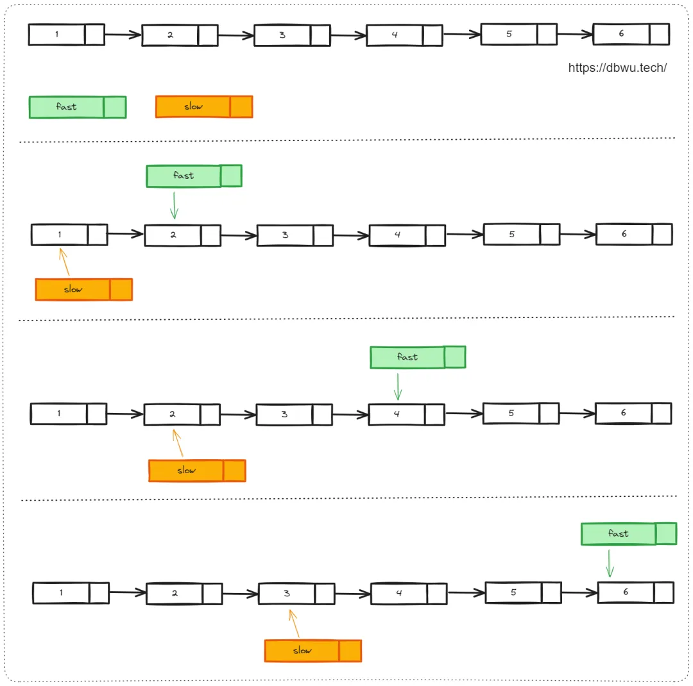
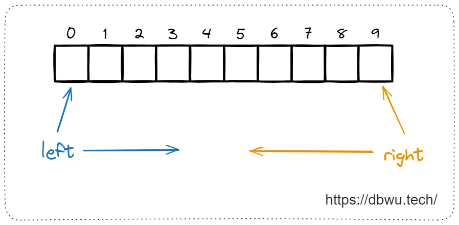
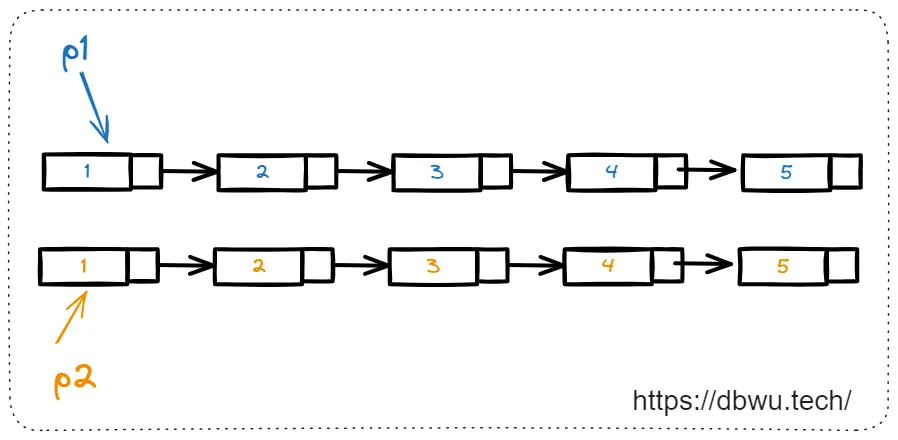
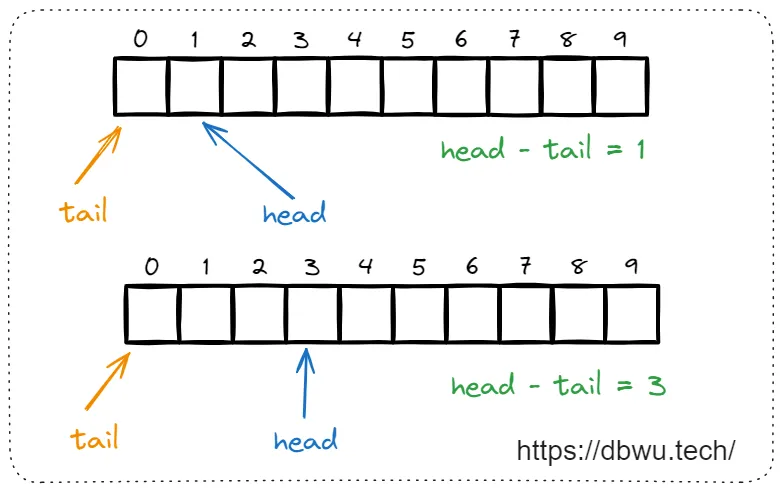

# 基础

## 1. 快慢指针

最经典的双指针使用场景
一般情况下，快慢指针的固定命名:

```
快指针:  fast慢指针:  slow
```



快慢指针示例

## 2. 左右指针

通常用于解决数组或字符串问题，其中:

- 左指针通常指向数组下标 0 ，字符串的开始位置
    
- 右指针通常指向数组下标 N-1 (其中 N 为数组长度)，字符串的结束位置
    

一般情况下，左右指针的固定命名:

```
左指针:  left右指针:  right
```



左右指针示例

## 3. 无序指针

如果两个指针没有任何语义和逻辑顺序，只是用于指向不同的地址，也可以直接简单命名。

例如在合并两个有序链表这道题中，可以使用两个无序指针分别指向链表 1 和链表 2:

```
指针 1: p1指针 2: p2
```



无序指针示例

## 4. 头尾指针

这种场景中，两个指针每次移动的位置不一样，可能移动也可能原地不动 (所以单纯应用角度分析的话，**头尾双指针属于快慢双指针的子集**)，例如使用数组使用的环形队列数据结构。

一般情况下，头尾指针的固定命名:

```
头指针 1: head尾指针 2: tail
```



# 头尾双指针

头尾双指针的典型使用场景是：

- **头指针** 作为数组/字符串的遍历索引，从起始位置遍历到结束位置

- **尾指针** 作为条件指针，每次移动 0 个位置或 1 个位置，并在满足题目逻辑条件时更新返回值，或者自身作为最终返回值

## [26. 删除有序数组中的重复项](https://leetcode.cn/problems/remove-duplicates-from-sorted-array/)

给你一个 **非严格递增排列** 的数组 `nums` ，请你 **[原地](http://baike.baidu.com/item/%E5%8E%9F%E5%9C%B0%E7%AE%97%E6%B3%95)** 删除重复出现的元素，使每个元素 **只出现一次** ，返回删除后数组的新长度。元素的 **相对顺序** 应该保持 **一致** 。然后返回 `nums` 中唯一元素的个数。

**示例 1：**

> **输入：** nums = [1,1,2]
> **输出：** 2, nums = [1,2,_]
> **解释：** 函数应该返回新的长度 **`2`** ，并且原数组 _nums_ 的前两个元素被修改为 **`1`**, **`2`** `。` 不需要考虑数组中超出新长度后面的元素。

解题思路：

**使用两个指针,**`tail` 指针指向最后一个不重复元素的位置。`head` 指针用于遍历数组。
- 如果 `head` 指针指向的元素与 `tail` 指针指向的元素不同，则 `tail` 前进一步，并将 `head` 指向的元素复制到 `tail` 位置。
- `tail + 1` 即为去重后数组的长度。

```go
func removeDuplicates(nums []int) int {
    tail := 0
    
    for head := 1; head < len(nums); head++ {
        if nums[head] != nums[tail] {
            tail++
            nums[tail] = nums[head]
        }
    }

    return tail + 1
}
```

## [27. 移除元素](https://leetcode.cn/problems/remove-element/description/)

给你一个数组 `nums` 和一个值 `val`，你需要 **[原地](https://baike.baidu.com/item/%E5%8E%9F%E5%9C%B0%E7%AE%97%E6%B3%95)** 移除所有数值等于 `val` 的元素。元素的顺序可能发生改变。然后返回 `nums` 中与 `val` 不同的元素的数量。

**示例 1：**

> **输入：** nums = [3,2,2,3], val = 3
> **输出：** 2, nums = [2,2,_,_]
> **解释：** 你的函数函数应该返回 k = 2, 并且 nums 中的前两个元素均为 2。
> 你在返回的 k 个元素之外留下了什么并不重要（因此它们并不计入评测）。

解题思路：

使用两个指针,`tail` 指向当前处理的最后一个不等于 `val` 的元素位置。`head` 指针用于遍历数组。
- 如果 `head` 指针指向的元素不等于 `val`，将 `head` 指针指向的元素复制到 `tail` 指针位置，`tail` 前进一步。
- `tail` 即为删除后的数组长度。

```go
func removeElement(nums []int, val int) int {
    tail := 0

    for head := range nums {
        if nums[head] != val {
            nums[tail] = nums[head]
            tail++
        }
    }

    return tail
}
```

## [392. 判断子序列](https://leetcode.cn/problems/is-subsequence/description/)

给定字符串 **s** 和 **t** ，判断 **s** 是否为 **t** 的子序列。

字符串的一个子序列是原始字符串删除一些（也可以不删除）字符而不改变剩余字符相对位置形成的新字符串。（例如，`"ace"` 是 `"abcde"` 的一个子序列，而 `"aec"` 不是）。

**示例 1：**

> **输入：** s = "abc", t = "ahbgdc"
> **输出：** true

**示例 2：**

> **输入：** s = "axc", t = "ahbgdc"
> **输出：** false

解题思路：

定义头指针为 `head`, 尾指针为 `tail`。
- ``head`` 作为遍历字符串 `t` 的索引，每次循环都加 1
- `tail` 作为更新 **子字符串 s 中当前需要检测字符**的索引，如果 `s[tail] == t[head]`，tail 加 1。
- 如果 `len(s) == tail` 说明匹配成功返回 `true`

```go
func isSubsequence(s string, t string) bool {
	// 如果子字符串为空，就必然属于子集合
	// (Tips: 空字符串也属于子集合之一)
	sLen, tLen := len(s), len(t)
	tail, head := 0, 0

	for tail < sLen && head < tLen {
		if s[tail] == t[head] {
			tail++
		}
		head++
	}

	return tail == sLen
}
```

## [28. 找出字符串中第一个匹配项的下标](https://leetcode.cn/problems/find-the-index-of-the-first-occurrence-in-a-string/)

给你两个字符串 `haystack` 和 `needle` ，请你在 `haystack` 字符串中找出 `needle` 字符串的第一个匹配项的下标（下标从 0 开始）。如果 `needle` 不是 `haystack` 的一部分，则返回  `-1` 。

**示例 1：**

> **输入：** haystack = "sadbutsad", needle = "sad"
> **输出：** 0
> **解释：** "sad" 在下标 0 和 6 处匹配。
> 第一个匹配项的下标是 0 ，所以返回 0 。

解题思路：

定义头指针为 `head`, 尾指针为 `tail`。
- ``head`` 作为遍历字符串 `haystack` 的索引，每次循环都加 1
- `tail` 作为更新 **子字符串 needle 中当前需要检测字符**的索引
- 如果 `len(needle) == tail` 说明匹配成功返回 `head`
**需要注意的是:** 不需要遍历到整个 haystack 字符串，只需要遍历匹配 haystack 字符串减去子字符串 needle 的长度即可，因为再往后面扫描也不可能匹配到了，而且还会引发下标访问越界问题。

```go
func strStr(haystack string, needle string) int {
	n, m := len(haystack), len(needle)

	for head := 0; head <= n-m; head++ {
		tail := 0
		for ; tail < m; tail++ {
			if haystack[head+tail] != needle[tail] {
				break
			}
		}
		if tail == m {
			return head
		}
	}

	return -1
}
```

# 左右双指针

左右双指针的典型使用场景是：

- **左指针** 从数组/字符串的起始位置开始向后遍历，直到和右指针相遇

- **右指针** 从数组/字符串的结束位置开始向前遍历，直到和左指针相遇

## [125. 验证回文串](https://leetcode.cn/problems/valid-palindrome/) 

如果在将所有大写字符转换为小写字符、并移除所有非字母数字字符之后，短语正着读和反着读都一样。则可以认为该短语是一个 **回文串** 。

字母和数字都属于字母数字字符。

给你一个字符串 `s`，如果它是 **回文串** ，返回 `true` ；否则，返回 `false` 。

示例 1：  
  
> 输入: s = "A man, a plan, a canal: Panama"  
> 输出：true  
> 解释："amanaplanacanalpanama" 是回文串。  

示例 2：  
  
> 输入：s = "race a car"  
> 输出：false  
> 解释："raceacar" 不是回文串。

解题思路：

- 定义左指针为 `left`, 右指针为 `right`
- `left` 指针从左向右开始遍历，每次移动 1 个位置 (不包括无效字符的位置)
- `right` 指针从右向左开始遍历，每次移动 1 个位置 (不包括无效字符的位置)
- 如果遍历过程中，`left` 和 `right` 指向的字符不相等，直接返回 false
- 如果 `left` 和 `right` 两个指针相遇或者循环结束，说明字符串为回文字符串

```go
func isPalindrome(s string) bool {
    s = strings.ToLower(s)
    left, right := 0, len(s) - 1
    for left < right {
        for left < right && !isalnum(s[left]) {
            left++
        }
        for left < right && !isalnum(s[right]) {
            right--
        }
        if left < right {
            if s[left] != s[right] {
                return false
            }
            left++
            right--
        }
    }
    return true
}

func isalnum(ch byte) bool {
    return (ch >= 'A' && ch <= 'Z') || (ch >= 'a' && ch <= 'z') || (ch >= '0' && ch <= '9')
}
```

## [977. 有序数组的平方](https://leetcode.cn/problems/squares-of-a-sorted-array/description/)

给你一个按 **非递减顺序** 排序的整数数组 `nums`，返回 **每个数字的平方** 组成的新数组，要求也按 **非递减顺序** 排序。

> **输入：** nums = [-4,-1,0,3,10]
> **输出：** [0,1,9,16,100]
> **解释：** 平方后，数组变为 [16,1,0,9,100]
> 排序后，数组变为 [0,1,9,16,100]

解题思路：

虽然数组有序，但是数组中包含了负数，负数平方可能大于正数平方，例如数组 `[-10, 1, 2, 5]` 中最小的负数平方之后大于最大的正数，而且题目要求使用复杂度为 O(N) 的算法来解决，这也就意味着不能对数组进行排序。也就是说，**在计算出元素平方值的同时就要将其插入到新的排序数组中**。

数组中包含了负数和整数，我们可以定义两个指针，分别指向数组的起始位置和结束位置 (也就是最小的负数和最大的整数)，然后比较两者的平方值，并将其中较大者（也就是数组所有元素平方后的最大值）放入数组，**需要注意的是**：放入平方值元素的时候，应该放入新数组末尾位置，然后更新对应的左右指针位置，以此类推，放入第二个、第三个 ... 第 N 个排序平方值元素。

- 定义左指针为 left, 右指针为 right, 返回值数组 res
- 此外定义一个索引指针 index, 用于更新返回值数组 res 的当前插入位置
- left 指针从左向右开始遍历
- right 指针从右向左开始遍历
- 比较当前 left 和 right 指向的两个值的平方值，并将较大的平方值插入到 res 返回值数组
- 如果 left 指向的平方值大，left 向后移动 1 个位置
- 如果 right 指向的平方值大，right 向前移动 1 个位置
- 每次插入元素后，更新 index 索引指针

```go
func sortedSquares(nums []int) []int {
	// 数组有序，但是负数平方可能大于正数平方
	// 例如 [-10, 1, 2, 5] 最小的负数平方之后大于最大的正数
	// 所以新数组从后往前插入元素
	// 左右双指针，根据平方后数值大小选择前进 OR 后退
	// 每次比较左右两个数，即使出现负数也 OK, 因为负数越小，其平方值越大
	n := len(nums)
	res := make([]int, n)
	left, right := 0, n-1

	for index := right; index >= 0; index-- {
		// 比较当前 left 和 right 指向的两个值的平方值
		// 并将较大的平方值插入到 res 返回值数组
		if x, y := nums[left]*nums[left], nums[right]*nums[right]; x > y {
			res[index] = x
			// 如果 left 指向的平方值大，left 向后移动 1 个位置
			left++
		} else {
			res[index] = y
			// 如果 right 指向的平方值大，right 向前移动 1 个位置
			right--
		}
	}

	return res
}
```

## [167. 两数之和 II - 输入有序数组](https://leetcode.cn/problems/two-sum-ii-input-array-is-sorted/description/)

给你一个下标从 **1** 开始的整数数组 `numbers` ，该数组已按 **非递减顺序排列**  ，请你从数组中找出满足相加之和等于目标数 `target` 的两个数。如果设这两个数分别是 `numbers[index1]` 和 `numbers[index2]` ，则 `1 <= index1 < index2 <= numbers.length`。

以长度为 2 的整数数组 `[index1, index2]` 的形式返回这两个整数的下标 `index1` 和 `index2`。

你可以假设每个输入 **只对应唯一的答案** ，而且你 **不可以** 重复使用相同的元素。

你所设计的解决方案必须只使用常量级的额外空间。

解题思路：

- 定义左指针为 `left`, 右指针为 `right`
- 遍历过程中，比较当前 `left` 和 `right` 指向的两个元素之和 sum 和目标值 target，如果相等，直接返回 `left` 和 `right` 两个指针索引值 (题目要求数组下标从 1 开始，所以指针返回前 + 1)
- 如果 `sum` 大于 `target`, 说明需要减小当前 `sum`, 此时将右指针向前移动 1 位 (因为数组是有序的，移动之后再次 `left` 和 `right` 再次相加，`sum` 会减小)
- 如果 sum 小于 target, 说明需要增大当前 `sum`, 此时将左指针向后移动 1 位 (因为数组是有序的，移动之后再次 `left` 和 `right` 再次相加，`sum` 会增大)

```go
func twoSum(numbers []int, target int) []int {
	left, right := 0, len(numbers)-1

	for left < right {
		if sum := numbers[left] + numbers[right]; sum == target {
			return []int{left + 1, right + 1}
		} else if sum < target {
			left++
		} else {
			right--
		}
	}

	return nil
}
```

## [11. 盛最多水的容器](https://leetcode.cn/problems/container-with-most-water/description/)

给定一个长度为 `n` 的整数数组 `height` 。有 `n` 条垂线，第 `i` 条线的两个端点是 `(i, 0)` 和 `(i, height[i])` 。

找出其中的两条线，使得它们与 `x` 轴共同构成的容器可以容纳最多的水。

返回容器可以储存的最大水量。

> **输入：** [1,8,6,2,5,4,8,3,7]
> **输出：** 49 
> **解释：** 图中垂直线代表输入数组 [1,8,6,2,5,4,8,3,7]。在此情况下，容器能够容纳水（表示为蓝色部分）的最大值为 49。

解题思路：

- 定义两个指针，一个从数组的左边开始，一个从数组的右边开始，分别记作 `left` 和 `right`。
- **在每一步中，以 `left` 和 `right` 之间的距离作为矩形的长度，以 `height[left]` 和 `height[right]` 中的较小值作为矩形的宽度，计算当前的面积。
- 如果 `height[left]` 小于 `height[right]`，说明移动左指针可能会得到更大的矩形面积，因此左指针向右移动。
- 如果 `height[left]` 大于等于 `height[right]`，说明移动右指针可能会得到更大的矩形面积，因此右指针向左移动。
- 比较当前的面积和已知的最大面积，如果当前面积更大，则更新最大面积。

```go
func maxArea(height []int) int {
	left, right := 0, len(height)-1
	ans := -1

	for left < right {
		area := min(height[left], height[right]) * (right - left)
		if area > ans {
			ans = area
		}
		if height[left] < height[right] {
			left++
		} else {
			right--
		}
	}

	return ans
}

func min(x, y int) int {
	if x < y {
		return x
	}
	return y
}
```

## [15. 三数之和](https://leetcode.cn/problems/3sum/description/)

给你一个整数数组 `nums` ，判断是否存在三元组 `[nums[i], nums[j], nums[k]]` 满足 `i != j`、`i != k` 且 `j != k` ，同时还满足 `nums[i] + nums[j] + nums[k] == 0` 。请

你返回所有和为 `0` 且不重复的三元组。

**注意：**答案中不可以包含重复的三元组。

> **输入：** nums = [-1,0,1,2,-1,-4]
> **输出：** [[-1,-1,2],[-1,0,1]]
> **解释：**
> nums[0] + nums[1] + nums[2] = (-1) + 0 + 1 = 0 。
> nums[1] + nums[2] + nums[4] = 0 + 1 + (-1) = 0 。
> nums[0] + nums[3] + nums[4] = (-1) + 2 + (-1) = 0 。
> 不同的三元组是 [-1,0,1] 和 [-1,-1,2] 。
> 注意，输出的顺序和三元组的顺序并不重要。

解题思路：

- 先将 `nums` 排序，时间复杂度为 O(Nlog⁡N)。
- 固定指针 k 为最左（最小）元素，双指针 i 和 j 分设在数组索引 (k+1,len(nums)−1)(k+1, len(nums)-1)(k+1,len(nums)−1) 两端。
- 双指针 i 和 j 交替向中间移动，记录对于每个固定指针 k 的所有满足 `nums[k] + nums[i] + nums[j] == 0` 的组合：
    - 当 `nums[k] > 0` 时直接 `break` 跳出：因为 `nums[j] >= nums[i] >= nums[k] > 0`，即 3 个元素都大于 0，在此固定指针 k 之后不可能再找到结果了。
    - 当 `k > 0` 且 `nums[k] == nums[k - 1]` 时跳过此元素 `nums[k]`：因为已经将 `nums[k - 1]` 的所有组合加入到结果中，本次双指针搜索只会得到重复组合。
        
- `i`，`j `分设在数组索引 `(k,len (nums))`两端，当 `i` < `j` 时循环计算 `s = nums[k] + nums[i] + nums[j]`，并按照以下规则执行双指针移动：
    - 当 `s < 0` 时，`i += 1`。
    - 当 `s > 0` 时，`j -= 1` 。
    - 当 `s == 0` 时，记录组合 [k,i,j] 至 `res`，执行 `i += 1` 和 `j -= 1` 并跳过所有重复的 `nums[i]` 和 `nums[j]`，防止记录到重复组合。

```go
func threeSum(nums []int) [][]int {
	ans := make([][]int, 0)
	sort.Ints(nums)
	for i, v := range nums {
		if i > 0 && nums[i] == nums[i-1] {
			continue
		}
		if v > 0 {
			break
		}
		left, right := i+1, len(nums)-1
		for left < right {
			sum := nums[left] + nums[right] + v
			if sum == 0 {
				ans = append(ans, []int{nums[left], v, nums[right]})
				for left < right && nums[left] == nums[left+1] {
					left++
				}
				for left < right && nums[right] == nums[right-1] {
					right--
				}
				left++
				right--
			} else if sum < 0 {
				left++ // 如果指针与下一个值相等，sum一定不变，所以去重放在 sum == 0的分支中
			} else {
				right--
			}
		}

	}

	return ans
}
```
# 无序双指针

如果需要使用双指针解题，但是两个指针没有任何语义和逻辑顺序，只是用于指向不同的地址，那么可以使用无序指针。

## [88. 合并两个有序数组](https://leetcode.cn/problems/merge-sorted-array/description/)

给你两个按 **非递减顺序** 排列的整数数组 `nums1` 和 `nums2`，另有两个整数 `m` 和 `n` ，分别表示 `nums1` 和 `nums2` 中的元素数目。

请你 **合并** `nums2` 到 `nums1` 中，使合并后的数组同样按 **非递减顺序** 排列。

**注意：**最终，合并后数组不应由函数返回，而是存储在数组 `nums1` 中。为了应对这种情况，`nums1` 的初始长度为 `m + n`，其中前 `m` 个元素表示应合并的元素，后 `n` 个元素为 `0` ，应忽略。`nums2` 的长度为 `n` 。

>**输入：** nums1 = [1,2,3,0,0,0], m = 3, nums2 = [2,5,6], n = 3
>**输出：** [1,2,2,3,5,6]
>**解释：** 需要合并 [1,2,3] 和 [2,5,6] 。
> 合并结果是 [1,2,2,3,5,6] 

解题思路：

`nums1` 数组的后半部分是空的（全部由 0 填充），因为 `nums1` 数组的容量要足够容纳 `nums1` 和 `nums2` 的所有元素。所以可以从后向前扫描，每次取两个数组中较大的数字放在 `nums1` 数组的末尾，然后索引递减。
- 定义两个无序指针 `p1` 和 `p2`。
- 需要定义一个索引指针 `index`，表示后向前更新数组元素时的当前索引。
- 单次遍历过程中，取出 `p1` 和 `p2` 中的较大值，放入索引指针 `index` 当前指向的位置。
- 如果 `p1` 指针指向的值更大，`p1` 指针向左移动 1 个位置，反之 `p2` 指针向左移动 1 个位置。
- 循环结束后，判断 `p2` 的位置
	- (1) == 0 说明两个数组中最小的元素在 `nums1`，无需调整
	- (2) >  0 说明两个数组中最小的元素在 `nums2`，仅调整 `nums2` 中剩余元素

```go
func merge(nums1 []int, m int, nums2 []int, n int)  {
    index := m+n-1
    p1, p2 := m-1, n-1

    for p1 >= 0 && p2 >= 0 {
        if nums1[p1] > nums2[p2] {
            // p1 指向的值更大
            nums1[index] = nums1[p1]
            p1--
        } else {
            // p2 指向的值更大
            nums1[index] = nums2[p2]
            p2--
        }

        index--
    }

    // 题目假设 nums1 的空间大小等于 m + n
    // 这样它就有足够的空间保存来自 nums2 的元素
    // 所以这里 p2 存在两种情况
    //  (1) == 0 说明两个数组中最小的元素在 nums1，无需调整
    //  (2) >  0 说明两个数组中最小的元素在 nums2，仅调整 nums2 中剩余元素
    for p2 >= 0 {
        nums1[index] = nums2[p2]
        index--
        p2--
    }
}
```

## [228. 汇总区间](https://leetcode.cn/problems/summary-ranges/description/)

给定一个  **无重复元素** 的 **有序** 整数数组 `nums` 。

返回 _**恰好覆盖数组中所有数字** 的 **最小有序** 区间范围列表_ 。也就是说，`nums` 的每个元素都恰好被某个区间范围所覆盖，并且不存在属于某个范围但不属于 `nums` 的数字 `x` 。

> **输入：** nums = [0,1,2,4,5,7]
> **输出：** ["0->2","4->5","7"]
> **解释：** 区间范围是：
> [0,2] --> "0->2"
> [4,5] --> "4->5"
> [7,7] --> "7"

解题思路：
- 定义两个无序指针 p1, p2
- p1 指针从左向右开始遍历
- p2 指针从左向右开始遍历
- 单次遍历过程中，将 p2 指向 p1 当前位置，p1 继续内部循环向前扫描，直到遇到非连续元素结束循环
- 将 p2 和 p1 指向的元素加入到结果集中
使用「分组循环」。这个写法的好处是，无需特判 `nums` 是否为空，也无需在循环结束后，再补上处理最后一段区间的逻辑。

```go
func summaryRanges(nums []int) []string {
	ans := make([]string, 0)

	for i, n := 0, len(nums); i < n; {
		start := i
		for i < n-1 && nums[i]+1 == nums[i+1] {
			i++
		}
		s := strconv.Itoa(nums[start])
		if start < i {
			s += "->" + strconv.Itoa(nums[i])
		}
		ans = append(ans, s)
		i++
	}

	return ans
}
```
