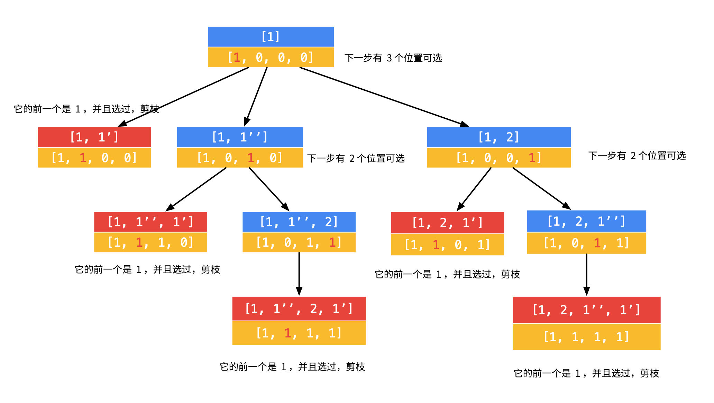

# [17. 电话号码的字母组合 中等](https://leetcode.cn/problems/letter-combinations-of-a-phone-number/description/)

给定一个仅包含数字 `2-9` 的字符串，返回所有它能表示的字母组合。答案可以按 **任意顺序** 返回。

给出数字到字母的映射如下（与电话按键相同）。注意 1 不对应任何字母。


**示例 1：**

> **输入：** digits = "23"
> **输出：** ["ad","ae","af","bd","be","bf","cd","ce","cf"]
## 思路

1. 将电话键的数字和对应的字母形成一个映射 Map, 便于查找和组合
2. 检测: 判断当前路径是否已经符合条件，也就是判断 **当前路径的长度是否等于数字串的长度**
3. 选择: 遍历当前数字对应的字母列表，**将当前字符添加到 当前路径 中，形成新的当前路径**
4. 递归: 将当前路径的长度加一，进入下一层递归
5. 回溯: 选择当前字母列表的下一个字符，回溯到上一步，尝试更多其他组合

## 代码实现

```go
func letterCombinations(digits string) []string {
	var (
		dict = map[string][]string{
			"2": {"a", "b", "c"},
			"3": {"d", "e", "f"},
			"4": {"g", "h", "i"},
			"5": {"j", "k", "l"},
			"6": {"m", "n", "o"},
			"7": {"p", "q", "r", "s"},
			"8": {"t", "u", "v"},
			"9": {"w", "x", "y", "z"},
		}
		ans          []string
		cur          string
		backtracking func(int)
	)

	if digits == "" {
		return ans
	}

	backtracking = func(start int) {
		if start == len(digits) {
			ans = append(ans, cur)
			return
		}

		k := string(digits[start])
		for i := 0; i < len(dict[k]); i++ {
			cur += dict[k][i]
			backtracking(start + 1)
			cur = cur[:len(cur)-1]
		}
	}

	backtracking(0)

	return ans
}
```

# [78. 子集 中等](https://leetcode.cn/problems/subsets/description/)

给你一个整数数组 `nums` ，数组中的元素 **互不相同** 。返回该数组所有可能的子集（幂集）。

解集 **不能** 包含重复的子集。你可以按 **任意顺序** 返回解集。

>**输入：** nums = [1,2,3]
> **输出：** [[],[1],[2],[1,2],[3],[1,3],[2,3],[1,2,3]]

## 思路

逐个枚举，空集的幂集只有空集，每增加一个元素，让之前幂集中的每个集合，追加这个元素，就是新增的子集。

## 代码实现

```go
func subsets(nums []int) [][]int {
	var (
		res       [][]int
		cur       []int
		backtrack func(i int)
	)

	backtrack = func(i int) {
		res = append(res, append([]int{}, cur...))
		for j := i; j < len(nums); j++ {
			cur = append(cur, nums[j])
			backtrack(j + 1)
			cur = cur[:len(cur)-1]
		}
	}
	backtrack(0)
	return res
}
```

### 迭代

```go
func subsets(nums []int) (ans [][]int) {
    n := len(nums)
    for mask := 0; mask < 1<<n; mask++ {
        set := []int{}
        for i, v := range nums {
            if mask>>i&1 > 0 {
                set = append(set, v)
            }
        }
        ans = append(ans, append([]int(nil), set...))
    }
    return
}
```

# [90. 子集 II 中等](https://leetcode.cn/problems/subsets-ii/description/)

给你一个整数数组 `nums` ，其中可能包含重复元素，请你返回该数组所有可能的 子集（幂集）。

解集 **不能** 包含重复的子集。返回的解集中，子集可以按 **任意顺序** 排列。

## 思路

从空子集开始，逐个元素尝试加入当前子集中，并递归处理剩余元素。为了避免生成重复子集，先将数组排序，并在每次递归调用时判断当前元素是否与前一个相等且当前元素的索引是否大于开始索引，如果大于则说明前一个已经被使用过且已经遍历完成，因此在使用该元素会生成重复子集，需要跳过

## 代码实现

```go
func subsetsWithDup(nums []int) [][]int {
	var (
		res       [][]int
		cur       []int
		backtrack func(i int)
	)

	sort.Ints(nums)
	backtrack = func(i int) {
		res = append(res, append([]int{}, cur...))
		for j := i; j < len(nums); j++ {
			if j > i && nums[j] == nums[j-1] {
				continue
			}
			cur = append(cur, nums[j])
			backtrack(j + 1)
			cur = cur[:len(cur)-1]
		}
	}
	backtrack(0)
	return res
}
```

### 迭代

```go
func subsetsWithDup(nums []int) [][]int {
    sort.Ints(nums)  // 排序数组，便于去重
    n := len(nums)
    totalSubsets := 1 << n  // 总子集数 2^n
    result := [][]int{}

    for i := 0; i < totalSubsets; i++ {
        subset := []int{}
        isDuplicate := false
        for j := 0; j < n; j++ {
            if i&(1<<j) != 0 {
                // 如果当前元素与前一个元素相同且前一个元素不在当前子集中，则跳过该元素
                if j > 0 && nums[j] == nums[j-1] && (i&(1<<(j-1))) == 0 {
                    isDuplicate = true
                    break
                }
                subset = append(subset, nums[j])
            }
        }
        if !isDuplicate {
            result = append(result, subset)
        }
    }
    return result
}
```

# [46. 全排列 中等](https://leetcode.cn/problems/permutations/description/)

给定一个不含重复数字的数组 `nums` ，返回其 _所有可能的全排列_ 。你可以 **按任意顺序** 返回答案。

**输入：** nums = [1,2,3]
**输出：** [[1,2,3],[1,3,2],[2,1,3],[2,3,1],[3,1,2],[3,2,1]]

## 思路

1. 终止条件： 当 x = len (nums) - 1 时，代表所有位已固定（最后一位只有 1 种情况），则将当前组合 nums 转化为数组并加入 res ，并返回。
2. 递推参数： 当前固定位 x 。
3. 递推工作： 将第 x 位元素与 i ∈ [x, len (nums)] 元素分别交换，并进入下层递归。
	1. 固定元素： 将元素 nums[i] 和 nums[x] 交换，即固定 nums[i] 为当前位元素。
	2. 开启下层递归： 调用 dfs (x + 1) ，即开始固定第 x + 1 个元素。
	3. 还原交换： 将元素 nums[i] 和 nums[x] 交换（还原之前的交换）。

## 代码实现

```go
func permute(nums []int) [][]int {
	var (
		ans          [][]int
		backtracking func(int)
	)

	backtracking = func(index int) {
		if index == len(nums)-1 {
			ans = append(ans, append([]int{}, nums...))
			return
		}
		for i := index; i < len(nums); i++ {
			nums[i], nums[index] = nums[index], nums[i]
			backtracking(index + 1)
			nums[i], nums[index] = nums[index], nums[i]
		}
	}

	backtracking(0)
	return ans
}
```

# [47. 全排列 II 中等](https://leetcode.cn/problems/permutations-ii/description/)
给定一个可包含重复数字的序列 `nums` ，_**按任意顺序**_ 返回所有不重复的全排列。

**输入：** nums = [1,1,2]
**输出：**
[[1,1,2],
 [1,2,1],
 [2,1,1]]
## 思路

1. 横向剪枝

当选取到nums[i]，并满足 `i > 0 && nums[i - 1] == nums[i]` 时，若 `!visited[i - 1] = true`，说明以nums[i - 1]为某一层元素的选择已穷尽，以至于在回溯的时候置 visited[i - 1] = false）。于是后续会根据这个条件跳过同层相等元素。

2. 纵向剪枝
最后一个子条件若采用 `visited[i - 1]`，当选取到nums[i]，并满足 `i > 0 && nums[i - 1] == nums[i]` 时，若 `visited[i - 1] = true`，表明当前是在nums[i - 1]的子树中选择nums[i]，根据这个条件，在子树中遇到nums[i]，总是不选取（continue），那么该子树总是无法提供有效排列（因为缺少nums[i]），于是对该子树的搜索都是无效的。之后回溯到nums[i - 1]所在层后，由于撤销为 visited[i - 1] = false，不再满足visited[i - 1] = true，于是不会跳过，可以正常选取到包含nums[i - 1]和nums[i]的排列。



## 代码实现

```go
func permuteUnique(nums []int) [][]int {
	numsLen := len(nums)
	ans := make([][]int, 0)
	used := make([]bool, numsLen)
	cur := make([]int, 0)
    sort.Ints(nums)
	var dfs func()
	dfs = func() {
		if len(cur) == numsLen {
			ans = append(ans, append([]int{}, cur...))
		}
		for i := 0; i < len(nums); i++ {
			if !used[i] {
				if i > 0 && nums[i] == nums[i-1] && !used[i-1] {
					continue
				}
				used[i] = true
				cur = append(cur, nums[i])
				dfs()
				used[i] = false
				cur = cur[:len(cur)-1]
			}
		}
	}
	dfs()
	return ans
}
```

# [39. 组合总和 中等](https://leetcode.cn/problems/combination-sum/description/)

给你一个 **无重复元素** 的整数数组 `candidates` 和一个目标整数 `target` ，找出 `candidates` 中可以使数字和为目标数 `target` 的 所有 **不同组合** ，并以列表形式返回。你可以按 **任意顺序** 返回这些组合。

`candidates` 中的 **同一个** 数字可以 **无限制重复被选取** 。如果至少一个数字的被选数量不同，则两种组合是不同的。 

对于给定的输入，保证和为 `target` 的不同组合数少于 `150` 个。

> **输入：** candidates = `[2,3,6,7],` target = `7`
> **输出：** [[2,2,3],[7]]
> **解释：**
> 2 和 3 可以形成一组候选，2 + 2 + 3 = 7 。注意 2 可以使用多次。
> 7 也是一个候选， 7 = 7 。
> 仅有这两种组合。
## 思路

1. 检测: 判断当前路径是否已经符合条件，也就是判断 **当前查找目标值等于 0**
2. 选择: 从指定的起始位置开始遍历数组，**将当前元素添加到 当前路径 中，形成新的当前路径**
3. 剪枝: 如果当前元素大于目标值，直接跳过
4. 递归: **将查找目标值减去当前元素**，进入下一层递归
5. 回溯: **当前路径中删除当前元素**，回溯到上一步，回溯尝试更多其他组合

## 代码实现

```go
func combinationSum(candidates []int, target int) [][]int {
	var (
		cur []int
		ans [][]int
		dfs func(int)
	)

	dfs = func(start int) {
		if target <= 0 {
			if target == 0 {
				ans = append(ans, append([]int{}, cur...))
			}
			return
		}
		for i := start; i < len(candidates); i++ {
            n := candidates[i]
			cur = append(cur, n)
            target -= n
			dfs(i)
			cur = cur[:len(cur)-1]
            target += n
		}
	}

	dfs(0)
	return ans
}
```

# [40. 组合总和 II 中等](https://leetcode.cn/problems/combination-sum-ii/)

给定一个候选人编号的集合 `candidates` 和一个目标数 `target` ，找出 `candidates` 中所有可以使数字和为 `target` 的组合。

`candidates` 中的每个数字在每个组合中只能使用 **一次** 。

**注意：**解集不能包含重复的组合。 

> **输入:** candidates = `[10,1,2,7,6,1,5]`, target = `8`,
> **输出:**
> [
> [1,1,6],
> [1,2,5],
> [1,7],
> [2,6]
> ]

## 思路

1. 检测: 判断当前路径是否已经符合条件，也就是判断 **当前查找目标值等于 0**
2. 选择: 从指定的起始位置开始遍历数组，**将当前元素添加到当前路径中，形成新的当前路径**
3. 剪枝: `i > begin` 确保 `在同一层中，有数字相同时，只选择第一个数字`。如果当前元素大于目标值，直接跳过
4. 递归: **将查找目标值减去当前元素**，进入下一层递归
5. 回溯: **当前路径中删除当前元素**，回溯到上一步，回溯尝试更多其他组合

## 代码实现

```go
func combinationSum2(candidates []int, target int) [][]int {
	var (
		cur []int
		ans [][]int
		dfs func(int)
	)
	sort.Ints(candidates)

	dfs = func(start int) {
		if target <= 0 {
			if target == 0 {
				ans = append(ans, append([]int{}, cur...))
			}
			return
		}
		for i := start; i < len(candidates); i++ {
			if i > start && candidates[i-1] == candidates[i] {
				continue
			}
			n := candidates[i]
			cur = append(cur, n)
			target -= n
			dfs(i+1)
			cur = cur[:len(cur)-1]
			target += n
		}
	}

	dfs(0)
	return ans
}
```

# [79. 单词搜索 中等](https://leetcode.cn/problems/word-search/description/)

## 思路

- **字符不匹配：**
    - 如果 `board[i][j] ≠ s[k]`，则当前字符不匹配，直接返回 `false`。
- **字符串末尾匹配：**
    - 如果已经访问到字符串的末尾（即 `k` 是字符串的最后一个索引），且对应字符依然匹配，则返回 `true`。
- **递归搜索：**
    - 否则，遍历当前位置的所有相邻位置。如果从某个相邻位置出发，能够搜索到子串 `word[k+1..]`，则返回 `true`；否则继续搜索直到找不到为止。

## 代码实现

```go
func exist(board [][]byte, word string) bool {
	var (
		backtracking func(int, int, int) bool
		direction    = [][]int{{0, 1}, {1, 0}, {0, -1}, {-1, 0}}
		m, n         = len(board), len(board[0])
		visited      = make([][]bool, m)
	)

	for i := range visited {
		visited[i] = make([]bool, n)
	}

	backtracking = func(x, y, index int) bool {
		if index == len(word)-1 {
			return board[x][y] == word[index]
		}

		if board[x][y] == word[index] {
			for i := 0; i < len(direction); i++ {
				visited[x][y] = true
				dx, dy := direction[i][0], direction[i][1]
				a, b := x+dx, y+dy
				if a >= 0 && a < m && b >= 0 && b < n && !visited[a][b] && backtracking(a, b, index+1) {
					return true
				}
				visited[x][y] = false
			}
		}
		return false
	}

	for i, v1 := range board {
		for j := range v1 {
			if backtracking(i, j, 0) {
				return true
			}
		}
	}

	return false
}
```

# 