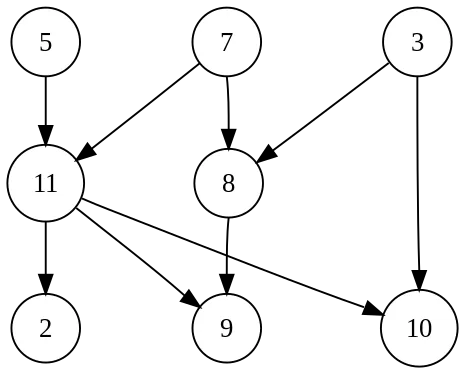
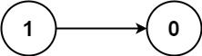
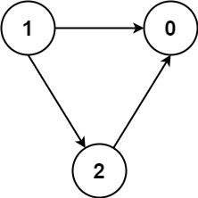

拓扑排序是一种对有向无环图（DAG）进行排序的算法，可以将图中的节点 (顶点) 按照一种线性顺序进行排列，其中每个节点 v 仅在其所有依赖关系都被访问后才被访问。

拓扑排序的典型应用是根据作业或任务的依赖性来调度作业或任务序列，作业由顶点表示，如果作业 x 必须在作业 y 开始之前完成，则从 x 到 y 存在一条边（例如，洗衣服时，洗衣机必须在我们将衣服放入烘干机之前完成）。



上面是一个典型的图结构，该图包含很多有效的拓扑排序，如果我们尝试从上到下，从左到右的顺序，可以得到如下的拓扑排序结果: 5、7、11、2、3、8、9、10。

### 算法步骤

> 拓扑排序的基本算法思想是: 通过不断删除入度为 0 的节点，并更新其相邻节点的入度，直到所有节点都访问过结束。所谓入度为 0 的节点是指在有向图中，没有任何边指向该节点的节点，也就是说，该及节点没有任何 “前置节点”，可以直接访问，因此入度为 0 的节点就是拓扑排序的起点。

下面的图结构中，节点 5, 节点 7, 节点 3 都是入度为 0 的节点。


下面是拓扑排序的一般步骤:
1. 将拓扑约束 (前置) 条件转换为邻接表
2. 初始化一个队列，将图中所有入度为 0 的节点加入队列
3. 循环从队列中取出节点，然后加入到拓扑排序结果中
4. 对于每个取出的节点，遍历其相邻节点，并将相邻节点的入度减去 1, 如果相邻节点的入度减去 1 之后入度变为 0, 则将其加入到队列
5. 重复步骤 2 和 3, 直到队列为空

# [207. 课程表 中等](https://leetcode.cn/problems/course-schedule/description/)

你这个学期必须选修 numCourses 门课程，记为 0 到 numCourses - 1 。

在选修某些课程之前需要一些先修课程。先修课程按数组 prerequisites 给出，其中 prerequisites[i] = [ai, bi] ，表示如果要学习课程 ai 则必须先学习课程  bi 。

例如，先修课程对 [0, 1] 表示：想要学习课程 0 ，你需要先完成课程 1 。
请你判断是否可能完成所有课程的学习？如果可以，返回 true ；否则，返回 false 。

示例 1：

> 输入：numCourses = 2, prerequisites = [[1,0]]
> 输出：true
> 解释：总共有 2 门课程。学习课程 1 之前，你需要完成课程 0 。这是可能的。

示例 2：

> 输入：numCourses = 2, prerequisites = [[1,0],[0,1]]
> 输出：false
> 解释：总共有 2 门课程。学习课程 1 之前，你需要先完成​课程 0 ；并且学习课程 0 之前，你还应先完成课程 1 。这是不可能的。

## 思路

- **构建图表示课程的先修关系**：
    - 使用邻接表 `graph` 来表示课程之间的依赖关系，其中 `graph[i]` 表示课程 `i` 作为先修课时，后续可以修的课程列表。
    - 同时使用 `inDegrees` 数组来记录每门课程的入度（即有多少门课程是它的前置课程）。
- **计算所有课程的入度**：
    - 遍历先修课程列表 `prerequisites`，更新每门课程的入度。每发现一个先修课程关系 `[a, b]`，则表示课程 `a` 依赖课程 `b`，因此 `a` 的入度增加1。
- **拓扑排序的初始化**：
    - 使用队列 `queue` 存储所有入度为 0 的课程（即没有任何先修课程，可以直接学习的课程）。
- **执行拓扑排序**：
    - 从队列中依次取出课程，并减少它依赖的其他课程的入度。
    - 每当某门课程的入度减少到 0 时，说明这门课程可以被学习，将其加入队列继续处理。
    - 每处理一门课程，将 `numCourses` 递减。
- **判断课程安排是否可能完成**：
    - 最后如果所有课程都被处理过（即 `numCourses == 0`），则说明没有循环依赖，课程可以全部完成，返回 `true`。否则，存在循环依赖，返回 `false`。

## 代码实现

```go
func canFinish(numCourses int, prerequisites [][]int) bool {
	graph := make(map[int][]int)
	inDegrees := make([]int, numCourses)
	for _, v := range prerequisites {
		graph[v[1]] = append(graph[v[1]], v[0])
		inDegrees[v[0]]++
	}

	queue := []int{}
	for i, v := range inDegrees {
		if v == 0 {
			queue = append(queue, i)
		}
	}
	
	for len(queue) != 0 {
		course := queue[0]
		queue = queue[1:]
		numCourses--
		for _, next := range graph[course] {
			inDegrees[next]--
			if inDegrees[next] == 0 {
				queue = append(queue, next)
			}
		}
	}
	return numCourses == 0
}
```

# [210. 课程表 II 中等](https://leetcode.cn/problems/course-schedule-ii/description/)

现在你总共有 `numCourses` 门课需要选，记为 `0` 到 `numCourses - 1`。给你一个数组 `prerequisites` ，其中 `prerequisites[i] = [ai, bi]` ，表示在选修课程 `ai` 前 **必须** 先选修 `bi` 。

- 例如，想要学习课程 `0` ，你需要先完成课程 `1` ，我们用一个匹配来表示：`[0,1]` 。

返回你为了学完所有课程所安排的学习顺序。可能会有多个正确的顺序，你只要返回 **任意一种** 就可以了。如果不可能完成所有课程，返回 **一个空数组** 。

**示例 1：**

> **输入：** numCourses = 2, prerequisites = [[1,0]]
> **输出：** [0,1]
> **解释：** 总共有 2 门课程。要学习课程 1，你需要先完成课程 0。因此，正确的课程顺序为 `[0,1] 。`

**示例 2：**

> **输入：** numCourses = 4, prerequisites = [[1,0],[2,0],[3,1],[3,2]]
> **输出：** [0,2,1,3]
> **解释：** 总共有 4 门课程。要学习课程 3，你应该先完成课程 1 和课程 2。并且课程 1 和课程 2 都应该排在课程 0 之后。因此，一个正确的课程顺序是 `[0,1,2,3]` 。另一个正确的排序是 `[0,2,1,3]` 。

## 思路

同 207，加入 ans 数组表示课程顺序。

## 代码实现

```go
func findOrder(numCourses int, prerequisites [][]int) []int {
	graph := make([][]int, numCourses)
	inDegrees := make([]int, numCourses)
	for _, v := range prerequisites {
		graph[v[1]] = append(graph[v[1]], v[0])
		inDegrees[v[0]]++
	}
	queue := make([]int, 0)
	ans := make([]int, 0)
	for i := 0; i < numCourses; i++ {
		if inDegrees[i] == 0 {
			queue = append(queue, i)
		}
	}
	for len(queue) != 0 {
		course := queue[0]
		queue = queue[1:]
		ans = append(ans, course)
		for _, next := range graph[course] {
			inDegrees[next]--
			if inDegrees[next] == 0 {
				queue = append(queue, next)
			}
		}
	}

	if len(ans) == numCourses {
		return ans
	}

	return nil
}

```

# [1462. 课程表 IV 中等](https://leetcode.cn/problems/course-schedule-iv/description/)

你总共需要上 numCourses 门课，课程编号依次为 0 到 numCourses-1 。你会得到一个数组 prerequisite ，其中 prerequisites[i] = [ai, bi] 表示如果你想选 bi 课程，你必须先选 ai 课程。

有的课会有直接的先修课程，比如如果想上课程 1 ，你必须先上课程 0 ，那么会以 [0,1] 数对的形式给出先修课程数对。
先决条件也可以是间接的。如果课程 a 是课程 b 的先决条件，课程 b 是课程 c 的先决条件，那么课程 a 就是课程 c 的先决条件。

你也得到一个数组 queries ，其中 queries[j] = [uj, vj]。对于第 j 个查询，您应该回答课程 uj 是否是课程 vj 的先决条件。

返回一个布尔数组 answer ，其中 answer[j] 是第 j 个查询的答案。

示例 1：

> **输入**：numCourses = 2, prerequisites = [[1,0]], queries = [[0,1],[1,0]]
> **输出**：[false, true]
> **解释**：课程 0 不是课程 1 的先修课程，但课程 1 是课程 0 的先修课程。

示例 2：

> **输入**：numCourses = 2, prerequisites = [], queries = [[1,0],[0,1]]
> **输出**：[false, false]
> **解释**：没有先修课程对，所以每门课程之间是独立的。

示例 3：

> **输入**：numCourses = 3, prerequisites = [[1,2],[1,0],[2,0]], queries = [[1,0],[1,2]]
> **输出**：[true, true]
> 
## 思路

- **构建图的表示**：
    - 使用邻接表 `graph` 来表示课程之间的先修关系。`graph[i]` 表示课程 `i` 是前置课程，它指向的课程列表是可以在完成课程 `i` 后学习的课程。
    - 使用 `inDegrees` 数组记录每门课程的入度，即有多少门课程是它的前置课程。
    - 使用二维布尔数组 `isReachable` 来表示课程之间的可达性。`isReachable[i][j]` 为 `true` 表示课程 `i` 是课程 `j` 的前置课程或间接前置课程。
- **拓扑排序与可达性计算**：
    - 使用拓扑排序对图进行处理，从入度为 0 的课程开始（即没有前置课程的课程）。
    - 在处理每门课程时，更新其后续课程的可达性。如果课程 `i` 是课程 `j` 的前置课程，那么 `isReachable[i][j]` 为 `true`。同时，如果 `k` 是课程 `i` 的前置课程，那么 `k` 也可以到达 `j`，因此 `isReachable[k][j]` 也需要更新。
- **处理查询**：
    - 对每个查询，检查 `isReachable[query[0]][query[1]]` 是否为 `true`。如果是，则表示 `query[0]` 是 `query[1]` 的前置课程。

## 代码实现

```go
func checkIfPrerequisite(numCourses int, prerequisites [][]int, queries [][]int) []bool {
	graph := make([][]int, numCourses)
	inDegrees := make([]int, numCourses)
	ans := make([]bool, len(queries))
	isReachable := make([][]bool, numCourses)
	for _, v := range prerequisites {
		graph[v[0]] = append(graph[v[0]], v[1])
		inDegrees[v[1]]++
	}
	for i := range isReachable {
		isReachable[i] = make([]bool, numCourses)
	}

	queue := []int{}
	for i, v := range inDegrees {
		if v == 0 {
			queue = append(queue, i)
		}
	}
	for len(queue) != 0 {
		course := queue[0]
		queue = queue[1:]
		for _, next := range graph[course] {
			isReachable[course][next] = true
			for i := 0; i < numCourses; i++ {
				isReachable[i][next] = isReachable[i][next] || isReachable[i][course]
			}
			inDegrees[next]--
			if inDegrees[next] == 0 {
				queue = append(queue, next)
			}
		}
	}

	for i, query := range queries {
		ans[i] = isReachable[query[0]][query[1]]
	}
	return ans
}
```

# [2115. 从给定原材料中找到所有可以做出的菜 中等](https://leetcode.cn/problems/find-all-possible-recipes-from-given-supplies/description/)
你有 `n` 道不同菜的信息。给你一个字符串数组 `recipes` 和一个二维字符串数组 `ingredients` 。第 `i` 道菜的名字为 `recipes[i]` ，如果你有它 **所有** 的原材料 `ingredients[i]` ，那么你可以 **做出** 这道菜。一道菜的原材料可能是 **另一道** 菜，也就是说 `ingredients[i]` 可能包含 `recipes` 中另一个字符串。

同时给你一个字符串数组 `supplies` ，它包含你初始时拥有的所有原材料，每一种原材料你都有无限多。

请你返回你可以做出的所有菜。你可以以 **任意顺序** 返回它们。

注意两道菜在它们的原材料中可能互相包含。

**示例 1：**

> **输入：** recipes = ["bread"], ingredients = [["yeast","flour"]], supplies = ["yeast","flour","corn"]
> **输出：** ["bread"]
> **解释：** 
> 我们可以做出 "bread" ，因为我们有原材料 "yeast" 和 "flour" 。

**示例 2：**

> **输入：** recipes = ["bread","sandwich"], ingredients = [["yeast","flour"],["bread","meat"]], supplies = ["yeast","flour","meat"]
> **输出：** ["bread","sandwich"]
> **解释：** 
> 我们可以做出 "bread" ，因为我们有原材料 "yeast" 和 "flour" 。
> 我们可以做出 "sandwich" ，因为我们有原材料 "meat" 且可以做出原材料 "bread" 。

## 思路

我们把每一种原材料（菜也算一种原材料）看成图上的一个节点，如果某一道菜需要一种原材料，就添加一条从原材料到菜的有向边。

可以发现，如果图上的一个节点的入度为 0（即不存在以该节点为终点的边），那么该节点对应的原材料是可以直接使用的。特别地，如果该节点对应的原材料是一道菜，那么我们就可以做出这道菜。在这之后，我们将以该节点本身和以该节点为起点的边全部删除，这样就可能会有节点的入度变为 0，我们就可以不断重复这一过程，直到图中不存在节点，或所有剩余节点的入度均不为 0。

## 代码实现

```go
func findAllRecipes(recipes []string, ingredients [][]string, q []string) (ans []string) {
	g := map[string][]string{}
	deg := make(map[string]int, len(recipes))
	for i, r := range recipes {
		for _, s := range ingredients[i] {
			g[s] = append(g[s], r) // 从这道菜的原材料向这道菜连边
		}
		deg[r] = len(ingredients[i])
	}
	for len(q) > 0 { // 拓扑排序（这里我们直接用初始原材料当队列）
		s := q[0]
		q = q[1:]
		for _, r := range g[s] {
			if deg[r]--; deg[r] == 0 { // 这道菜的所有原材料我们都有
				q = append(q, r)
				ans = append(ans, r)
			}
		}
	}
	return
}
```

# [310. 最小高度树 中等](https://leetcode.cn/problems/minimum-height-trees/description/)

树是一个无向图，其中任何两个顶点只通过一条路径连接。 换句话说，任何一个没有简单环路的连通图都是一棵树。

给你一棵包含 `n` 个节点的树，标记为 `0` 到 `n - 1` 。给定数字 `n` 和一个有 `n - 1` 条无向边的 `edges` 列表（每一个边都是一对标签），其中 `edges[i] = [ai, bi]` 表示树中节点 `ai` 和 `bi` 之间存在一条无向边。

可选择树中任何一个节点作为根。当选择节点 `x` 作为根节点时，设结果树的高度为 `h` 。在所有可能的树中，具有最小高度的树（即，`min(h)`）被称为 **最小高度树** 。

请你找到所有的 **最小高度树** 并按 **任意顺序** 返回它们的根节点标签列表。

树的 **高度** 是指根节点和叶子节点之间最长向下路径上边的数量。

**示例 1：**


> **输入：** n = 4, edges = [[1,0],[1,2],[1,3]]
> **输出：** [1]
> **解释：** 如图所示，当根是标签为 1 的节点时，树的高度是 1 ，这是唯一的最小高度树。
## 思路

- 无向无环图A在删除度为1的结点后得到无向无环图B。可以证明，图A所成最小高度树TreeA是由图B所成的最小高度树TreeB接上被删除结点后构成的。反证法：图B所成的树TreeB如果不是最小高度树，那么存在图B的最小高度树TreeB’，TreeB’的高度比TreeB更小。那么TreeB’接上被删除结点后高度比TreeA更小，这与TreeA是最小高度树矛盾。

- 既然图A的最小高度树是由图B的最小高度树接上被删除的结点所成。那么图A的最小高度树的根结点与图B的最小高度树的根结点是相同的，因为，接上被删除的结点不会成为根结点，否则相比不成为根结点的高度还要高1。因此找图A的最小高度树的根结点演变为找图B的最小高度树的根结点。

## 代码实现

```go
func findMinHeightTrees(n int, edges [][]int) (ans []int) {
	if n == 1 {
		return []int{0}
	}
	g := make([][]int, n)
	degree := make([]int, n)
	for _, e := range edges {
		a, b := e[0], e[1]
		g[a] = append(g[a], b)
		g[b] = append(g[b], a)
		degree[a]++
		degree[b]++
	}
	q := []int{}
	for i, d := range degree {
		if d == 1 {
			q = append(q, i)
		}
	}
	for len(q) > 0 {
		ans = []int{}
		for i := len(q); i > 0; i-- {
			a := q[0]
			q = q[1:]
			ans = append(ans, a)
			for _, b := range g[a] {
				degree[b]--
				if degree[b] == 1 {
					q = append(q, b)
				}
			}
		}
	}
	return
}
```

# [802. 找到最终的安全状态  中等](https://leetcode.cn/problems/find-eventual-safe-states/description/)、

有一个有 `n` 个节点的有向图，节点按 `0` 到 `n - 1` 编号。图由一个 **索引从 0 开始** 的 2D 整数数组 `graph`表示， `graph[i]`是与节点 `i` 相邻的节点的整数数组，这意味着从节点 `i` 到 `graph[i]`中的每个节点都有一条边。

如果一个节点没有连出的有向边，则该节点是 **终端节点** 。如果从该节点开始的所有可能路径都通向 **终端节点** ，则该节点为 **安全节点** 。

返回一个由图中所有 **安全节点** 组成的数组作为答案。答案数组中的元素应当按 **升序** 排列。

**示例 1：**


> **输入：** graph = [[1,2],[2,3],[5],[0],[5],[],[]]
> **输出：** [2,4,5,6]
> **解释：** 示意图如上。
> 节点 5 和节点 6 是终端节点，因为它们都没有出边。
> 从节点 2、4、5 和 6 开始的所有路径都指向节点 5 或 6 。

## 思路

### DFS + 三色标记法

根据题意，若起始节点位于一个环内，或者能到达一个环，则该节点不是安全的。否则，该节点是安全的。

我们可以使用深度优先搜索来找环，并在深度优先搜索时，用三种颜色对节点进行标记，标记的规则如下：

白色（用 0 表示）：该节点尚未被访问；
灰色（用 1 表示）：该节点位于递归栈中，或者在某个环上；
黑色（用 2 表示）：该节点搜索完毕，是一个安全节点。
当我们首次访问一个节点时，将其标记为灰色，并继续搜索与其相连的节点。

如果在搜索过程中遇到了一个灰色节点，则说明找到了一个环，此时退出搜索，栈中的节点仍保持为灰色，这一做法可以将「找到了环」这一信息传递到栈中的所有节点上。

如果搜索过程中没有遇到灰色节点，则说明没有遇到环，那么递归返回前，我们将其标记由灰色改为黑色，即表示它是一个安全的节点。

### 拓扑排序

根据题意，若一个节点没有出边，则该节点是安全的；若一个节点出边相连的点都是安全的，则该节点也是安全的。

根据这一性质，我们可以将图中所有边反向，得到一个反图，然后在反图上运行拓扑排序。

具体来说，首先得到反图 rg 及其入度数组 inDeg。将所有入度为 0 的点加入队列，然后不断取出队首元素，将其出边相连的点的入度减一，若该点入度减一后为 0，则将该点加入队列，如此循环直至队列为空。循环结束后，所有入度为 0 的节点均为安全的。我们遍历入度数组，并将入度为 0 的点加入答案列表。

## 代码实现

### 思路 1

```go
func eventualSafeNodes(graph [][]int) (ans []int) {
    n := len(graph)
    color := make([]int, n)
    var safe func(int) bool
    safe = func(x int) bool {
        if color[x] > 0 {
            return color[x] == 2
        }
        color[x] = 1
        for _, y := range graph[x] {
            if !safe(y) {
                return false
            }
        }
        color[x] = 2
        return true
    }
    for i := 0; i < n; i++ {
        if safe(i) {
            ans = append(ans, i)
        }
    }
    return
}
```
### 思路 2

```go
func eventualSafeNodes(graph [][]int) []int {
	inDegree := make([]int, len(graph))
	reGraph := make([][]int, len(graph))
	for i, edges := range graph {
		for _, v := range edges {
			reGraph[v] = append(reGraph[v], i)
			inDegree[i]++
		}
	}

	queue := []int{}
	for i, v := range inDegree {
		if v == 0 {
			queue = append(queue, i)
		}
	}
	for len(queue) > 0 {
		u := queue[0]
		queue = queue[1:]
		for _, v := range reGraph[u] {
			inDegree[v]--
			if inDegree[v] == 0 {
				queue = append(queue, v)
			}
		}
	}

	ans := []int{}
	for i, v := range inDegree {
		if v == 0 {
			ans = append(ans, i)
		}
	}
	return ans
}
```

# [1203. 项目管理 困难](https://leetcode.cn/problems/sort-items-by-groups-respecting-dependencies/description/)

有 `n` 个项目，每个项目或者不属于任何小组，或者属于 `m` 个小组之一。`group[i]` 表示第 `i` 个项目所属的小组，如果第 `i` 个项目不属于任何小组，则 `group[i]` 等于 `-1`。项目和小组都是从零开始编号的。可能存在小组不负责任何项目，即没有任何项目属于这个小组。

请你帮忙按要求安排这些项目的进度，并返回排序后的项目列表：

- 同一小组的项目，排序后在列表中彼此相邻。
- 项目之间存在一定的依赖关系，我们用一个列表 `beforeItems` 来表示，其中 `beforeItems[i]` 表示在进行第 `i` 个项目前（位于第 `i` 个项目左侧）应该完成的所有项目。

如果存在多个解决方案，只需要返回其中任意一个即可。如果没有合适的解决方案，就请返回一个 **空列表** 。

> **输入：** n = 8, m = 2, group = [-1,-1,1,0,0,1,0,-1], beforeItems = [[],[6],[5],[6],[3,6],[],[],[]]
> **输出：** [6,3,4,1,5,2,0,7]

## 思路

可以将项目抽象成点，项目间依赖关系的抽象成边，即如果进行项目 `i` 前需要完成项目`j`，那么就存在一条` j→i` 的边。然后判断图中是否可以拓扑排序。

但这样的方法忽略了题目中的一个关键条件：「同一小组的项目，排序后在列表中彼此相邻」。这意味着组与组之间也存在依赖关系，故还要解决组之间的拓扑排序。基于此，解决这道题其实可以分成两步：

首先解决组与组的依赖关系。我们将组抽象成点，组与组的关系抽象成边，建图后判断是否存在一个拓扑排序。
如果存在拓扑顺序 `groupTopSort`，我们只要再确定组内的依赖关系。遍历组间的拓扑序 `groupTopSort`，对于任意的组 `g`，对所有属于组 `g` 的点再进行拓扑排序。如果能够拓扑排序，则将组 `g`内部的拓扑序按顺序放入答案数组即可。

## 代码实现

```go
func sortItems(n int, m int, group []int, beforeItems [][]int) []int {

	// 拓扑排序(双重)
	// 因为同一组的项目要呆在一起,造成组与组之间也有依赖
	// trick: 给没有组的项目设置一个组编号,使得其可以参与组的拓扑排序

	topoSort := func(objs []int, degree []int, g [][]int) (orders []int) { // k个items进行排序,返回排序后的items

		k := len(objs)
		q := make([]int, 0, k)
		for _, id := range objs {
			if degree[id] == 0 {
				q = append(q, id)
			}
		}
		var cur int
		for len(q) > 0 {
			cur, q = q[0], q[1:]
			orders = append(orders, cur) // 出的时机收集(如果是入的时机收集,有两处)
			for _, nx := range g[cur] {
				degree[nx]--
				if degree[nx] == 0 {
					q = append(q, nx)
				}
			}
		}
		return
	}

	// 预处理,让没有组的项目设置一个组
	groupItems := make([][]int, m+n) // 一个group有哪些item
	for id, gID := range group {
		if gID == -1 {
			gID = m
			group[id] = m
			m++
		}
		groupItems[gID] = append(groupItems[gID], id) // 组的范围[0,m)
	}
	groupItems = groupItems[:m]
	// 建立组和项目的依赖
	// trick!!!!, 如果是跨组的项目依赖,只建立组之间的依赖(如果前置组的依赖全部满足,那么就是前置组项目的依赖全部满足),
	// 这样的好处是项目只需考虑组内的依赖,因为最终需要一组组的分批处理, 当某个项目前置满足时,并不是处理的时机,而是要等到处理此组数据时才处理),还有一个好处就是可以共用一份topoSort代码
	groupGraph := make([][]int, m)
	groupDegree := make([]int, m)
	itemGraph := make([][]int, n)
	itemDegree := make([]int, n)
	for id, items := range beforeItems {
		gID := group[id]
		for _, preID := range items {
			gPreID := group[preID]

			if gID != gPreID { // 跨组依赖,只需建立组之间的依赖
				groupGraph[gPreID] = append(groupGraph[gPreID], gID)
				groupDegree[gID]++
			} else { // 同组依赖
				itemGraph[preID] = append(itemGraph[preID], id)
				itemDegree[id]++
			}
		}
	}

	// 先处理组中依赖,如果可以全部满足,那跨组的项目依赖也全部满足
	groupIDs := make([]int, m)
	for i := 0; i < m; i++ {
		groupIDs[i] = i
	}
	groupOrders := topoSort(groupIDs, groupDegree, groupGraph)
	if len(groupOrders) != m { // 组中有依赖循环
		return []int{}
	}

	ans := make([]int, 0, n)
	for _, gID := range groupOrders {
		items := groupItems[gID]
		// 一组组分批处理,好让同组项目放在一起
		itemOrdersInOneGroup := topoSort(items, itemDegree, itemGraph)

		if len(itemOrdersInOneGroup) != len(items) { // 注意!! 同组依赖也可能有循环
			return []int{}
		}
		ans = append(ans, itemOrdersInOneGroup...)
	}
	return ans
}
```