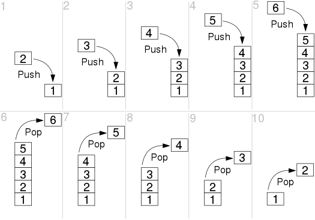

在计算机科学中，栈 (Stack) 是一种抽象数据结构，主要针对集合类数据 (最常见的是数组) 进行两种操作：

1. **Push (入栈)**: 将元素添加到集合中
2. **Pop (出栈)**: 将最近加入的元素从集合中删除




如上图所示的栈结构中，初始化栈内元素为 1，紧接着进行了两轮操作:

1. 将元素 2, 3, 4, 5, 6 分别入栈 (也就是图中的 1, 2, 3, 4, 5 对应的小图)
2. 将元素 6, 5, 4, 2, 2 分别出栈 (也就是图中的 6, 7, 8, 9, 10 对应的小图)

因为入栈和出栈的操作顺序正好相反，所以栈的顺序简称为 “后进先出”，单次缩写为 LIFO (Last In, First Out)。

# 🛠️ 容易出错的细节

虽然栈 (Stack) 数据结构简单直观，易于理解，但是实践中还是有几个常见的细节会引发 Bug。

1. 入栈和出栈操作顺序错误
2. **边界异常**: 栈为空时出栈、栈溢出 (栈已满时入栈)
3. 无限循环或递归: 没有及时出栈或者出栈逻辑实现错误
4. 元素类型异常: 入栈之前应该检测元素类型，尤其是当元素为接口类型时，一定要检测入栈元素是否实现了特定接口，避免运行时错误

# [20. 有效的括号](https://leetcode.cn/problems/valid-parentheses/description/)

给定一个只包括 `'('`，`')'`，`'{'`，`'}'`，`'['`，`']'` 的字符串 `s` ，判断字符串是否有效。

有效字符串需满足：

1. 左括号必须用相同类型的右括号闭合。
2. 左括号必须以正确的顺序闭合。
3. 每个右括号都有一个对应的相同类型的左括号。

> **输入：** s = "()"
> **输出：** true

解题思路:

1. 将字符分为两组，左边界组: `( { [`, 右边界组  `) } ]`，并形成映射关系: `( => ), { => }, [ => ]`
2. 声明并初始化一个栈结构，用于存储字符
3. 遍历字符串
	1. 如果当前字符属于左边界组，将其入栈
	2. 如果当前字符属于右边界组，取出栈顶字符
	3. 比较当前字符和栈顶字符是否为映射关系，如果不是，说明字符串不是有效括号，直接返回 false 即可
4. 遍历字符串结束，确认栈是否为空，如果为空，说明字符串是有效括号，如果不为空，说明字符串不是有效括号

```go
// 题解代码
func isValid(s string) bool {
 // 如果 s 的长度为奇数，肯定不是有效括号
 if len(s)&1 == 1 {
  return false
 }

 // 将左右边界字符进行分组并形成映射
 charMap := map[byte]byte{
  '(': ')',
  '{': '}',
  '[': ']',
 } 

 var stack []byte

 for i := range s {
  if _, ok := charMap[s[i]]; ok {
   stack = append(stack, s[i])
  } else {
   index := len(stack) - 1
   if len(stack) == 0 || s[i] != charMap[stack[index]] {
    return false
   }
   stack = stack[:index]
  }
 }

 // 此时栈内可能还存在一些左边界字符
 // 所以需要判断栈是否为空
 return len(stack) == 0
}
```

# [150. 逆波兰表达式求值](https://leetcode.cn/problems/evaluate-reverse-polish-notation/description/)

给你一个字符串数组 `tokens` ，表示一个根据 [逆波兰表示法](https://baike.baidu.com/item/%E9%80%86%E6%B3%A2%E5%85%B0%E5%BC%8F/128437) 表示的算术表达式。

请你计算该表达式。返回一个表示表达式值的整数。

> **输入**：tokens = ["2","1","+","3","*"]
> **输出**：9
> **解释**：该算式转化为常见的中缀算术表达式为：((2 + 1) * 3) = 9

解题思路：

1. 声明并初始化一个栈结构，用于存储遍历过程中遇到的数字
2. 遍历 tokens 数组
	1. 如果当前 token 是数字，将其入栈
	2. 如果当前 token 是运算符，取出栈顶的两个数字，并根据运算符执行具体的计算，然后将计算结果加入栈
3. 遍历 tokens 数组结束，**返回栈底元素** (也就是最后一次计算出的结果值)

```go
func evalRPN(tokens []string) int {
 if len(tokens) == 0 {
  return 0
 }

 var stack []int

 for _, token := range tokens {
  // 将当前 token 解析为数字
  val, err := strconv.Atoi(token)

  // 如果没有发生错误
  // 说明当前 token 为数字，直接入栈
  if err == nil {
   stack = append(stack, val)
  } else {
   // 说明当前 token 为运算符
   // 取出栈顶的两个数字
   num1, num2 := stack[len(stack)-2], stack[len(stack)-1]
   stack = stack[:len(stack)-2]

   // 根据不同的运算符执行不同的计算
   // 同时将计算结果加入到栈中s
   switch token {
   case "+":
    stack = append(stack, num1+num2)
   case "-":
    stack = append(stack, num1-num2)
   case "*":
    stack = append(stack, num1*num2)
   case "/":
    stack = append(stack, num1/num2)
   }
  }
 }

 // 返回栈底元素
 return stack[0]
}
```

# [71. 简化路径](https://leetcode.cn/problems/simplify-path/description/)

给你一个字符串 `path` ，表示指向某一文件或目录的 Unix 风格 **绝对路径** （以 `'/'` 开头），请你将其转化为更加简洁的规范路径。

在 Unix 风格的文件系统中，一个点（`.`）表示当前目录本身；此外，两个点 （`..`） 表示将目录切换到上一级（指向父目录）；两者都可以是复杂相对路径的组成部分。任意多个连续的斜杠（即，`'//'`）都被视为单个斜杠 `'/'` 。 对于此问题，任何其他格式的点（例如，`'...'`）均被视为文件/目录名称。

请注意，返回的 **规范路径** 必须遵循下述格式：

- 始终以斜杠 `'/'` 开头。
- 两个目录名之间必须只有一个斜杠 `'/'` 。
- 最后一个目录名（如果存在）**不能** 以 `'/'` 结尾。
- 此外，路径仅包含从根目录到目标文件或目录的路径上的目录（即，不含 `'.'` 或 `'..'`）。

返回简化后得到的 **规范路径** 。

> 示例 1：
> 
> **输入**：path = "/home//foo/"
> **输出**："/home/foo"
> **解释**：在规范路径中，多个连续斜杠需要用一个斜杠替换。
> 
> 示例 2：
> 
> **输入**：path = "/a/./b/../../c/"
> **输出**："/c"

解题思路：

1. 声明并初始化一个栈结构，用于存储遍历过程中遇到的 目录名称/文件名称
2. 将参数路径使用 `/` 分隔符分割为字符串数组
3. 遍历字符串数组
	1. 如果当前字符串不是有效的路径字符，例如 `""` `.`, 直接跳过
	2. 如果当前字符串是目录名称/文件名称，将其入栈
	3. 如果当前字符串表示上级目录 `..` ，将栈顶元素出栈
4. 遍历字符串数组结束，将栈内所有元素使用 `/` 分隔符分割为字符串路径，然后在路径最前面加 `/` 即可

```go
func simplifyPath(path string) string {
	stack := []string{}

	for _, p := range strings.Split(path, "/") {
		switch p {
		case ".", "":
			continue
		case "..":
			if len(stack) > 0 {
				stack = stack[:len(stack)-1]
			}
		default:
			stack = append(stack, p)
		}
	}

	return "/" + strings.Join(stack, "/")
}
```

