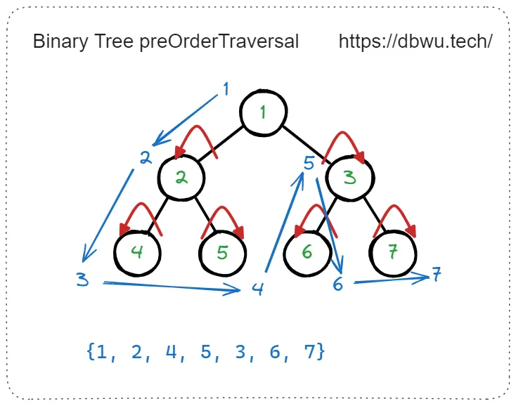
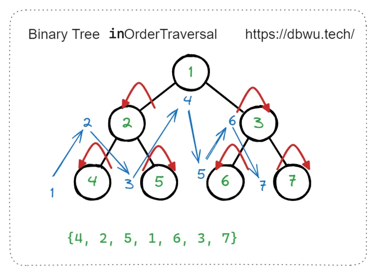
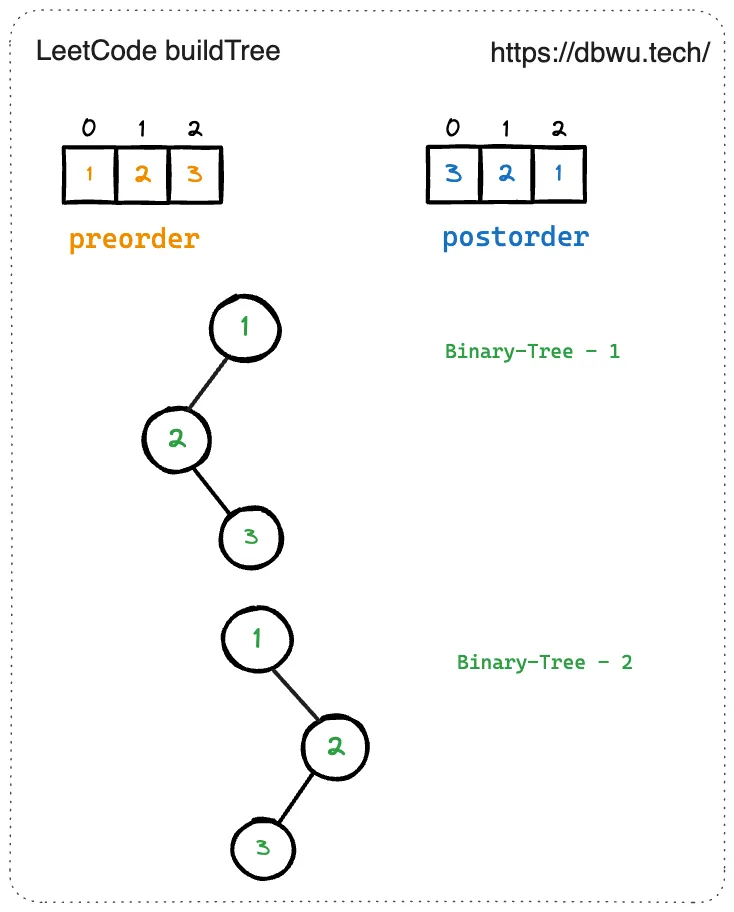

# 1. 基础

>在计算机科学中，二叉树是一种树形数据结构，其中每个节点最多有两个子节点，称为左子节点和右子节点。

## 前序 (先序) 遍历

先访问根节点，然后 (递归) 前序遍历左子树，最后 (递归) 前序遍历右子树。



```go
// 简单递归版本
func preOrderTraversal(root *TreeNode) {
	if root != nil {
		// 先访问根节点
		fmt.Println(root.Val)
		// 然后 (递归) 前序遍历左子树
		preOrderTraversal(root.Left)
		// 最后 (递归) 前序遍历右子树
		preOrderTraversal(root.Right)
	}
}
```

迭代：
首先我们应该创建一个 `Stack` 用来存放节点，首先我们想要打印根节点的数据，此时 Stack 里面的内容为空，所以我们优先将头结点加入 `Stack`，然后打印。

之后我们应该先打印左子树，然后右子树。所以先加入 `Stack` 的就是右子树，然后左子树。

```go
func preOrderTraversal(root *TreeNode) {
	if root == nil {
		return
	}

	stack := []*TreeNode{root}

	for len(stack) != 0 {
		node := stack[len(stack)-1]
		stack = stack[:len(stack)-1]
		fmt.Println(node.Val)
		if node.Right != nil {
			stack = append(stack, node.Right)
		}
		if node.Left != nil {
			stack = append(stack, node.Left)
		}
	}
}
```
## 中序遍历

先 (递归) 中序遍历左子树，然后访问根节点，最后 (递归) 中序遍历右子树。



```go
// 简单递归版本
func inOrderTraversal(root *TreeNode) {
	if root != nil {
		// 先 (递归) 中序遍历左子树
		inOrderTraversal(root.Left)
		// 然后访问根节点
		fmt.Println(root.Val)
		// 最后 (递归) 中序遍历右子树
		inOrderTraversal(root.Right)
	}
}
```

迭代：

1. 创建一个 `Stack`，然后按左中右的顺序输出节点。
2. 尽可能的将这个节点的左子树压入 `Stack`，此时栈顶的元素是最左侧的元素，其目的是找到一个最小单位的子树 (也就是最左侧的一个节点)，并且在寻找的过程中记录了来源，才能返回上层, 同时在返回上层的时候已经处理完毕左子树了。
3. 当处理完最小单位的子树时，返回到上层处理了中间节点。（如果把整个左中右的遍历都理解成子树的话，就是处理完左子树->中间 (就是一个节点)->右子树）
4. 如果有右节点，其也要进行中序遍历。

```go
func inOrderTraversal(root *TreeNode) {
	if root == nil {
		return
	}

	cur := root
	stack := []*TreeNode{}
	for cur != nil || len(stack) != 0 {
		for cur != nil {
			stack = append(stack, cur)
			cur = cur.Left
		}
		cur = stack[len(stack)-1]
		stack = stack[:len(stack)-1]
		fmt.Println(cur.Val)
		cur = cur.Right
	}
}

```
## 后序遍历

先 (递归) 后序遍历左子树，然后 (递归) 后序遍历右子树，最后访问根节点。


```go
// 简单递归版本
func postOrderTraversal(root *TreeNode) {
	if root != nil {
		// 先 (递归) 后序遍历左子树
		postOrderTraversal(root.Left)
		// 然后 (递归) 后序遍历右子树
		postOrderTraversal(root.Right)
		// 最后访问根节点
		fmt.Println(root.Val)
	}
}
```

迭代 1：
1. 前序遍历的过程 是 中左右。
2. 将其转化成 中右左。也就是压栈的过程中优先压入左子树，在压入右子树。

```go
// 迭代版本1
func postOrderTraversal(root *TreeNode) []int {
	if root == nil {
		return nil
	}

	stack := []*TreeNode{}
	output := []*TreeNode{}

	// 把根节点压入stack
	stack = append(stack, root)

	// 当stack不为空时
	for len(stack) > 0 {
		// 弹出stack的最后一个元素
		node := stack[len(stack)-1]
		stack = stack[:len(stack)-1]

		// 把该元素压入output
		output = append(output, node)

		// 把该节点的左子节点压入stack
		if node.Left != nil {
			stack = append(stack, node.Left)
		}
		// 把该节点的右子节点压入stack
		if node.Right != nil {
			stack = append(stack, node.Right)
		}
	}

	// 准备结果
	result := []int{}
	// 把output中的元素依次弹出即为后序遍历结果
	for len(output) > 0 {
		node := output[len(output)-1]
		output = output[:len(output)-1]
		result = append(result, node.Val)
	}

	return result
}
```

迭代 2：

1. 用一个指针 `prev` 标记当前退出的节点是什么。
2. 后序遍历的过程中在遍历完左子树跟右子树 `prev` 都会回到根结点。所以当前不管是从左子树还是右子树回到根结点都不应该再操作了，应该退回上层。
3. 如果是从右边再返回根结点，应该回到上层。

```go
func postOrderTraversal(root *TreeNode) {
	if root == nil {
		return
	}

	stack := []*TreeNode{root}
	var prev *TreeNode

	for len(stack) > 0 {
		peek := stack[len(stack)-1]
		if peek.Left != nil && peek.Left != prev && peek.Right != prev {
			stack = append(stack, peek.Left)
		} else if peek.Right != nil && peek.Right != prev {
			stack = append(stack, peek.Right)
		} else {
			fmt.Println(peek.Val)
			stack = stack[:len(stack)-1]
			prev = peek
		}
	}
}
```

# 2. 构建二叉树

## [105. 从前序与中序遍历序列构造二叉树](https://leetcode.cn/problems/construct-binary-tree-from-preorder-and-inorder-traversal/description/)

给定两个整数数组 `preorder` 和 `inorder` ，其中 `preorder` 是二叉树的**先序遍历**， `inorder` 是同一棵树的**中序遍历**，请构造二叉树并返回其根节点。


> **输入:**  preorder = [3,9,20,15,7], inorder = [9,3,15,20,7]
> **输出:**  [3,9,20,null,null,15,7]

### 思路

1. 根据题目给出的两种遍历方式计算出根节点，**前序遍历数组的第一个元素就是根节点**
2. 找到 **中序遍历数组中根节点的值对应的索引**，并根据索引将数组分成两个部分，左半部分就是左子树的所有节点值，右半部分就是右子树的所有节点值
3. 递归数组左半部分，**并将返回值赋值给 根节点的左节点**
4. 递归数组右半部分，**并将返回值赋值给 根节点的右节点**

### 代码实现

```go
func buildTree(preorder []int, inorder []int) *TreeNode {
	if len(preorder) == 0 {
		return nil
	}

	// 前序遍历数组的第一个元素就是根节点
	root := &TreeNode{Val: preorder[0]}

	for i := range inorder {
		// 找到中序遍历数组中根节点的值对应的索引
		// 并根据索引将数组分成两个部分
		if inorder[i] == root.Val {
			// 左半部分就是左子树的所有节点值
			root.Left = buildTree(preorder[1:i+1], inorder[:i])
			// 右半部分就是右子树的所有节点值
			root.Right = buildTree(preorder[i+1:], inorder[i+1:])
		}
	}

	return root
}
```

## [106. 从中序与后序遍历序列构造二叉树](https://leetcode.cn/problems/construct-binary-tree-from-inorder-and-postorder-traversal/)

给定两个整数数组 `inorder` 和 `postorder` ，其中 `inorder` 是二叉树的中序遍历， `postorder` 是同一棵树的后序遍历，请你构造并返回这颗 _二叉树_ 。


> **输入：** inorder = [9,3,15,20,7], postorder = [9,15,7,20,3]
> **输出：** [3,9,20,null,null,15,7]

### 思路

后序遍历的最后一个节点是根节点，我们可以根据这个特点找到根节点在中序遍历中的位置，然后递归地构造左右子树。

具体地，我们先用一个哈希表 `d` 存储中序遍历中每个节点的位置。然后我们设计一个递归函数 `dfs(i, j, n)`，其中 `i` 和 `j` 分别表示中序遍历和后序遍历的起点，而 `n` 表示子树包含的节点数。函数的逻辑如下：

1. 如果 `n ≤ 0`，说明子树为空，返回空节点。
2. 否则，取出后序遍历的最后一个节点 `v`，然后我们在哈希表 `d` 中找到 `v` 在中序遍历中的位置，设为 `k`。那么左子树包含的节点数为 `k - i`，右子树包含的节点数为 `n - k + i - 1`。
3. 递归构造左子树 `dfs(i, j, k - i)` 和右子树 `dfs(k + 1, j + k - i, n - k + i - 1)`，并连接到根节点上，最后返回根节点。

### 代码实现

```go
func buildTree(inorder []int, postorder []int) *TreeNode {
	d := map[int]int{}
	for i, v := range inorder {
		d[v] = i
	}
	var dfs func(i, j, n int) *TreeNode
	dfs = func(i, j, n int) *TreeNode {
		if n <= 0 {
			return nil
		}
		v := postorder[j+n-1]
		k := d[v]
		l := dfs(i, j, k-i)
		r := dfs(k+1, j+k-i, n-k+i-1)
		return &TreeNode{v, l, r}
	}
	return dfs(0, 0, len(inorder))
}
```

## 思考：根据先序遍历和后序遍历顺序是否可以确定出二叉树的结构？为什么？

**根据先序和后序遍历的结果无法唯一确定二叉树**，因为先序遍历和后序遍历序列无法提供足够的信息来唯一确定一棵二叉树。

具体来说:

1. 如果只给出先序遍历序列，无法确定左右子树的分界线
2. 如果只给出后序遍历序列，同样无法确定左右子树的分界线
3. 如果同时给出先序遍历和后序遍历序列，依然无法唯一确定二叉树的结构。因为在这种情况下，可以构造出多个不同的二叉树，它们具有相同的先序和后序遍历序列。

举个例子:

下面同时给出了先序遍历和后序遍历序列的结果，但是该结果可以对应多棵二叉树结构。

```
# 先序遍历结果  
preorder =  [1, 2, 3]  
  
# 后序遍历结果  
postorder = [3, 2, 1]
```



> 当二叉树的节点存在单个叶子节点的时候，无法唯一确定二叉树的结构。

# 3. 分治

## [100. 相同的树](https://leetcode.cn/problems/same-tree/description/)

给你两棵二叉树的根节点 `p` 和 `q` ，编写一个函数来检验这两棵树是否相同。

如果两个树在结构上相同，并且节点具有相同的值，则认为它们是相同的。


> **输入：** p = [1,2,3], q = [1,2,3]
> **输出：** true

### 思路

如果两个二叉树都为空，则两个二叉树相同。如果两个二叉树中有且只有一个为空，则两个二叉树一定不相同。

如果两个二叉树都不为空，那么首先判断它们的根节点的值是否相同，若不相同则两个二叉树一定不同，若相同，再分别判断两个二叉树的左子树是否相同以及右子树是否相同。这是一个递归的过程，因此可以使用深度优先搜索，递归地判断两个二叉树是否相同。
### 代码实现

```go
func isSameTree(p *TreeNode, q *TreeNode) bool {
	if p == nil && q == nil {
		return true
	}
	if p == nil || q == nil {
		return false
	}
	return p.Val == q.Val && isSameTree(p.Left, q.Left) && isSameTree(p.Right, q.Right)
}
```

## [226. 翻转二叉树](https://leetcode.cn/problems/invert-binary-tree/description/)

给你一棵二叉树的根节点 `root` ，翻转这棵二叉树，并返回其根节点。


> **输入：** root = [4,2,7,1,3,6,9]
> **输出：** [4,7,2,9,6,3,1]

### 思路

交换当前节点的左右两个子节点，并递归翻转左子树和右子树。

### 代码实现

```go
func invertTree(root *TreeNode) *TreeNode {
    if root == nil {
        return root
    }

 // 交换当前节点的左右两个子节点
    root.Left, root.Right = root.Right, root.Left

 // 递归翻转左子树
    invertTree(root.Left)
 // 递归翻转右子树
    invertTree(root.Right)

    return root
}
```


## [101. 对称二叉树 ](https://leetcode.cn/problems/symmetric-tree/)

给你一个二叉树的根节点 `root` ，检查它是否轴对称。


> **输入：** root = [1,2,2,3,4,4,3]
> **输出：** true

### 思路

1. 如果 左子树的右节点 和 右子树的左节点 不相同，或者 左子树的左节点 和 右子树的右节点 不相同， (值不相等或者任一节点为 nil), 直接返回 false
2. 递归检测左子树的右节点和右子树的左节点是否为镜像 (对称) &&  左子树的左节点和右子树的右节点是否为镜像 (对称)
3. 如果两个节点的值相等，返回 true, 否则返回 false
### 代码实现

```go
func isSymmetric(root *TreeNode) bool {
	if root == nil {
		return true
	}
	var dfs func(*TreeNode, *TreeNode) bool
	dfs = func(p *TreeNode, q *TreeNode) bool {
		if p == nil && q == nil {
			return true
		}
		if p == nil || q == nil {
			return false
		}
		if p.Val != q.Val {
			return false
		}
		return dfs(p.Left, q.Right) && dfs(p.Right, q.Left)
	}
	return dfs(root.Left, root.Right)
}
```

## [112. 路径总和](https://leetcode.cn/problems/path-sum/)


> **输入：** root = [5,4,8,11,null,13,4,7,2,null,null,null,1], targetSum = 22
> **输出：** true
> **解释：** 等于目标和的根节点到叶节点路径如上图所示。

### 思路

1. 如果节点为 nil, 直接返回 false, 如果左子树和右子树都为 nil, 直接判断并返回目标路径和是否等于当前节点值
2. 在目标路径和基础上减去当前节点的值，得到剩余路径总和，递归计算左子树与右子树中是否存在剩余的路径总和
3. 只要左右子树中任一存在路径和，返回 true, 否则返回 false

### 代码实现

```go
func hasPathSum(root *TreeNode, targetSum int) bool {
	if root == nil {
		return false
	}
	if root.Left == nil && root.Right == nil {
		return root.Val == targetSum
	}

	// 递归计算左右子树中是否存在剩余路径总和
	return hasPathSum(root.Left, targetSum-root.Val) || hasPathSum(root.Right, targetSum-root.Val)
}
```

## [236. 二叉树的最近公共祖先](https://leetcode.cn/problems/lowest-common-ancestor-of-a-binary-tree/description/)

给定一个二叉树, 找到该树中两个指定节点的最近公共祖先。

最近公共祖先的定义为：“对于有根树 T 的两个节点 p、q，最近公共祖先表示为一个节点 x，满足 x 是 p、q 的祖先且 x 的深度尽可能大（**一个节点也可以是它自己的祖先**）。”


> **输入：** root = [3,5,1,6,2,0,8,null,null,7,4], p = 5, q = 1
> **输出：** 3
> **解释：** 节点 `5` 和节点 `1` 的最近公共祖先是节点 `3 。`

### 思路

1. 如果当前节点为 nil, 或者当前节点本身就是 p 节点或者 q 节点其中一个, 直接返回当前节点
2. 递归计算左子树与右子树中 p 节点和 q 节点的公共祖先节点，记为 left 和 right
3. 根据 left 和 right 的值，有可以分为 4 种情况
	- 如果 left 和 right 都不等于 nil, **说明 p 节点和 q 节点分布在左子树和右子树中**，那么两者的公共节点就是 root 节点
	- 如果 left 不等于 nil 但是 right 等于 nil, **说明 p 节点和 q 节点都在左子树中**，那么两者的公共节点就是 left 节点
	- 如果 left 等于 nil 但是 right 不等于 nil, **说明 p 节点和 q 节点都在右子树中**，那么两者的公共节点就是 right 节点
	- 如果 left 和 right 都等于 nil, **说明 p 节点和 q 节点至少有一个节点不存在树中**，那么两者的公共节点就是 right 节点，这种情况可能会出现在递归的子树中，例如 p 节点和 q 节点位于树的深层，而 root 节点位于树的浅层 (例如上图中在左子树中查找节点 1 和 8 时，`lowestCommonAncestor(5, 1, 8)`)

### 代码实现

```go
func lowestCommonAncestor(root, p, q *TreeNode) *TreeNode {
	if root == nil || root == p || root == q {
		return root
	}
	left := lowestCommonAncestor(root.Left, p, q)
	right := lowestCommonAncestor(root.Right, p, q)
	if left != nil && right != nil {
		return root
	}
	if left == nil {
		return right
	}
	return left
}
```

## [114. 二叉树展开为链表](https://leetcode.cn/problems/flatten-binary-tree-to-linked-list/description/)

给你二叉树的根结点 `root` ，请你将它展开为一个单链表：

- 展开后的单链表应该同样使用 `TreeNode` ，其中 `right` 子指针指向链表中下一个结点，而左子指针始终为 `null` 。
- 展开后的单链表应该与二叉树 [**先序遍历**](https://baike.baidu.com/item/%E5%85%88%E5%BA%8F%E9%81%8D%E5%8E%86/6442839?fr=aladdin) 顺序相同。


> **输入：** root = [1,2,5,3,4,null,6]
> **输出：** [1,null,2,null,3,null,4,null,5,null,6]

### 思路

1. 如果节点为 nil, 直接返回
2. 将右子树和左子树 (递归) 展开成链表
3. 在单个递归过程中，将当前 root 节点进行展开:
	- 将 root 节点的 Right 节点暂存起来 (tmp 节点)
	- 将 root 节点的 Right 设置为 Left 节点
	- 将 root 节点的 Left 节点设置为 nil
	- 将现在的 Right 节点 (原来的 Left 节点) 连接到 原来的 Right 节点 (tmp 节点)
### 代码实现

```go
func flatten(root *TreeNode)  {
	if root == nil {
		return
	}
	
	flatten(root.Left)
	flatten(root.Right)
	
	tmp := root.Right
	root.Right = root.Left
	root.Left = nil
	for root.Right != nil {
		root = root.Right
	}
	
	root.Right = tmp
}
```

## [543. 二叉树的直径](https://leetcode.cn/problems/diameter-of-binary-tree/description/)

给你一棵二叉树的根节点，返回该树的 **直径** 。

二叉树的 **直径** 是指树中任意两个节点之间最长路径的 **长度** 。这条路径可能经过也可能不经过根节点 `root` 。

两节点之间路径的 **长度** 由它们之间边数表示。


> **输入：** root = [1,2,3,4,5]
> **输出：** 3
> **解释：** 3 ，取路径 [4,2,1,3] 或 [5,2,1,3] 的长度。
### 思路

1. 如果节点为 `nil`，直接返回 0。
2. 递归计算以每个节点为根的子树的深度，并更新最大直径。
3. 对于每个节点 `root`：
    - 递归地计算其左子树的深度 `left`。
    - 递归地计算其右子树的深度 `right`。
    - 计算当前节点的直径，即 `left + right`，并更新最大直径 `ans`。
    - 返回当前节点的深度，即 `max(left, right) + 1`。

### 代码实现

```go
func diameterOfBinaryTree(root *TreeNode) int {
	var dfs func(root *TreeNode) int
	ans := 0
	dfs = func(root *TreeNode) int {
		if root == nil {
			return 0
		}

		left := dfs(root.Left)
		right := dfs(root.Right)
		ans = max(ans, left+right)

		return max(left, right) + 1
	}
	dfs(root)

	return ans
}

func max(a, b int) int {
	if a > b {
		return a
	}
	return b
}
```

## [98. 验证二叉搜索树](https://leetcode.cn/problems/validate-binary-search-tree/description/)

给你一个二叉树的根节点 `root` ，判断其是否是一个有效的二叉搜索树。

**有效** 二叉搜索树定义如下：

- 节点的左子树只包含 **小于** 当前节点的数。
- 节点的右子树只包含 **大于** 当前节点的数。
- 所有左子树和右子树自身必须也是二叉搜索树。


> **输入：** root = [2,1,3]
> **输出：** true

### 思路

1. 对于根节点，其值应该在 `(-∞, +∞)` 范围内。
2. 对于每个节点，左子树的所有节点值应该在 `(min, 当前节点值)` 范围内，右子树的所有节点值应该在 `(当前节点值, max)` 范围内。
3. 递归地验证每个子树，更新其值范围。
### 代码实现

```go
func isValidBSTCore(root *TreeNode, min, max int) bool {
	if root == nil {
		return true
	}
	return root.Val > min && root.Val < max && isValidBSTCore(root.Left, min, root.Val) && isValidBSTCore(root.Right, root.Val, max)
}

func isValidBST(root *TreeNode) bool {
	return isValidBSTCore(root, math.MinInt64, math.MaxInt64)
}
```

## [1448. 统计二叉树中好节点的数目](https://leetcode.cn/problems/count-good-nodes-in-binary-tree/description/)

****

> **输入：** root = [3,1,4,3, null, 1,5]
> **输出：** 4
> **解释：** 图中蓝色节点为好节点。
> 根节点 (3) 永远是个好节点。
> 节点 4 -> (3,4) 是路径中的最大值。
> 节点 5 -> (3,4,5) 是路径中的最大值。
> 节点 3 -> (3,1,3) 是路径中的最大值。

### 思路

使用深度优先搜索（DFS）来遍历树，并在遍历过程中维护路径上的最大值。如果当前节点的值大于等于路径上的最大值，则该节点是一个「好节点」
### 代码实现

```go
func goodNodes(root *TreeNode) int {
	var (
		dfs func(*TreeNode, int)
		ans int
	)
	dfs = func(node *TreeNode, m int) {
		if node == nil {
			return
		}
		if node.Val >= m{
			m = node.Val
			ans++
		}
		dfs(node.Left, m)
		dfs(node.Right, m)
	}
	dfs(root, root.Val)

	return ans
}
```

## [110. 平衡二叉树](https://leetcode.cn/problems/balanced-binary-tree/description/)

给定一个二叉树，判断它是否是 平衡二叉树


> **输入：** root = [3,9,20,null,null,15,7]
> **输出：** true

### 思路

利用后序遍历的特性，从底至顶返回子树深度。如果发现某子树不是平衡树，则剪枝，直接向上返回。这种方法的核心思想是，在递归过程中，如果发现任意一个节点的左右子树深度差大于1，则该子树不平衡，返回-1。

在每次递归调用中：

- 如果当前节点为 `nil`，返回深度0。
- 递归计算左子树和右子树的深度。
- 如果左子树或右子树的深度为-1，返回-1。
- 如果左右子树的深度差大于1，返回-1。
- 否则，返回当前子树的深度，即左右子树深度的最大值加1。
### 代码实现

```go
func isBalanced(root *TreeNode) bool {
    return height(root) >= 0
}

func height(root *TreeNode) int {
    if root == nil {
        return 0
    }
    leftHeight := height(root.Left)
    rightHeight := height(root.Right)
    if leftHeight == -1 || rightHeight == -1 || abs(leftHeight - rightHeight) > 1 {
        return -1
    }
    return max(leftHeight, rightHeight) + 1
}

func max(x, y int) int {
    if x > y {
        return x
    }
    return y
}

func abs(x int) int {
    if x < 0 {
        return -1 * x
    }
    return x
}
```

## [124. 二叉树中的最大路径和](https://leetcode.cn/problems/binary-tree-maximum-path-sum/description/)


> **输入：** root = [-10,9,20,null,null,15,7]
> **输出：** 42
> **解释：** 最优路径是 15 -> 20 -> 7 ，路径和为 15 + 20 + 7 = 42

### 思路

- **计算左子树和右子树的最大路径和**：
    - 计算左子树的最大路径和：`leftMax = max(0, dfs(root.Left))`，如果左子树路径和为负，则不考虑，返回 0。
    - 计算右子树的最大路径和：`rightMax = max(0, dfs(root.Right))`，如果右子树路径和为负，则不考虑，返回 0。
- **更新全局最大路径和**：
    - 当前节点作为路径的顶点，路径的最大和为：`root.Val + leftMax + rightMax`。更新全局最大路径和 `ans`。
- **返回值**：
    - 返回当前节点为父节点提供的最大路径和，即 `root.Val + max(leftMax, rightMax)`。
    - 遍历过程中只需记录全局最大路径和，并保证每次递归返回的值只包含单条子路径和

### 代码实现

```go
func maxPathSum(root *TreeNode) int {
	var (
		ans = math.MinInt32
		dfs func(*TreeNode) int
	)
	dfs = func(root *TreeNode) int {
		if root == nil {
			return 0
		}
		left := max(0, dfs(root.Left))
		right := max(0, dfs(root.Right))
		ans = max(ans, root.Val+left+right)
		return root.Val + max(left, right)
	}
	dfs(root)
	return ans
}
```

# 4. 中序遍历
## [230. 二叉搜索树中第K小的元素](https://leetcode.cn/problems/kth-smallest-element-in-a-bst/description/)

给定一个二叉搜索树的根节点 `root` ，和一个整数 `k` ，请你设计一个算法查找其中第 `k` 小的元素（从 1 开始计数）。

  


> **输入：** root = [3,1,4,null,2], k = 1
> **输出：** 1

### 思路

因为二叉搜索树和中序遍历的性质，所以二叉搜索树的中序遍历是按照键增加的顺序进行的。于是，我们可以通过中序遍历找到第 `k` 个最小元素。
### 代码实现

```go
func kthSmallest(root *TreeNode, k int) int {
	if root == nil {
		return -1
	}
	var dfs func(*TreeNode) int
	dfs = func(node *TreeNode) int {
		if node == nil {
			return -1
		}
		left := dfs(node.Left)
		if left != -1 {
			return left
		}
		k--
		if k == 0 {
			return node.Val
		}
		right := dfs(node.Right)
		if right != -1 {
			return right
		}
		return -1
	}

	return dfs(root)
}
```

# 5. 回溯

## [113. 路径总和 II](https://leetcode.cn/problems/path-sum-ii/description/)

给你二叉树的根节点 `root` 和一个整数目标和 `targetSum` ，找出所有 **从根节点到叶子节点** 路径总和等于给定目标和的路径。

**叶子节点** 是指没有子节点的节点。


> **输入：** root = [5,4,8,11, null, 13,4,7,2, null, null, 5,1], targetSum = 22
> **输出：** [\[5,4,11,2],[5,8,4,5\]]
### 思路

采用深度优先搜索的方式，枚举每一条从根节点到叶子节点的路径。当我们遍历到叶子节点，且此时路径和恰为目标和时，我们就找到了一条满足条件的路径。

### 代码实现

```go
func pathSum(root *TreeNode, targetSum int) [][]int {
	var (
		res  [][]int
		dfs  func(*TreeNode, int)
		path []int
	)

	dfs = func(root *TreeNode, sum int) {
		if root == nil {
			return
		}

		sum -= root.Val
		path = append(path, root.Val)
		if root.Left == nil && root.Right == nil && sum == 0 {
			res = append(res, append([]int{}, path...))
			return
		}
		dfs(root.Left, sum)
		dfs(root.Right, sum)
		path = path[:len(path)-1]
	}

	dfs(root, targetSum)
	return res
}
```

## [437. 路径总和 III](https://leetcode.cn/problems/path-sum-iii/description/)

### 思路

可以将问题拆解成两个部分：

1. 从当前节点开始的路径和等于目标值的路径数。
2. 从当前节点的左右子节点开始的路径和等于目标值的路径数。

为了实现这一目标，我们可以设计两个递归函数：

- `rootSum`：计算从某个节点开始的路径和等于目标值的路径数。
- `pathSum`：遍历整棵树的每个节点，并将每个节点作为起点调用 `rootSum` 计算从该节点开始的路径数。
### 代码实现

```go
func rootSum(root *TreeNode, targetSum int) (res int) {
    if root == nil {
        return
    }
    val := root.Val
    if val == targetSum {
        res++
    }
    res += rootSum(root.Left, targetSum-val)
    res += rootSum(root.Right, targetSum-val)
    return
}

func pathSum(root *TreeNode, targetSum int) int {
    if root == nil {
        return 0
    }
    res := rootSum(root, targetSum)
    res += pathSum(root.Left, targetSum)
    res += pathSum(root.Right, targetSum)
    return res
}
```