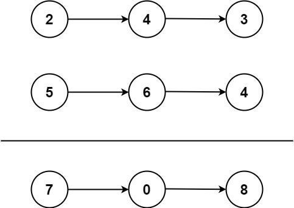
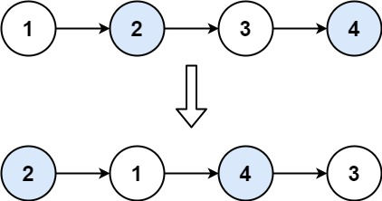

# 1. 哨兵模式

哨兵模式主要应用在以下题型:
- 需要保留参数 head 头节点的指针并作为返回值返回，例如 “删除链表中的节点” 类型问题
- 无法提前确认返回值具体是哪个节点，例如 “合并链表” 类型问题，“反转链表” 类型问题

### 代码模板

使用哨兵模式时，要记住两个必需的核心变量:
1. 哨兵节点：作为基准保存返回值，其 Next 指向具体的返回值，一般命名为 `dummy`, 当然也有人称之为 `哑巴节点`
2. 扫描节点：从链表头节点开始向后扫描，直到尾节点或符合条件的节点，作用简单来说就是 `游标指针`，一般命名为 `cur`

下面是一个典型的使用哨兵模式解题的代码模板:

```go
func Solution(head *ListNode) *ListNode {
 // 哨兵节点指向 头节点
 dummy := &ListNode{Next: head}

 // 游标节点   
 cur := dummy

 for cur.Next != nil {
   // 执行某些解题逻辑代码

   ...

   // 更新游标指针
   // 虽然游标指针一直在变化，但是哨兵节点指针的指向没有发生变化
   cur = cur.Next
 }

 // 返回哨兵节点指向的 头节点
 return dummy.Next
}
```

## [21. 合并两个有序链表](https://leetcode.cn/problems/merge-two-sorted-lists/description/)

将两个升序链表合并为一个新的 **升序** 链表并返回。新链表是通过拼接给定的两个链表的所有节点组成的。


> **输入：** l1 = [1,2,4], l2 = [1,3,4]
> **输出：** [1,1,2,3,4,4]

解题思路：同时遍历链表 1 和链表 2，将两个链表中的当前较小值插入到合并到后的链表中并套用模板

```go
func mergeTwoLists(l1 *ListNode, l2 *ListNode) *ListNode {
	dummy := &ListNode{}
	p := dummy
	for l1 != nil && l2 != nil {
		if l1.Val < l2.Val {
			p.Next = l1
			l1 = l1.Next
		} else {
			p.Next = l2
			l2 = l2.Next
		}
		p = p.Next
	}
	if l1 != nil {
		p.Next = l1
	}
	if l2 != nil {
		p.Next = l2
	}
	return dummy.Next
}
```


## [2. 两数相加](https://leetcode.cn/problems/add-two-numbers/description/)

给你两个 **非空** 的链表，表示两个非负的整数。它们每位数字都是按照 **逆序** 的方式存储的，并且每个节点只能存储 **一位** 数字。

请你将两个数相加，并以相同形式返回一个表示和的链表。

你可以假设除了数字 0 之外，这两个数都不会以 0 开头。



>**输入：** l1 = [2,4,3], l2 = [5,6,4]
> **输出：** [7,0,8]
> **解释：** 342 + 465 = 807.

解题思路：套入模板，同时遍历链表 1 和链表 2，取出两个链表的当前节点的值以及进位进行相加，并将结果放入合并后的链表的下一个节点。同时保存进位

```go
func addTwoNumbers(l1 *ListNode, l2 *ListNode) *ListNode {
	// 哨兵节点
	dummy := &ListNode{}
	cur := dummy
	carry := 0 // 进位

	for l1 != nil || l2 != nil || carry != 0 {
		if l1 != nil {
			carry += l1.Val
			l1 = l1.Next
		}
		if l2 != nil {
			carry += l2.Val
			l2 = l2.Next
		}
		// 当计算出来的新节点放到当前节点后面
		cur.Next = &ListNode{Val: carry % 10}
		//保存进位
		carry /= 10
		// 更新当前节点
		cur = cur.Next
	}

	return dummy.Next
}
```


## [24. 两两交换链表中的节点](https://leetcode.cn/problems/swap-nodes-in-pairs/description/)

给你一个链表，两两交换其中相邻的节点，并返回交换后链表的头节点。你必须在不修改节点内部的值的情况下完成本题（即，只能进行节点交换）。



> **输入：** head = [1,2,3,4]
> **输出：** [2,1,4,3]

解题思路：使用指针遍历链表，当游标指针的下一个节点和下下一个节点同时不为 nil 时，交换两者

```go
func swapPairs(head *ListNode) *ListNode {
	// 哨兵节点
	dummy := &ListNode{Next: head}
	cur := dummy
	
	for cur.Next != nil && cur.Next.Next != nil {
		p1, p2 := cur.Next, cur.Next.Next
		// 交换 p1 和 p2 节点
		cur.Next = p2
		p1.Next = p2.Next
		p2.Next = p1
		// 将 cur 移动到下一组待交换的节点的前一个节点处
		cur = p1
	}

	return dummy.Next
}
```