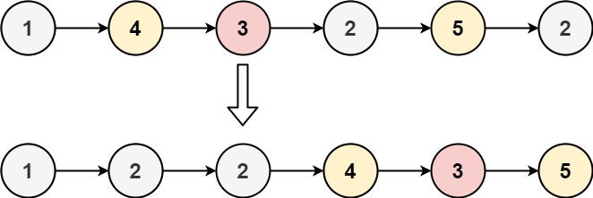
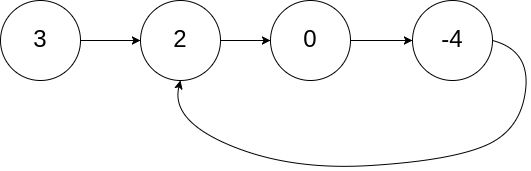
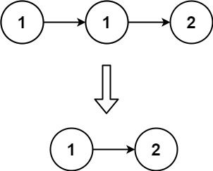
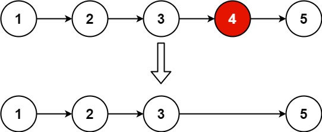
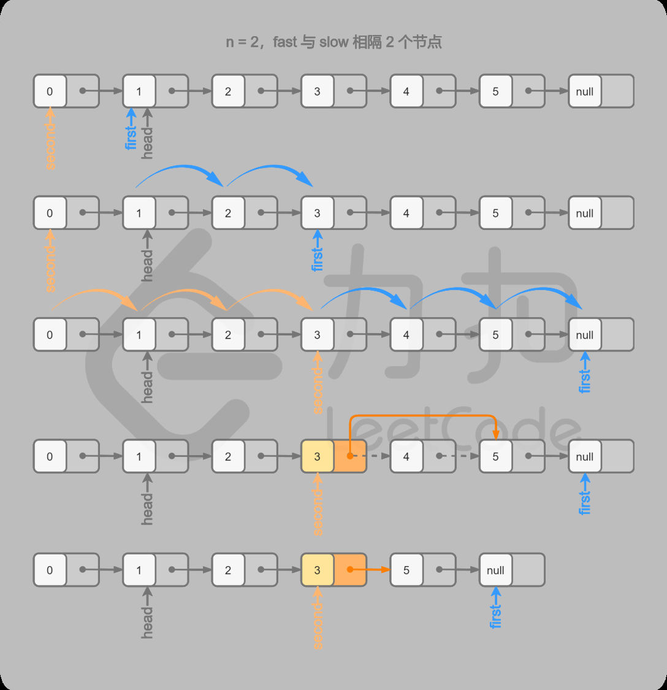
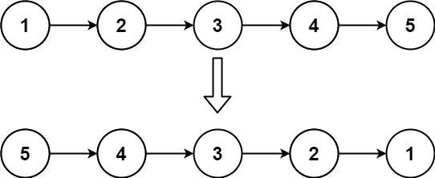
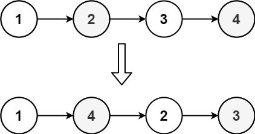
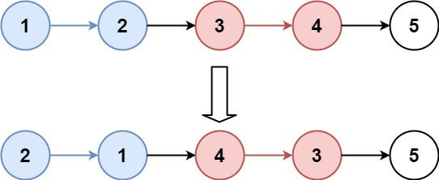

# 1. 哨兵模式

哨兵模式主要应用在以下题型:
- 需要保留参数 head 头节点的指针并作为返回值返回，例如 “删除链表中的节点” 类型问题
- 无法提前确认返回值具体是哪个节点，例如 “合并链表” 类型问题，“反转链表” 类型问题

### 代码模板

使用哨兵模式时，要记住两个必需的核心变量:
1. 哨兵节点：作为基准保存返回值，其 Next 指向具体的返回值，一般命名为 `dummy`, 当然也有人称之为 `哑巴节点`
2. 扫描节点：从链表头节点开始向后扫描，直到尾节点或符合条件的节点，作用简单来说就是 `游标指针`，一般命名为 `cur`

下面是一个典型的使用哨兵模式解题的代码模板:

```go
func Solution(head *ListNode) *ListNode {
 // 哨兵节点指向 头节点
 dummy := &ListNode{Next: head}

 // 游标节点   
 cur := dummy

 for cur.Next != nil {
   // 执行某些解题逻辑代码

   ...

   // 更新游标指针
   // 虽然游标指针一直在变化，但是哨兵节点指针的指向没有发生变化
   cur = cur.Next
 }

 // 返回哨兵节点指向的 头节点
 return dummy.Next
}
```

## [21. 合并两个有序链表](https://leetcode.cn/problems/merge-two-sorted-lists/description/)

将两个升序链表合并为一个新的 **升序** 链表并返回。新链表是通过拼接给定的两个链表的所有节点组成的。


> **输入：** l1 = [1,2,4], l2 = [1,3,4]
> **输出：** [1,1,2,3,4,4]

解题思路：同时遍历链表 1 和链表 2，将两个链表中的当前较小值插入到合并到后的链表中并套用模板

```go
func mergeTwoLists(l1 *ListNode, l2 *ListNode) *ListNode {
	dummy := &ListNode{}
	p := dummy
	for l1 != nil && l2 != nil {
		if l1.Val < l2.Val {
			p.Next = l1
			l1 = l1.Next
		} else {
			p.Next = l2
			l2 = l2.Next
		}
		p = p.Next
	}
	if l1 != nil {
		p.Next = l1
	}
	if l2 != nil {
		p.Next = l2
	}
	return dummy.Next
}
```


## [2. 两数相加](https://leetcode.cn/problems/add-two-numbers/description/)

给你两个 **非空** 的链表，表示两个非负的整数。它们每位数字都是按照 **逆序** 的方式存储的，并且每个节点只能存储 **一位** 数字。

请你将两个数相加，并以相同形式返回一个表示和的链表。

你可以假设除了数字 0 之外，这两个数都不会以 0 开头。


>**输入：** l1 = [2,4,3], l2 = [5,6,4]
> **输出：** [7,0,8]
> **解释：** 342 + 465 = 807.

解题思路：套入模板，同时遍历链表 1 和链表 2，取出两个链表的当前节点的值以及进位进行相加，并将结果放入合并后的链表的下一个节点。同时保存进位

```go
func addTwoNumbers(l1 *ListNode, l2 *ListNode) *ListNode {
	// 哨兵节点
	dummy := &ListNode{}
	cur := dummy
	carry := 0 // 进位

	for l1 != nil || l2 != nil || carry != 0 {
		if l1 != nil {
			carry += l1.Val
			l1 = l1.Next
		}
		if l2 != nil {
			carry += l2.Val
			l2 = l2.Next
		}
		// 当计算出来的新节点放到当前节点后面
		cur.Next = &ListNode{Val: carry % 10}
		//保存进位
		carry /= 10
		// 更新当前节点
		cur = cur.Next
	}

	return dummy.Next
}
```


## [24. 两两交换链表中的节点](https://leetcode.cn/problems/swap-nodes-in-pairs/description/)

给你一个链表，两两交换其中相邻的节点，并返回交换后链表的头节点。你必须在不修改节点内部的值的情况下完成本题（即，只能进行节点交换）。


> **输入：** head = [1,2,3,4]
> **输出：** [2,1,4,3]

解题思路：使用指针遍历链表，当游标指针的下一个节点和下下一个节点同时不为 nil 时，交换两者

```go
func swapPairs(head *ListNode) *ListNode {
	// 哨兵节点
	dummy := &ListNode{Next: head}
	cur := dummy
	
	for cur.Next != nil && cur.Next.Next != nil {
		p1, p2 := cur.Next, cur.Next.Next
		// 交换 p1 和 p2 节点
		cur.Next = p2
		p1.Next = p2.Next
		p2.Next = p1
		// 将 cur 移动到下一组待交换的节点的前一个节点处
		cur = p1
	}

	return dummy.Next
}
```

## [86. 分隔链表](https://leetcode.cn/problems/partition-list/description/)

给你一个链表的头节点 `head` 和一个特定值 `x` ，请你对链表进行分隔，使得所有 **小于** `x` 的节点都出现在 **大于或等于** `x` 的节点之前。

你应当 **保留** 两个分区中每个节点的初始相对位置。




> **输入：** head = [1,4,3,2,5,2], x = 3
> **输出** ：[1,2,2,4,3,5]

解题思路：
- 两个哨兵节点: 将小于 X 的所有节点单独形成一个链表 less, 将大于等于 X 的所有节点单独形成一个链表 greater, 声明两个哨兵节点分别指向 less 链表的头节点和 greater 链表的头节点
- **填充具体的解题逻辑**：使用游标指针遍历链表，将小于 X 的节点插入到链表 less 末尾, 将大于等于 X 的节点插入到链表 large greater，遍历完成之后，连接 less 链表和 greater 链表，并切断 large 链表的尾指针指向，防止链表形成环。

```go
func partition(head *ListNode, x int) *ListNode {
	LessDummy := &ListNode{}
	GreaterDummy := &ListNode{}
	cur := head
	p1, p2 := LessDummy, GreaterDummy
	for cur != nil {
		if cur.Val < x {
			p1.Next = cur
			p1 = p1.Next
		} else {
			p2.Next = cur
			p2 = p2.Next
		}
		cur = cur.Next
	}
	// 切断 greater 链表的尾指针
    // 例如源链表为 1 -> 4 -> 3 -> 2 -> 5 -> 2, X = 3
    // 那么在分割完成后
    // less 链表为 1 -> 2 -> 2 -> 5 ...
    // greater 链表为 4 -> 3 -> 5 -> 2 ...
    // 这时就需要将 greater 链表末尾指针给切断，否则就形成了 “环形链表”
	p2.Next = nil

	// 将 less 链表连接到 greater 链表
	p1.Next = GreaterDummy.Next
	return LessDummy.Next
}
```

# 2. 快慢指针

快慢指针是使用两个指针来遍历链表，快指针走的快 (例如每次扫描两个及以上节点)，慢指针走的慢 (例如每次扫描一个节点)，严格意义上来说，**“快慢指针” 属于 “双指针” 的解题类型范畴**，之所以在这篇关于链表类的文章中单独拎出来，主要有两点：

1. 链表的节点就是由指针连接起来的，天然适用于快慢指针来遍历，比如我们可以使用 **快慢指针来简洁实现 “找到链表的中间节点”**
2. 链表类型的某些问题，使用快慢指针是最简洁优雅的方案，例如经典的 “判断链表中是否存在环问题”

## 代码模板

```go
func Solution(head *ListNode) bool {
    // 通用边界检查
    if head == nil {
        return false
    }

    // 初始化快、慢两个指针
    slow, fast := head, head.Next
    // 主要这里的边界检查
    // 因为快指针每次走两步，需要需要检测两步之内的节点是否为 nil
    // 慢指针无需执行边界检查
    // 因为只要快指针不为 nil, 慢指针肯定也不会为 nil
    for fast != nil && fast.Next != nil {
        // 执行某些解题逻辑代码

        ...

        // 快指针每次走 2 步
        fast = fast.Next.Next
        // 慢指针每次走 1 步
        slow = slow.Next
    }

    return false
}
```

##  [141. 环形链表 ](https://leetcode.cn/problems/linked-list-cycle/)

给你一个链表的头节点 `head` ，判断链表中是否有环。

如果链表中有某个节点，可以通过连续跟踪 `next` 指针再次到达，则链表中存在环。 为了表示给定链表中的环，评测系统内部使用整数 `pos` 来表示链表尾连接到链表中的位置（索引从 0 开始）。**注意：`pos` 不作为参数进行传递** 。仅仅是为了标识链表的实际情况。

_如果链表中存在环_ ，则返回 `true` 。否则，返回 `false` 。



> **输入：** head = [3,2,0,-4], pos = 1
> **输出：** true
> **解释：** 链表中有一个环，其尾部连接到第二个节点。

解题思路：
- 定义快慢指针，
- 在移动的过程中，快指针反过来追上慢指针，就说明该链表为环形链表。否则快指针将到达链表尾部，该链表不为环形链表。

```go
func hasCycle(head *ListNode) bool {
	if head == nil {
		return false
	}

	// 快指针先走，避免提前判断快慢指针重合
	slow, fast := head, head.Next
	for fast != nil && fast.Next != nil {
		if slow == fast {
			return true
		}
		fast = fast.Next.Next
		slow = slow.Next
	}

	return false
}

```

## [142. 环形链表 II](https://leetcode.cn/problems/linked-list-cycle-ii/description/)

给定一个链表的头节点  `head` ，返回链表开始入环的第一个节点。 _如果链表无环，则返回 `null`。_

如果链表中有某个节点，可以通过连续跟踪 `next` 指针再次到达，则链表中存在环。 为了表示给定链表中的环，评测系统内部使用整数 `pos` 来表示链表尾连接到链表中的位置（**索引从 0 开始**）。如果 `pos` 是 `-1`，则在该链表中没有环。**注意：`pos` 不作为参数进行传递**，仅仅是为了标识链表的实际情况。

**不允许修改** 链表。

示例 1：


> **输入：** head = [3,2,0,-4], pos = 1
> **输出：** 返回索引为 1 的链表节点
> **解释：** 链表中有一个环，其尾部连接到第二个节点。

解题思路：

设链表共有 `a + b` 个节点，其中链表头部到链表入口节点有 `a` 个节点（不计链表入口节点），链表环有 `b` 个节点。设两指针 `fast` 和 `slow` 分别走了 `f` 和 `s` 步，则有：

- `fast` 指针每轮走 2 步，因此 `f = 2s`。
- `fast` 指针比 `slow` 指针多走了 `n` 个环的长度，因此 `f = s + nb`。

将以上两式联立可得：

- `n = (f - s) / b`
- `f = 2nb`
- `s = nb`

让指针从链表头部一直向前走并统计步数 `k`，那么所有 **走到链表入口节点时的步数** 是：
`k = a + nb`，即先走 `a` 步到入口节点，之后每绕 `b` 步都会再次到入口节点。由于 `slow` 节点走了 `nb` 步，因此使用额外一个指针从head 头与 `slow` 节点一起走 `a` 步，则会在入口节点重合。

```go
func detectCycle(head *ListNode) *ListNode {
    slow, fast := head, head
    for fast != nil {
        slow = slow.Next
        if fast.Next == nil {
            return nil
        }
        fast = fast.Next.Next
        if fast == slow {
            p := head
            for p != slow {
                p = p.Next
                slow = slow.Next
            }
            return p
        }
    }
    return nil
}
```

## [83. 删除排序链表中的重复元素 ](https://leetcode.cn/problems/remove-duplicates-from-sorted-list/description/)

给定一个已排序的链表的头 `head` ， _删除所有重复的元素，使每个元素只出现一次_ 。返回 _已排序的链表_ 。



> **输入：**head = [1,1,2]
> **输出：**[1,2]

解题思路：
从指针 `cur` 指向链表的头节点，随后开始对链表进行遍历。如果当前 `cur` 与 `cur.Next` 对应的元素相同，那么我们就将 `cur.Next`  从链表中移除；否则说明链表中已经不存在其它与 `cur` 对应的元素相同的节点，因此可以将 `cur` 指向 `cur.Next` 。

```go
func deleteDuplicates(head *ListNode) *ListNode {
    if head == nil {
        return nil
    }

    cur := head
    for cur.Next != nil {
        if cur.Val == cur.Next.Val {
            cur.Next = cur.Next.Next
        } else {
            cur = cur.Next
        }
    }

    return head
}
```


## [19. 删除链表的倒数第 N 个结点](https://leetcode.cn/problems/remove-nth-node-from-end-of-list/description/)

给你一个链表，删除链表的倒数第 `n` 个结点，并且返回链表的头结点。



> **输入：** head = [1,2,3,4,5], n = 2
> **输出：** [1,2,3,5]


解题思路：

倒数第 N 个节点就是正数的 M - N 个节点，那么我们设定 **一个快指针先走 N 步，然后设定一个慢和快指针以相同的步幅一起走** (指针每次向前移动一次)，这样等到快指针移动到末尾时，慢指针正好移动到第 M - N 个节点，也就是倒数第 N 个节点，删除慢指针指向的节点即可。



```go
func removeNthFromEnd(head *ListNode, n int) *ListNode {
	if n <= 0 {
		return head
	}

	dummy := &ListNode{0, head}
	fast, slow := head, dummy
	
	for i := 0; i < n && fast != nil; i++ {
		fast = fast.Next
	}
	
	for fast != nil {
		slow = slow.Next
		fast = fast.Next
	}
	slow.Next = slow.Next.Next

	return dummy.Next
}
```

# 3. 反转链表

## [206. 反转链表](https://leetcode.cn/problems/reverse-linked-list/description/)

给你单链表的头节点 `head` ，请你反转链表，并返回反转后的链表。



> **输入：** head = [1,2,3,4,5]
> **输出：** [5,4,3,2,1]

解题思路：

定义三个指针变量分别指向:
- prev : 当前节点的前一个节点指针，初始化时为 `nil`
- cur : 当前节点指针，游标指针，初始化时指向链表头节点
- next : 当前节点的下一个节点指针，遍历时不断更新

链表扫描结束之后，prev 指针变量指向反转后的链表头节点，直接返回即可。

```go
func reverseList(head *ListNode) *ListNode {
    var prev *ListNode
    cur := head

    for cur != nil {
        next := cur.Next
        cur.Next = prev
        prev = cur
        cur = next
    }

    return prev
}
```

递归版思路：
1. `newHead := reverseList(head.Next)`：
	- 递归调用自身，传入当前节点的下一个节点(`head.Next`)。
	- 这个调用会一直递归下去，直到找到链表的最后一个节点（即 `head.Next == nil` 时的节点），这时会返回这个节点作为新的头节点 `newHead`。
2. **反转链表**：
    - `head.Next.Next = head`：
        - 当前节点的下一个节点的`Next`指针指向当前节点。也就是让当前节点的下一个节点指向自己，实现局部的反转。
    - `head.Next = nil`：
        - 将当前节点的`Next`指针设置为`nil`，断开当前节点与其下一个节点之间的连接，防止形成环。

```go
func reverseList(head *ListNode) *ListNode {
    if head == nil || head.Next == nil {
        return head
    }
    newHead := reverseList(head.Next)
    head.Next.Next = head
    head.Next = nil
    return newHead
}
```

## [143. 重排链表](https://leetcode.cn/problems/reorder-list/description/)

给定一个单链表 `L` 的头节点 `head` ，单链表 `L` 表示为：
L0 → L1 → … → Ln - 1 → Ln
请将其重新排列后变为：
L0 → Ln → L1 → Ln - 1 → L2 → Ln - 2 → …
不能只是单纯的改变节点内部的值，而是需要实际的进行节点交换。



> **输入：** head = [1,2,3,4]
> **输出：** [1,4,2,3]

解题思路：注意到目标链表即为将原链表的左半端和反转后的右半端合并后的结果。
因此可以分三步解决：
1. **找到链表的中点**：
    - 使用快慢指针（快指针一次走两步，慢指针一次走一步）找到链表的中间节点。
    - 当快指针到达链表末尾时，慢指针正好到达链表的中点。
2. **反转链表的后半部分**：
    - 从中点开始，将链表的后半部分反转，这样我们就得到了两部分链表：前半部分和反转后的后半部分。
3. **合并链表**：
    - 交替合并前半部分和反转后的后半部分，使其按照 𝐿0→𝐿𝑛→𝐿1→𝐿𝑛−1→𝐿2→𝐿𝑛−2→…L0→Ln→L1→Ln−1→L2→Ln−2→… 的顺序排列。

```go
func middleNode(head *ListNode) *ListNode {
    slow, fast := head, head
    for fast.Next != nil && fast.Next.Next != nil {
        slow = slow.Next
        fast = fast.Next.Next
    }
    return slow
}

func reverseList(head *ListNode) *ListNode {
    var prev, cur *ListNode = nil, head
    for cur != nil {
        nextTmp := cur.Next
        cur.Next = prev
        prev = cur
        cur = nextTmp
    }
    return prev
}

func mergeList(l1, l2 *ListNode) {
    var l1Tmp, l2Tmp *ListNode
    for l1 != nil && l2 != nil {
        l1Tmp = l1.Next
        l2Tmp = l2.Next

        l1.Next = l2
        l1 = l1Tmp

        l2.Next = l1
        l2 = l2Tmp
    }
}

func reorderList(head *ListNode) {
    if head == nil {
        return
    }
    mid := middleNode(head)
    l1 := head
    l2 := mid.Next
    mid.Next = nil
    l2 = reverseList(l2)
    mergeList(l1, l2)
}
```

## [25. K 个一组翻转链表](https://leetcode.cn/problems/reverse-nodes-in-k-group/description/)

给你链表的头节点 `head` ，每 `k` 个节点一组进行翻转，请你返回修改后的链表。

`k` 是一个正整数，它的值小于或等于链表的长度。如果节点总数不是 `k` 的整数倍，那么请将最后剩余的节点保持原有顺序。

你不能只是单纯的改变节点内部的值，而是需要实际进行节点交换。



> **输入：** head = [1,2,3,4,5], k = 2
> **输出：** [2,1,4,3,5]

解题思路：
1. **初始化**：
    - 创建一个 `dummy` 节点，其 `Next` 指向链表头部，便于处理头节点的翻转。
2. **遍历链表，检查是否有足够的 𝑘 个节点**：
    - 使用指针 `p` 遍历链表，并通过计数器 `cnt` 检查当前组是否有 𝑘 个节点。
3. **翻转当前组的 𝑘 个节点**：
    - 记录当前组的下一个节点 `next`，将当前组的末尾节点 `p.Next` 设置为 `nil`，以便调用 `reverseList` 进行反转。
    - 调用 `reverseList` 反转当前组，并将翻转后的子链表连接到之前处理好的链表部分。
4. **更新指针位置，准备处理下一组节点**：
    - 更新指针 `headNew` 和 `head` 的位置，准备处理下一组节点。
    - 继续遍历链表，直到所有节点处理完毕。
5. **返回修改后的链表**：
    - 返回 `dummy.Next`，即新的链表头部。

```go
func reverseList(head *ListNode) *ListNode {
	var cur, next, pre *ListNode
	cur = head
	for cur != nil {
		next = cur.Next
		cur.Next = pre
		pre = cur
		cur = next
	}

	return pre
}

func reverseKGroup(head *ListNode, k int) *ListNode {
	dummy := &ListNode{Next: head}
	p := dummy.Next
	// 上一组的最后一个节点
	headNew := dummy
	cnt := 0
	var next *ListNode
	for p != nil {
		cnt++
		if cnt == k {
			cnt = 0
			next = p.Next
			p.Next = nil
			// 反转后，head为k的最后一个节点
			// 函数返回该组的头节点，与上一组的节点连接
			headNew.Next = reverseList(head)
			head.Next = next
			headNew = head
			head = next
			p = head
		} else {
			p = p.Next
		}
	}

	return dummy.Next
}
```